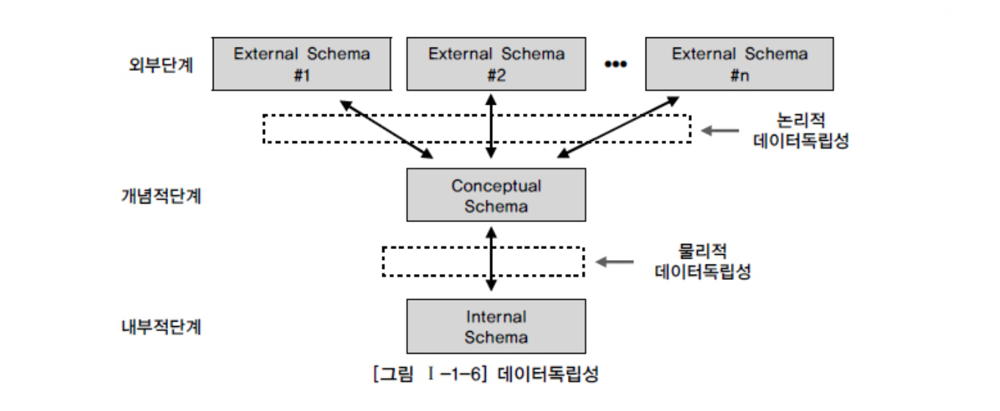

# SQL 전문가 가이드

## 1장

### 제 1장 데이터 모델의 이해

### 모델링의 특징 

1. 추상화
2. 단순화
3. 명확화

```
추, 단, 명
```

### 모델링 세 가지 관점

1. 데이터 관점
2. 프로세스 관점
3. 데이터와 프로세스의 상관관점

### 데이터 모델링 정의

* 해당 업무에 어떤 데이터가 존재하는지 또는 업무가 필요로 하는 정보가 무엇인지 분석하는 방법

### 데이터 모델링 유의성

1. 중복
2. 비유연성
3. 비일관성

### 데이터 모델링 3단계

1. 개념적 데이터 모델링 : 추상화 수준이 높고, 핵심 엔티티와 그들 간의 관계 다이어그램 생성
2. 논리적 데이터 모델링 : 누가 어떻게 데이터에 액세스하며 중복을 제거하고 참조 무결성 규칙 등의 정규화 작업 진행
3. 물리적 데이터 모델링 : 테이블, 칼럼 등 물리적인 저장구조와 사용될 저장 장치에 대한 접근 방법 

### 데이터 독립성

* 어떤 단위에 대해 독립적이며 다른 기능의 변경으로부터 쉽게 변경되지 않는 자신의 고유한 기능



* 외부 단계는 사용자와 가까운 단계로 개개인이 보는 자료에 대한 관점 (사용자 관점)
* 개념 단계는 사용자가 처리하는데이터 유형의 공통적인 사항을 처리 (통합관점)
* 내부 단계는 물리적으로 저장된 방법에 대한 스키마 구조 (물리적 저장구조)
* 논리적 독립성 : 개념 스키마가 변경되어도 외부 스키마에는 영향 없음
* 물리적 독립성 : 내부 스키마가 변경되어도 개념/외부 스키마는 영향 없음

### 데이터 모델링 세 가지 요소

1. 개체(엔티티)
2. 속성
3. 관계

### 엔티티의 특징 

1. 업무에서 필요로 하는 정보 : 업무영역내에서 관리할 필요가 있는 대상에 대해서만 선정
2. 식별이 가능해야 함 : 사원번호와 같은 고유하게 식별 가능한 값
3. 인스턴스의 집합 : 한 개의 엔티티에는 두 개 이상의 인스턴스가 필요
4. 업무프로세스에 의해 이용 : 업무프로세스에서 반드시 이용해야함
5. 속성을 포함
6. 관계의존재 : 다른 엔티티와 최소 한 개 이상의 관계 존재가 필요

### 엔티티의 분류

**유무형에 따른 분류**

* 유형 엔티티 : 물리적인 형태, 안정적이며 지속적으로 활용되는 엔티티 ex)사원, 물품..
* 개념 엔티티 : 물리적인 형태는 없으며, 관리해야 할 개념적인 정보 ex)조직, 보험상품..
* 사건 엔티티 : 업무를 수행함에 따라 발생되는 엔티티, 발생량이 많음 ex) 주문,청구,미납..

**발생시점에 따른 분류**

* 기본/키 엔티티 : 업무에 원래 존재하는 정보로, 독립적으로 생성 가능하며 자신의 고유한 주식별자 ex)사원, 부서, 고객, 상품..
* 중심 엔티티 : 기본 엔티티로부터 발생되고 업무에 있어 중심적인 역할 ex)계약, 사고, 청구, 주문..
* 행위 엔티티 : 두 개 이상의 부모엔티티로부터 발생되고 자주 바뀌거나 데이터양 증가 ex)주문목록, 이력테이블..

### 속성

* 업무에서 필요로 하는 인스턴스에서 관리하고자 하는 의미상 더 이상 분리되지 않는 최소의 데이터 단위

**엔티티,인스턴스,속성, 속성값의 관계**

* 한 개의 엔티티는 두 개 이상의 인스턴스 집합이어야 한다.
* 한 개의 엔티티는 두 개 이상의 속성을 갖는다.
* 한 개의 속성은 한 개의 속성값을 갖는다.

**속성의 특징**

* 주식별자에 함수적 종속성을 가져야 한다.
* 하나의 속성에는 한 개의 값만을 가진다.

**속성 특성에 따른 분류**

* 기본 속성 : 업무로부터 추출한 모든 속성
* 설계 속성 : 속성을 새로 만들거나 변형하여 정의하는 속성(코드성 속성 해당)
* 파생 속성 : 다른 속성에 영향 받아 발생하는 속성(보통 계산된 값들 해당)

**엔티티 구성방식에 따른 분류**

* 복합 속성 : 시, 구, 동, 번지 등과 같은 여러 세부 속성들로 구성
* 단순 속성 : 나이, 성별 등 더 이상 다른 속성들로 구성될 수 없는 단순한 속성

**속성의 명명**

1. 해당업무에서 사용하는 이름 부여.
2. 서술식 속성명은 사용하지 않음.
3. 약어사용은 가급적 제한함.
4. 유일성 확보.

### 관계 

* 연관관계는 실선 표현, 의존관계는 점선 표현
* 선택참여관계에서 필수참여는 UML에서 O (NOT NULL)로 표시하며, 선택참여는 NULL 을 허용한다.

### 식별자

* 식별자 : 하나의 엔티티에 구성되어 있는 속성 중 엔티티를 대표할 수 있는 속성
* 하나의 엔티티는 반드시 하나의 유일한 식별자가 존재해야 한다.
* 보통 식별자와 키를 동일하게 생각하는 경우가 존재하지만, 식별자는 논리 데이터 모델링, 키는 물리 데이터 모델링에서 사용한다.

**식별자의 특징**

* 유일성, 최소성, 불변성, 존재성

**식별자 분류체계**

* 주식별자 : 엔티티 내에서 각 어커런스를 구분할 수 있는 구분자, 타 엔티티와 참조관계를 연결할 수 있는 식별자.
* 보조식별자 : 엔티티 내에서 각 어커런스를 구분할 수는 있으나, 대표성을 가지지 못해 참조관계를 연결하지 못함.
* 내부식별자 : 엔티티 내부에서 스스로 만들어지는 식별자
* 외부식별자 : 타 엔티티와의 관계를 통해 타 엔티티로부터 받아오는 식별자
* 단일식별자 : 하나의 속성으로 구성된 식별자
* 복합식별자 : 둘 이상의 속성으로 구성된 식별자
* 본질식별자 : 업무에 의해 만들어지는 식별자
* 인조식별자 : 업무적으로 만들어지지는 않지만 원조식별자가 복잡한 구성을 가지고 있어 인위적으로 만든 식별자

**주식별자 도출기준**

* 업무에서 자주 이용되는 속성 지정
* 명칭, 내역등과 같은 이름은 지정하지 않는다.
* 너무 많은 속성이 포함되지 않도록 한다.

**식별자관계와 비식별자관계에 따른 식별자**

* 외부식별자(Foreign Identifier) : 다른 엔티티와의 관계를 통해 자식 쪽에 엔티티에 생성되는 속성이며 DB생성 시 Foregin Key 역할을 한다.

* 식별자관계 : 반드시 부모 엔티티가 생성되어야 자기 자신의 엔티티가 생성되는 경우, 부모로부터 받은 속성을 자식 엔티티가 모두 사용하고, 주 식별자로 사용한다면 1:1 관계이며, 다른 부모엔티티에서 받은 속성을 포함하거나 스스로 가지고 있는 속성과 함께 주식별자로 구성된다면 1:M 관계가 된다.

### 반정규화 기법
**1. 테이블 반정규화**

1. 테이블 병합
    * 1:1 관계 테이블 병합
    * 1:M 관계 테이블 병합
    * 슈퍼/서브타입 테이블 병합
2. 테이블 분할
    * 수직분할
    * 수평분할
3. 테이블 추가
    * 중복테이블 추가
    * 통계테이블 추가
    * 이력테이블 추가
    * 부분테이블 추가

**2. 컬럼 반정규화**

* 중복컬럼 추가
* 파생컬럼 추가
* 이력테이블 컬럼추가
* PK에 의한 컬럼 추가
* 응용시스템오작동을 위한 컬럼 추가

**3. 관계 반정규화**

* 중복관계 추가

### 인덱스 특성을 고려한 PK/FK 성능향상

**CASE1 PK 컬럼 순서로 인한 성능 저하**

```SQL
CREATE UNIQUE INDEX 주문목록_I01 
ON 주문목록(주문번호, 주문일자, 주문번호코드)

-- 정상적인 인덱스 사용 (첫 번째 컬럼을 비교하여 순차적으로 데이터를 찾아감)
SELECT 주문단가
FROM 주문목록
WHERE 주문번호 = '1002'

----------------------------------------------------------------------------------------------

-- 인덱스를 잘못 사용 (맨 앞에 있는 컬럼이 제외되어 스캔 범위가 넓어져 성능 저하 발생)
SELECT 주문단가
FROM 주문목록
WHERE 주문일자 = '2008.1.1'
```

**CASE2 PK 생성 순서로 인한 성능 저하**

```SQL
CREATE UNIQUE INDEX 입시마스터_I01
ON 입시마스터(년도, 학기, 수험번호)

-- 정상적인 인덱스 사용 (PK 순서를 변경함으로써 인덱스를 사용할 수 있어짐)
SELECT COUNT(수험번호)
FROM 입시마스터
WHERE 년도 = '2008'
AND 학기 = '1'

----------------------------------------------------------------------------------------------

CREATE UNIQUE INDEX 입시마스터_I01
ON 입시마스터(수험번호, 년도, 학기)

-- 인덱스를 잘못 사용 (수험번호에 대한 값이 WHERE 절에 들어오지 않아 I01 인덱스를 사용하지 못하고 FULL SCAN 발생)
SELECT COUNT(수험번호)
FROM 입시마스터
WHERE 년도 = '2008'
AND 학기 = '1'
```

**CASE3 PK 순서를 잘못 지정하여 성능 저하**

```SQL
CREATE UNIQUE INDEX 현금출급기실적_I01
ON 현금출급기실적(사무소코드, 거래일자, 출급기번호, 명세표번호)

-- 정상적인 인덱스 사용 (사무소코드로 좁은 범위를 먼저 스캔함으로써 성능향상 가능)
SELECT 건수, 금액
FROM 현금출급기실적
WHERE 사무소코드 = '000368'
AND 거래일자 BETWEEN '20231205' AND '20241205';

---------------------------------------

CREATE UNIQUE INDEX 현금출급기실적_I01
ON 현금출급기실적(거래일자, 사무소코드, 출급기번호, 명세표번호)

-- 인덱스 스캔은 정상 동작하나 인덱스 성능 잘못 사용 (거래일자의 넓은 범위조회로 인한 성능저하 발생)
SELECT 건수, 금액
FROM 현금출급기실적
WHERE 거래일자 BETWEEN '20231205' AND '20241205' 
AND 사무소코드 = '000368';
```

* PK 구조를 그대로 둔 상태에서 인덱스만 하나 만들어도 성능 개선은 가능하나, 인덱스가 전혀 사용되지 않는다면 DML시 불필요한 인덱스로 인하여 성능이 저하되어 더 좋지 않다.
* 좀 더 자주 이용되는 조회의 형태로 PK순서를 구성하여 이용하게 하고 순서를 바꾼 인덱스를 추가로 생성하는 것이 바람직하다.
