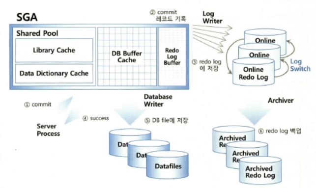
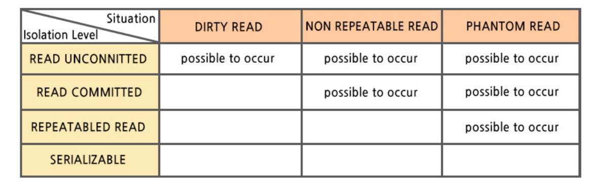

# SQLP 기출 문제 정리

## 1과목 sql 수행 구조 

### 자주 출제되는 개념 및 모르는 개념 

**Redo Undo**

* Redo Undo 를 알기전에 트랜잭션 ACID 개념을 알고 넘어가자

1. 트랜잭션 단위로 변경 또는 롤백(A 원자성)
2. 어중간한 데이터 변경은 X(C  일관성)
3. 다른 트랜잭션과 동시 실행이든 결과는 같아야함(I 일관성)
4. 장비가 꺼지더라도 커밋한 데이터는 복구 가능(D 지속성)

```Redo```
* Redo : 모든 변경사항을 Redo 로그에 기록하며 데이터베이스 복구할 때 사용한다.
* Database Recovry : 데이터베이스 복구를 하기 위함
* Cache Recovery : 트랜잭션 데이터 유실에 대비하여 시스템이 셧다운 되는 시점에 커밋되지 않았던 트랜잭션 모두 롤백
* Fast Commit : 모든 변경사항을 Append 방식으로 로그 파일에 기록

* Redo 로그의 Fast Commit 메커니즘



```Undo```

* Transaction Rollback : 트랜잭션에 의한 변경사항을 최종 커밋하지 않고, 롤백하고자 할 때 사용
* Transaction Recovery : 최종 커밋되지 않은 변경사항까지 모두 복구됨.
* Read Consistency : Undo 데이터를 이용하여 읽기 일관성을 구현.

* REDO는 오래된 데이터를 최신 데이터로 만듬
* UNDO는 최신 데이터를 오래된 데이터로 만듬
* 읽기 일관성을 위해 UNDO 사용
* 인스턴스가 비정상되면 REDO와 UNDO를 사용하여 데이터를 복구하고, 롤백을 수행함


**클러스터**

**세그먼트**

* 데이터 저장공간을 사용하는 오브젝트(테이블, 인덱스, 파티션, 클러스터, LOB)
* 데이터 저장공간을 사용하지 않는 오브젝트(뷰, 시너님, 시퀀스, 함수, 프로시저, 트리거)
* 두 가지 저장공간으로 이루어진 세그먼트는 익스텐트의 집합이며 익스텐트 내 블록은 논리적으로 인접한 반면, 익스텐트끼리 서로 인접하지는 않는다.

**버퍼캐시 블록**
 
### 오라클 백그라운드 프로세스

* 오라클 데이터베이스가 시작되기 위해서는 꼭 필요한 5가지이며 종료되면 다같이 종료 됩니다.

1. SMON(System Monitor) : 오라클 인스턴스 관리, Fail시 인스턴스 복구 임시 블록 세그먼트들을 재사용합니다.
2. PMON(Process Monitor) : 서버에서 사용되는 각 프로세스들을 감시하는 프로세스이며 비정상 종료 데이터베이스 접속 정리를 하고 SGA 리소스를 재사용 가능하게 하며 트랜잭션을 롤백시킵니다.
3. DBWN(Database Writer) : 수정된(Dirty) 버퍼 내용을 데이터 파일에 기록합니다.
4. LGWR(Log Writer) : 버퍼캐쉬에 발생한 모든 변화를 Redo 로그 파일에 기록합니다.
5. CKPT(Check Point) : 모든 변경된 버퍼를 디스크 내의 데이터 파일로 저장합니다. 
  

## 2과목 SQL 분석 도구

### 예상 실행계획

### SQL 트레이스

### 응답시간 분석

## 3과목 인덱스 튜닝

## 4과목 조인 튜닝

## 5과목 SQL 옵티마이저

## 6과목 고급 SQL 튜닝 

## 7과목 LOCK과 트랜잭션 동시성 제어

### Lock

* 트랜잭션은 가능한 짧게 정의
* 공유 Lock과 배타적 Lock은 서로 호환되지 않아 블로킹 발생
* 온라인 트랜잭션에서는 배치가 동시 변경하지 않도록 시간대 조절 필요
* Lock은 자연스러운 현상
* 블로킹이 자주 나타나는 것은 좋지 않은 현상

**오라클은 MVCC 모델로 DML 수행 중인 데이터를 어떤 간섭도 받지 않고 읽을 수 있는 반면 SQL Server는 Select문으로 데이터를 읽을 때 공유 Lock을 사용함으로써 서로 블로킹한다.**

**모든 DBMS는 DML 수행 시 배타적 Lock을 사용하고, 배타적 Lock끼리는 호환되지 않으므로 서로 블로킹한다.(MVCC모델 오라클은 DML수행 중 어떤 간섭도 받지 않고 데이터를 읽을 수 있다.**

**테이블에 Unique 인덱스나 제약이 없으면, INSERT 끼리는 서로 블로킹 하지 않지만 Full Scan으로 처리되어 SELECT 데이터를 읽을 때 블로킹 된다.**

**SQL Server는 INSERT 중인 데이터를 읽으려고하면 블로킹된다. (하지만 데이터가 포함이 되지 않으면 블로킹되지 않기에 테이블의 인덱스 유무와 데이터에 따라 블로킹 되거나 안될 수도 있다.)**

**TX Lock은 트랜잭션별로 단 하나씩, TM Lock은 DML 수행하는 테이블 별로 하나씩 설정한다.**

### 동시 트랜잭션에 의해 나타날 수 있는 이상 현상

* ``Dirty Read`` : 다른 트랜잭션이 변경 중인 데이터를 읽는데 트랜잭션이 롤백됨으로써 비일관성 상태에 놓이는 현상
* ``Non-Repeatable Read`` : 한 트랜잭션 내에서 같은 데이터를 두 번 이상 읽을 때, 다른 트랜잭션이 값을 수정 or 삭제하여 값이 서로 달라지는 현상
* ``Phantom Read`` : 한 트랜잭션 내에서 일정 범위의 데이터를 두 번 이상 읽을 때, 다른 트랜잭션이 새로운 데이터를 추가하여 없던 데이터가 나타나는 현상

### 트랜잭션 격리 수준 

동시에 여러 트랜잭션이 처리될 때 다른 트랜잭션에서 변경하거나 조회하는 데이터를 볼 수 있도록 허용할지 말지 결정.

* READ UNCOMMITED : 각 트랜잭션에서 변경 내용이 COMMIT, ROLLBACK 상관없이 다른 트랜잭션에서 값을 읽을 수 있다. (트랜잭션 작업이 완료되지 않았는데도 또 다른 트랜잭션에서 볼 수 있게되는 DIRTY READ 현상 발생)
* READ COMMITED : 실제 테이블 값이 아닌 Undo 영역 백업된 레코드에서 값을 가져온다.
* REPETABLE READ : MVCC 변경 방식이라 불리며, Undo 공간에 백업해두고 실제 레코드 값을 변경한다.
* PHANTOM READ : 다른 트랜잭션에서 수행한 변경 작업에 의해 레코드가 보였다가 안 보였다가 하는 현상이다.
* SERIALIZABLE : 가장 단순한 격리 수준이며 동시 처리 성능이 가장 낮고 엄격한 격리 수준을 가져 DB에서는 거의 사용 하지 않는다.

