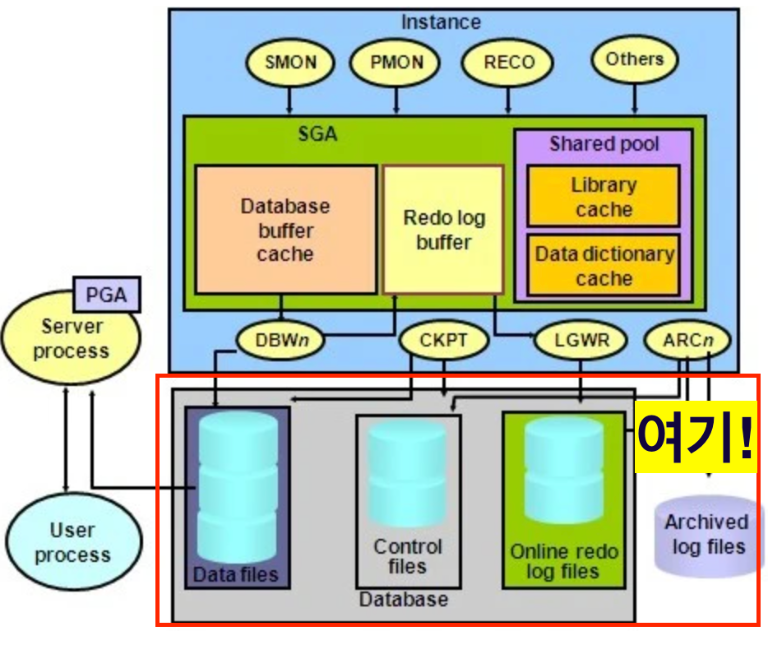

# 오라클 아키텍처 구성


오라클 아키텍처는 크게 다음과 같이 구성된다.

# 오라클 인스턴스


오라클 인스턴스는 SGA와 Process로 구성되어있다.

## SGA (System Global Area)

* Oracle은 구동을 시작할 때 가장먼저 SGA라는 메모리 캐시 영역을 할당한다.
* 크게 DB 버퍼캐시, Shared Pool, Redo Log Buffer 3가지로 존재한다.
* SGA는 공유 메모리 영역으로 많은 프로세스가 동시에 데이터를 액세스하여 사용자 데이터를 보호하는 메모리 액세스를 직렬화 하기 위한 Latch 가 필요하다.
  
## DB 버퍼캐시

* DBWR에 의해서 관리되며 데이터 파일들로부터 읽은 Data Block의 복사본을 담고 있는 영역이다.
* 수행하는 SQL문장의 실제 데이터를 메모리에 저장하여 다른 사용자의 동일한 데이터 요청 시 Disk I/O 수행 대신 메모리상의 데이터를 리턴한다.
* LRU(가장 최신 데이터 위주 사용) 알고리즘으로 가장 오래 전 사용된 것은 DISK로 보내고 가장 최근 블록을 유지한다. 

## Shared Pool

* SGA내에 위치한 Shared Pool은 하나의 데이터베이스에 행해지는 모든 SQL문을 처리하는데 사용한다.

### 라이브러리 캐시

* 같은 SQL문을 재실행할 때 Hard Parse 생략하고 Soft Parse 되도록 SQL 정보를 저장하는 곳이다.
* 라이브러리 캐시는 SQL과 PL/SQL 영역을 저장한다.

### 딕셔너리 캐시

* 데이터베이스 테이블과 뷰에 대한 정보, 구조, 사용자 등에 대한 정보가 저장된다.

## Redo Log Buffer 

* 데이터베이스에서 일어난 모든 변화를 저장하는 메모리이다.
* LGWR에 의해 데이터베이스 복구에 사용되는 온라인 리두로그 파일에 버퍼값들을 저장한다.

## 백그라운드 프로세스 종류

### SMON (System Monitor)

* 오라클 ```인스턴스를 복구```한다.
* 불필요한 임시 세그먼트를 정리한다.
* 변경 내용을 리두 로그 버퍼에 저장하고 DB Buffer Block에 ``버퍼 내용을 저장``한다.
* 오라클 전반적인 시스템을 감시한다.

### PMON (Process Monitor)

* 이전에 실패한 사용자 프로세스를 정리한다.
* Lock 프로세스 소멸시 Lock을 해제하는 등의 사용자가 사용하고 있는 ```리소스를 정리```한다.

### DBWR (Database Writer)

* 데이터 블럭 버퍼 캐쉬와 딕셔너리 캐쉬 내용을 관리한다.
* ```버퍼캐시 내용을 데이터 파일에 저장```한다.

### LGWR (Log Writer)

* 리두 로그 버퍼의 내용을 ```온라인 리두 로그파일에 기록```한다.

### CKPT (체크포인트)

* 변경된 모든 블록을 데이터 파일에 쓰도록 유도한다.
* 데이터 파일 헤더와 컨트롤 파일을 변경한다.

## PGA (Program Gloabal Area)


* 유저 프로세스가 서버 프로세스에게 세션을 허락해 달라는 요청을 하면 유저 프로세스를 처리하기 위한 메모리가 요구되는데 이 때 사용되는 메모리 영역이다.

## DataBase



* 디스크에 저장된 데이터 집합이다.