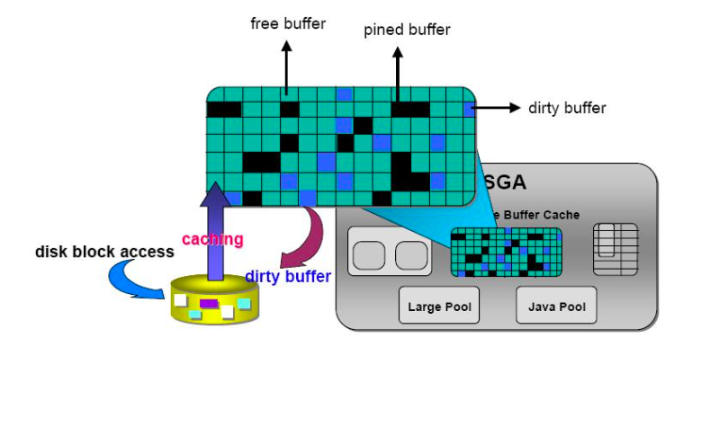
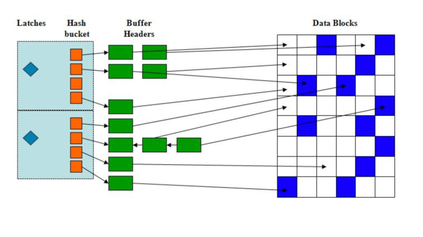

# DB 버퍼 캐시



* 사용자가 입력한 데이터를 데이터 파일에 저장한 뒤, 다시 읽는 과정에서 거쳐가는 캐시 영역이다.
* 최근에 사용한 블록에 대한 정보를 저장하는 메모리의 일정 영역으로 물리적인 I/O를 최소화한다.

## 블록단위 I/O

* 메모리 버퍼 캐시에서 버퍼 블록을 액세스 할 때
* 데이터파일에 저장된 데이터 블록을 DB 버퍼 캐시로 적재할 때
* 캐시에서 변경된 블록을 다시 데이터파일에 저장할 때

### Single Block I/O

* 한번의 I/O Call에 하나의 데이터 블록만 읽어 메모리에 적재하는 방법이다.
* 인덱스를 경유해 테이블 액세스시 사용하는 액세스 방법이다.

### Multi Block I/O

* Call이 필요한 시점에 인접한 블록들을 같이 읽어 메모리에 적재하는 방법이다.
* Full Table Scan시 사용하는 액세스 방법이다.

## 버퍼 캐시 구조



### 해시테이블 구조로 관리

* 찾고자 하는 데이터블록 주소인 DBA를 해시값으로 변환하여 해시 키 값으로 사용한다.
* 해당 해시 버킷에서 체인을 따라 스캔하여 있으면 바로 읽고 없으면 디스크에서 가져와 해시 체인에 연결한 후 읽는다.
* 버퍼 헤더만 헤시 체인에 연결 되고 데이터 값은 포인터를 이용해 버퍼 블록을 찾아 얻는다.
* 여러 개의 해시 버킷으로 구성되며 해시 버킷과 해시 체인은 1:1 관계이다.

**하나의 해시 버킷의 구성**

* 버킷 ==> 체인 ==> 헤더의 구조로 되어있다.
* 해시 체인은 Shared Pool 내에 존재하며 양방향의 링크된 리스트로 되어있다.

**버퍼 캐시 구조를 통한 데이터 액세스 전체적인 흐름**

```
1. 해시테이블
    2. 해시 버킷
        3. 버퍼 헤더 체인
            4. 버퍼 헤더
                5. 버퍼 캐시 블록
                    6. 테이블 블록 헤더
                        7. 테이블 블록
```

## 캐시 버퍼 체인

* 각 해시 체인은 Latch에 의해 보호된다.

### 래치 (Latch)
 
* 같은 리소스에 대한 액세스를 직렬화하여 보호하기 위해 구현된 Lock 메커니즘이다.
* 하나의 Latch가 여러 해시 체인을 동시 보호한다.

### 모든 버퍼 블록은 셋 중 하나의 상태이다.

**Free 버퍼**

* 빈 상태 혹은 데이터 파일과 동기화 된 상태이다.
* 언제든 덮어 쓸 수 있으며 변경 시 Dirty 버퍼가 된다.

**Dirty 버퍼**

* 변경 되어 데이터 파일과 동기화가 필요한 상태이다.
* 동기화 되면 Free 버퍼가 된다.

**Pinned 버퍼**

* 읽기/쓰기 작업 중인 버퍼 블록을 의미한다.