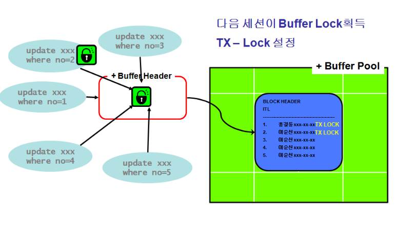

# 버퍼 Lock

## 버퍼 Lock 이란?

* 자신이 현재 그 버퍼를 사용 중임을 버퍼 헤더에 Pin을 설정하여 표시하는 것이다.
* 캐쉬된 버퍼 블록을 읽거나 변경하려는 프로세스는 버퍼 헤더로부터 버퍼 Lock을 획득해야 한다.  
* 오라클은 Row Level로 Lock을 제공하여 서로 다른 Row를 변경하는 것은 문제가 되지 않는다.
* 하지만 1개의 블록을 동시에 변경하는 것은 안되어 한 명의 사용자 만이 블록을 변경하고 있다는 것을 보장 받아야 하는데 이 때 획득하는 것이 버퍼 Lock이다.

## 버퍼 Lock 상태

### Share 모드 Lock

* 버퍼 내용을 읽기만 할 때 사용한다.

### Exclusive 모드 Lock

* 버퍼 내용을 변경할 때 사용한다.
* 버퍼가 Exclusive 모드로 점유되어 있다면 버퍼 헤더의 Lock 대기자 목록에 등록 후 래치를 해제한다.
* 선행 버퍼 Lock이 해제되면 그 때 버퍼 Lock을 획득할 수 있다.

## 버퍼 Lock 설정 시 래치 획득

* 블록 읽을 때 대부분 두 번 래치를 획득한다.
* 블록을 찾을 때 Pin 설정을 위해 획득 -> 다쓰고 Pin 해제할 때 획득
* consistent gets와 같은 몇몇 오퍼레이션은 한 번만 래치를 획득하기도 한다.

## 버퍼 Lock 획득 / 해제 과정

1. 변경하고자 하는 Row에 Block이 존재하는 위치에 찾아가기 위해 cache buffer chains latch를 획득한다.
2. Block을 찾은 해당 Buffer에 대해 Buffer Lock을 획득하고, cache buffer chains latch를 해제한다.
3. 해당 Row에 대해 TX Lock 을 획득하고 Row를 변경한다.
4. Buffer Lock을 해제하기 위해 래치를 획득하여 PIN을 해제한다.