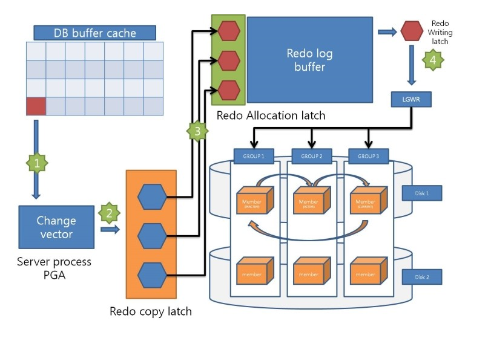

# Redo 로그

# Redo

-   **모든 변경사항을 Redo 로그에 기록하며 데이터베이스를 복구할 때 사용**한다.

1.  Online Redo 로그

-   Redo 로그 버퍼에 버퍼링된 로그 엔트리를 기록한다.
-   최소 두 개 구성되어 라운드 로빈 로그 스위칭이 발생한다.

2.  Archived Redo 로그

-   Online Redo 로그 파일이 재사용 되기 전 다른 위치로 저장되는 백업본이다.
-   미디어 파일 복구시 사용된다.

## Redo 목적

1.  Database Recovery

-   Media Fail 발생 후 복구시 Archived Redo 로그를 활용한다.

2.  Cached Recovery

-   휘발성의 버퍼 캐시 데이터를 복구하기 위해 Redo 로그를 사용한다.
-   데이터 파일에는 Commit 된 변경 사항만 존재한다.

3.  **Fast Commit**

-   Commit 시 데이터 Block 쓰기 대신 Redo 쓰기를 한다.
-   변경 사항은 Redo 로그에는 바로 기록(Append 방식)하고, 버퍼 블록의 메모리-디스크 동기화는 나중에 일괄 수행한다.
-   Commit 시점에는 Undo 세그먼트 헤더의 트랜잭션 테이블에만 Commit 정보를 기록하고 블록 클린아웃은 나중에 수행하는 방식이다.

## Redo 로그를 사용하는 경우

-   3초마다 DBWR 프로세스로부터 신호를 받을 때
-   로그 버퍼의 1/3이 차거나 기록된 Redo 레코드가 1MB를 넘을 때
-   사용자가 커밋 또는 롤백 명령을 날릴 때

## COMMIT\_WRITE

1.  COMMIT\_WRITE(IMMEDIATE, WAIT)
2.  COMMIT\_WRITE(IMMEDIATE, NOWAIT)
3.  COMMIT\_WRITE(BATCH, WAIT)
4.  COMMIT\_WRITE(BATCH, NOWAIT)

## Redo 로깅 관련 모드

1.  \_DISABLE\_LOGGING = TRUE

-   Redo 로그에 기록하는 것만 패스하는 것으로 위험한 파라미터이다.

2.  NOLOGGING

-   NOLOGIGNG 모드임에도 불구하고 Redo 레코드가 발생한다.