# 친절한 SQL 튜닝 - 조시형

## 1장 SQL 처리 과정과 I/O

### 1.1 SQL 파싱과 최적화

* SQL 튜닝을 시작하기에 앞서 옵티마이저가 SQL을 어떻게 처리하는지, 서버 프로세스는 어떻게 읽고 저장하는지 살펴보자.

**옵티마이저**

* SQL 옵티마이저는 SQL쿼리를 최적하기 위해 최적의 실행 계획을 결정하며 아래와 같은 과정을 통해 이루어집니다. (네비게이션과 같은 역할을 해주는 최적의 실행 계획을 해주는 내부 엔진으로 기억하자)

1. 쿼리 파싱 및 분석 : SQL문을 분석하고 파싱하여 내부 표현으로 변환하여 분석.
2. 통계 정보 수집 : 테이블 및 인덱스 통계 정보 수집.
3. 실행 계획 생성 : 테이블 및 인덱스 액세스 방법, 조인 순서, 조인 방법 포함 실행.
4. 최적 실행 계획 선택 : 생성된 실행 계획 중에서 가장 효율적 선택함으로써 쿼리 실행 시간, 리소스 사용량 최소

**서버 프로세스**

1. 클라이언트 연결 수립.
2. SQL 쿼리 수신.
3. 쿼리 실행
4. 결과 반환
5. 연결 종료

**프로시저**

* 프로시저 : 데이터베이스 내에서 미리 컴파일되어 저장된 하나 이상의 SQL문과 프로그래밍 논리를 가진 데이터베이스 객체입니다.

```SQL
CREATE OR REPLACE PROCEDURE calculate_sum (
    num1 IN NUMBER,
    num2 IN NUMBER
)
IS
    total NUMBER;
BEGIN
    -- 입력된 두 숫자의 합을 계산합니다.
    total := num1 + num2;
    
    -- 결과를 출력합니다.
    DBMS_OUTPUT.PUT_LINE('두 숫자의 합: ' || total);
END;

-- 호출방법
BEGIN
    calculate_sum(10, 20);
END;
```

* SQL은 Structured Query Language 의 줄임말이다. PL/SQL 처럼 절차적 프로그래밍 기능을 구현할 수 있는 확장 언어도 제공하지만, 기본적으로 구조적이고 집합적이고 선언적인 질의 언어이다.
* 결과적으로는 구조적, 집합적이지만 결과집합을 만드는 과정은 절차적일 수 밖에 없기 때문에 프로시저가 필요하다. 그런 프로시저를 만들어 내는 DBMS 내부 엔진이 바로 SQL 옵티마이저이다.
* DBMS 내부에서 프로시저를 작성하고 컴파일해서 실행 가능한 상태로 만드는 전 과정을 **SQL 최적화**라고 한다.

**SQL최적화**

1. SQL 파싱

* **SQL파서**가 파싱을 진행. 파싱을 요약하면 아래와 같음.
    * 파싱 트리 생성 : SQL 문의 구성요소를 분석하여 파싱 트리 생성
    * Syntax 생성 : 문법적 오류 유무 확인
    * Semantic 체크 : 의미상 오류 확인 (존재하지 않는 테이블 또는 컬럼 사용 유무 파악)

2. SQL 최적화

* 옵티마이저가 수집한 시스템 및 통계정보를 바탕으로 다양한 실행경로를 생성 비교 후 효율적인 하나 선택

3. 로우 소스 생성

* 실행경로를 실제 실행 가능한 코드, 프로시저 형태로 포맷팅 하는 단계

**SQL옵티마이저**

* SQL옵티마이저 : 작업을 가장 효율적으로 수행할 수 있는 최적의 데이터 액세스 경로를 선택해주는 DBMS 핵심 엔진

1. 쿼리를 수행하는 데 후보군이 될만한 실행계획 탐색
2. 데이터 딕셔너리에 수집해 둔 통계를 이용하여 각 실행계획의 예상비용 선택
3. 최저 비용을 나타내는 실행계획 선택

**실행계획과 비용**

* DBMS에는 SQL 실행경로 미리보기를 통해 SQL이 테이블을 스캔하는지 인덱스를 스캔하는지, 인덱스 스캔을 한다면 어떤 인덱스인지를 확인할 수 있다.

```SQL
CREATE INDEX tt1_x01 ON tt1(NO, id);
CREATE INDEX tt1_x02 ON tt1(NO, id, name);

SELECT 
	*
FROM
	tt1
WHERE
	NO = 2
	AND id = 9;

SELECT /*+ index(tt1 tt1_x02) */
	*
FROM
	tt1
WHERE
	NO = 2
	AND id = 9;

SELECT /*+ full(tt1) */
	*
FROM
	tt1
WHERE
	NO = 2
	AND id = 9;
```

* 위와 같이 인덱스를 생성하였을 때 옵티마이저는 T_X01 인덱스를 선택했다. 선택한 근거는 무엇일까?
* tt1_x02 인덱스를 선택했을 때는 코스트가 2, full scan을 선택했을 때는 코스트가 20으로 선택한 근거가 비용임을 알 수 있다.
* 비용은 쿼리를 수행하는 동안 발생할 것으로 예상되는 I/O 횟수 또는 예상 소요시간을 표현한 값이다.
* 하지만 네비게이션과 동일하게 목적지에 도착하기까지 걸리는 시간은 예상보다 늦게 도착할 수도 일찍 도착하기도 한다.
* SQL 실행계획에 표시되는 Cost도 어디까지나 예상치이며 옵티마이저가 통계정보를 활용해서 계산해 낸 값이다.

```SQL
/*+ INDEX(A A_X01) INDEX(B B_X01) */    -- 두 유효
/*+ INDEX(C), FULL(D)*/     -- 첫 번째 힌트만 유효

-- 스키마명 명시 X
SELECT /*+ FULL(SCOTT.EMP)*/    -- 무효
    FROM EMP

-- FROM 절 옆에 ALIAS 사용 시 힌트에도 ALIAS 사용
SELECT /*+ FULL(EMP)*/
    FROM EMP e
```

* 옵티마이저가 제공해주는 힌트를 사용할 때는 위와 같은 주의사항들에 맞춰서 사용하자.

```SQL
SELECT /*+ LEADING(A) USE_NL(B) INDEX(A (주문일자)) INDEX(B 고객_PK) */
    A. 주문번호, A.주문금액, B.고객명, B.연락처, B.주소
FROM 주문 A, 고객 B
WHERE A.주문일자 = :ORD_DT
AND   A.고객ID = B.고객ID
```

* 옵티마이저의 작은 실수가 기업에 큰 손실을 끼치는 시스템 같은 경우 위와 같이 빈틈없는 힌트 기술을 통해 다른 방식을 선택하지 못하도록 기술해준다.
* **자주 사용하는 힌트 목록은 27P 참고**

### 1.2 SQL 공유 및 재사용

* SQL 내부 최적화 과정을 알고나면 동시성이 높은 트랜잭션 처리 시스템에서 바인드 변수가 왜 중요한지 이해하자.

**소프트파싱 vs 하드파싱**

* **SQL 파싱, 최적화, 로우 소스 생성 과정**을 거쳐 생성한 내부 프로시저를 반복 재사용할 수 있도록 캐싱해 두는 메모리 공간을 **라이브러리 캐시**라고 한다.

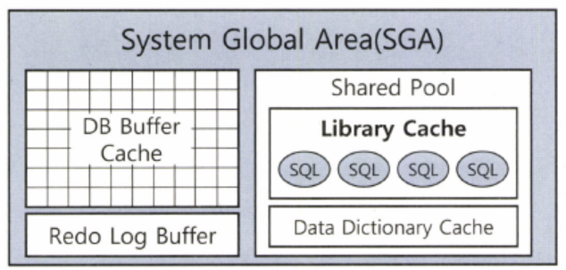

* 라이브러리 캐시는 위의 그림과 같은 구조이며 SGA구성요소이고, 서버 프로세스와 백그라운드 프로세스가 공통으로 액세스하는 데이터와 제어 구조를 캐싱하는 메모리 공간이다.

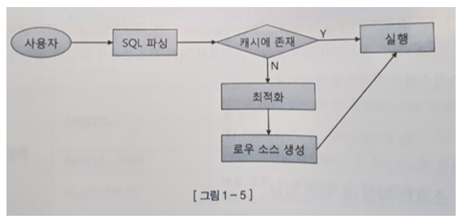

* 소프트 파싱과 하드 파싱은 위의 도식화한 그림으로 설명이 된다.

* **소프트파싱** : SQL을 캐시에서 찾아 바로 실행단계로 넘어가는 것
* **하드파싱** : 찾는 데 실패해 최적화 및 로우 소스 생성 단계까지 모두 거치는 것

**SQL 최적화 과정은 왜 하드한가?**

* 네비게이션을 예로 들어 가장 빠른 길을 선택하는 방식은 최적 경로 탐색이 꽤 어렵고 무거운 작업임을 알 수가 있다.
* 마찬가지로 옵티마이저 SQL을 최적할 때도 훨씬 많은 일을 수행한다.
    * ex) 다섯 개 테이블 조인 쿼리문 5! 가지 수, NL, 소트 머지, 해시, 테이블 전체, 인덱스 스캔 등등.. 고려해야 할 일이 상당히 많다.
* 데이터베이스에서 이루어지는 처리 과정은 대부분 I/O 작업에 집중되는 반면, 하드 파싱은 **CPU를 많이 소비하는 몇 안되는 작업** 중 하나이다.
* 어려운 하드파싱 작업을 거쳐 생성한 내부 프로시저를 **한 번만 사용하고 버린다면** 이만저만한 **비효율**이기 때문에 **라이브러리 캐시가 필요**하다

### 1.2.1 바인드 변수의 중요성

* 사용자 정의 함수/프로시저, 트리거, 패키지 등은 생성할 때부터 이름을 갖는다.
* 컴파일 상태로 딕셔너리에 저장되며, 사용자가 삭제하지 않는 한 영구적으로 보관된다.
* 실행할 때 라이브러리 캐시에 적재함으로써 여러 사용자가 공유하면서 재사용한다.

**이름없는 SQL문제**

* 반면에 SQL은 이름이 따로 없기 때문에 딕셔너리에 저장하지 않으며, 처음 실행할 때 최적화 과정을 거쳐 동적으로 생성한 내부 프로시저를 라이브러리 캐시에 적재함으로써 재사용한다.
* 캐시 공간이 부족하게되면 버려졌다가 다음에 다시 실행할 떄 똑같은 과정을 거쳐 캐시에 적재된다.
* 라이브러리 캐시에서 SQL을 찾기 위해 사용하는 키 값이 SQL문 그 자체이므로 각각 최적화를 진행하고 라이브러리 캐시에서 별도 공간을 사용한다.

**아래 중요한 예제를 통해 알아보자**

* 500만 고객을 보유한 어떤 쇼핑몰에서 로그인 모듈 담당 개발자가 프로그램을 아래와 같이 작성했다고 하자.

```SQL
public void login(String login_id) throws Exception{
    String SQLStmt = "SELECT * FROM CUSTOMER WHERE LOGIN_ID = '" + login_id + "'";
    Statement st = con.createStatement();
    ResultSet rs = st.executeQuery(SQLStmt);
    if(rs.next()){
        // do anything
    }
    rs.close();
    st.close();
}
```

* 위와 같이 코드를 작성할 경우 100만 고객이 동시에 시스템 접속을 하면 무슨 일이 발생할까?
* DBMS에 발생하는 부하는 대게 과도한 I/O가 원인이기 때문에 여러 종류의 경합 떄문에 로그인 처리가 제대로 처리되지 않을 것이다.
* 이유는 SQL 하드파싱 때문이다. 내부 라이브러리 캐시(V$SQL)를 조회해보자.

```SQL
SELECT * FROM CUSTOMER WHERE LOGIN_ID = 'oraking'
SELECT * FROM CUSTOMER WHERE LOGIN_ID = 'javaking'
SELECT * FROM CUSTOMER WHERE LOGIN_ID = 'tommy'
...
...

-- 내부 프로시저
create procedure LOGIN_ORAKING() {...}
create procedure LOGIN_JAVAKING() {...}
create procedure LOGIN_TOMMY() {...}
...
...
```

* 로그인 프로그램을 이렇게 작성하게 되면 고객이 로그인할 때마다 DBMS 내부 프로시저를 하나씩 만들어서 라이브러리 캐시에 적재하는 셈이다.
* 이런식으로 여러 개 생성할 것이 아니라 로그인ID를 파라미터로 받는 프로시저 하나를 공유하면서 재사용 하는 것이 유리하다.

```SQL
-- 로그인 ID를 파라미터로 받는 프로시저를 하나로 공유한다면?
create procedure LOGIN (login_id in varchar2) {...}

public void login(String login_id) throws Exception{
    String SQLStmt = "SELECT * FROM CUSTOMER WHERE LOGIN_ID = ?";
    PreparedStatement st = con.prepareStatement(SQLStmt);
    st.setString(1, login_id);
    ResultSet rs = st.executeQuery();
    if(rs.next()){
        // do anything
    }
    rs.close();
    st.close();
}

-- 아래와 같은 로그인과 관련해서 아래 SQL 하나만 발견된다.
SELECT * FROM CUSTOMER WHERE LOGIN_ID = :1
```

* 이처럼 파라미터 Driven 방식으로 SQL을 작성하는 방법이 제공되는데 이 것이 바로 바인드 변수이다.
* 종합해보자면 하드파싱은 하나만 사용함으로써 캐싱된 SQL을 100만 고객이 공유하고 재사용함으로써 부담을 줄이는 것이다.

### 1.3 데이터 저장 구조 및 I/O 메커니즘

* I/O 튜닝이 곧 SQL 튜닝이라고 해도 과언이 아닐만큼 I/O 이해에 대한 이해가 중요할 수 밖에 없다. 데이터 저장 구조, 디스크 및 메모리에서 데이터를 읽는 메커니즘을 제대로 살펴보자.

**SQL이 느린이유**

* SQL이 느린 이유는 십중팔구 I/O 때문이다. 구체적으로 디스크 I/O 때문이다.
* 그렇다면 I/O란 무엇일까 이 책의 저자는 I/O 를 잠(SLEEP) 이라고 설명한다.
* OS 또는 I/O 시스템이 처리하는 동안 프로세스는 잠을 자기 때문이다.

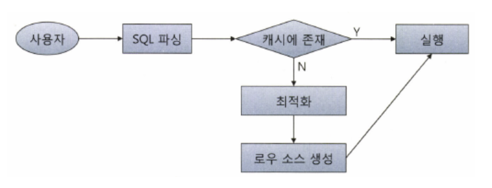

* 프로세스는 실행 중인 프로그램이며 위와 같은 생명주기를 같는다.
* 생성 이후 종료 전까지의 준비와 실행과 대기 상태를 반복한다.(new -> ready -> running -> wait -> terminated)
* 여러 프로세스가 하나의 CPU를 공유할 수 있지만 특정 순간에는 하나의 프로세스만 CPU를 사용할 수 있기 때문에 이런 메커니즘이 필요하다.
* interrupt 없이 일하는 프로세스도 디스크에서 데이터를 읽을 때는 CPU를 OS에 반환하고 수면상태에서 I/O가 완료되기를 기다린다.
* 열심히 일해야 할 프로세스가 잠을 자고 있으니 I/O가 많으면 성능이 느려질 수 밖에 없다.
* 일반적으로 I/O Call 속도는 Single Block I/O 기준 평균 10ms 

### 1.3.1 데이터베이스 저장 구조

* 데이터를 저장하려면 먼저 테이블스페이스를 생성해야 한다.
* 테이블스페이스는 세그먼트를 담는 콘테이너로서, **여러 개의 데이터파일**로 구성된다.

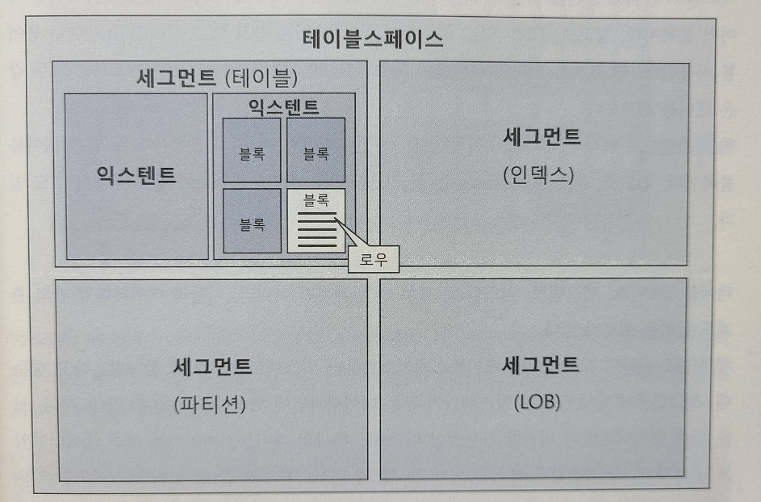

* 위와 같이 테이블스페이스를 생성했으면 그림처럼 세그먼트(테이블, 저장공간이 필요한 오브젝트)를 생성한다.
* 세그먼트는 여러 익스텐트로 구성되어있다. 파티션 구조가 아니라면 테이블도 하나의 세그먼트이고 인덱스도 하나의 세그먼트이다. (즉 각 파티션이 하나의 세그먼트)
* 익스텐트는 연속된 블록들의 집합이기도 하다. 연속된 여러 개의 데이터 블록으로 구성되어있다.
* 실제로 저장하는 공간은 데이트 블록이고 한 블록에 저장된 레코드는 모두 같은 테이블 레코드이다.
* 데이터베이스에서 데이터를 읽고 쓰는 단위는 블록이며, 특정 레코드 하나를 읽는다하더라도 해당 블록을 통째로 읽는다.
* 각 용어에 대해 간단히 정의하자면 아래와 같다.

1. 블록 : 데이터를 읽고 쓰는 단위
2. 익스텐트 : 공간을 확장하는 단위, 연속된 블록 집합
3. 세그먼트 : 데이터 저장공간이 필요한 오브젝트
4. 테이블스페이스 : 세그먼트를 담는 콘테이너
5. 데이터파일 : 디스크 상의 물리적인 OS 파일

### 1.3.2 시퀀셜 액세스 vs 랜덤 엑세스

* 테이블 또는 인덱스 블록을 액세스하는 방식으로는 **시퀀셜 액세스와 랜덤 액세스** 두 가지가 있다.
* 시퀀셜 엑세스는 단어의 의미와 같이 연결된 순서에 따라 차례대로 블록을 읽는 방식이다.
* 인덱스 리프 블록은 앞뒤를 가리키는 주소값을 통해 논리적으로 연결되어있는데 이 주소 값에 따라 앞 또는 뒤로 순차적으로 스캔하는 방식이 시퀀셜 액세스에 해당한다.

**데이터 블록 간에는 서로 논리적인 연결고리를 갖고 있지 않은데 어떻게 액세스할까?**

* 오라클은 세그먼트에 할당된 익스텐트 목록을 세그먼트 헤더에 맵으로 관리한다.
* 익스텐트 맵은 각 인스텐트의 첫 번째 블록 주소 값을 갖는다.
* 읽어야 할 익스텐트 목록을 익스텐트 맵에서 얻고, 연속해서 저장된 블록을 순서대로 읽으면 이것이 Full Table Scan 이다.
* 랜덤 액세스는 논리적, 물리적인 순서를 따르지 않고, 레코드 하나를 읽기 위해 한 블록씩 접근하는 방식이다.

### 1.3.3 논리적I/O vs 물리적 I/O

**DB 버퍼캐시**

* 디스크 I/O가 SQL 성능을 결정하는 것은 거듭 강조한다.
* 자주 읽는 블록을 매번 디스크에서 읽는 것은 비효율적이고 DBMS에 데이터 캐싱 매커니즘이 필수인 이유이다.
* 앞서 알아본 라이브러리 캐시가 SQL과 실행계획, DB 저장형 함수/프로시저 등을 캐싱하는 **코드 캐시**라고 한다면, **DB 버퍼 캐시는 데이터 캐시**라고 할 수 있다(같은 블록에 대한 반복적인 I/O Call을 줄이는 목적)
* 서버 프로세스와 데이터 파일 사이에 위치함으로써 데이터 블록을 읽기 전에 버퍼캐시부터 탐색한다.
* 운 좋게 캐시에서 블록을 찾으면 프로세스가 잠을 자지 않아도 되니 속도는 당연히 빠르고, 찾지 못하더라도 한 번은 I/O Call을 하고 잠을 자겠지만 두 번째 부터는 잠을 자지 않아도 되는 공유메모리 영역으로 같은 블록을 읽는 다른 프로세스도 득을 본다.

**논리적 I/O vs 물리적 I/O**

* 논리적 블록 I/O : SQL문을 처리하는 과정에 메모리 버퍼캐시에서 발생한 총 블록 I/O (메모리 I/O)
* 물리적 블록 I/O : 디스크에서 발생한 총 블록 I/O (디스크 I/O)

* SQL 처리 도중 읽어야 할 블록을 버퍼캐시에서 찾지 못할 때만 디스크를 액세스하므로 논리적 블록 I/O 중 일부를 물리적으로 I/O 한다.
* 메모리 I/O는 전기적 신호인데 반해, 디스크 I/O는 액세스 암을 통해 물리적 작용이 일어나므로 논리적 I/O보다 10,000배쯤 느리다.
* SQL을 수행하려면 데이터가 담긴 블록을 읽어야 하는데 데이터를 입력하거나 삭제하지 않는 상황에서 조건절에 같은 변수 값을 입력하면, 아무리 여러 번 실행해도 매번 읽는 블록 수는 같다.
* **SQL을 수행하면서 읽은 총 블록 I/O**가 **논리적 I/O**이다.
* DB 버퍼캐시에서 블록을 찾지 못해 **디스크에서 읽은 블록 I/O**가 **물리적 I/O** 이다.

**버퍼캐시 히트율**

* 버퍼캐시 효율을 측정하는 데 전통적으로 가장 많이 사용해 온 지표는 **버퍼캐시 히트율(BCHR)**이다.

**BCHR = (논리적 I/O - 물리적 I/O / 논리적 I/O) * 100**

* BCHR은 읽은 전제 블록 중에서 물리적인 디스크 I/O를 수반하지 않고 곧바로 메모리에서 찾은 비율을 나타낸다.
* 일반적으로 시스템 레벨에서 평균 99% 히트율을 달성해야 한다.
* 실제 SQL 성능을 향상하려면 물리적 I/O 가 아닌 논리적 I/O를 줄여야 한다. 공식을 아래와 같이 변경하면 쉽게 알 수 있다.

**물리적 I/O = 논리적 I/O * (100 - BCHR)**

* 즉 논리적 I/O는 일정하여 물리적 I/O는 BCHR에 의해 결정되는데 시스템 상황에 의해 결정되기 때문에 SQL 성능을 높이기 위해서는 **논리적 I/O를 줄이는 일뿐이다.**
* **논리적 I/O를 줄임으로써 물리적 I/O를 줄이는 것이 곧 SQL 튜닝이다.**

### 1.3.4 SingleBlock I/O vs MultiBlock I/O

* 메모리 캐시가 클수록 좋지만, 데이터를 모두 캐시에 적재할 수는 없으므로 캐시에서 찾지 못한 데이터 블록은 I/O Call을 통해 디스크에서 DB 버퍼캐시로 적재하고서 읽는다.
* I/O Call을 할 때, 한 번에 한 블록씩 요청하기도 하고, 여러 블록씩 요청하기도 하는데 **한 번에 한블록씩 요청해서 메모리에 적재하는 방식을 Single Block I/O** 라고한다.
* 반면에 **한 번에 여러 블록씩 요청해서 메모리에 적재하는 방식을 Multiblock I/O** 라고 한다.
* 인덱스를 이용할 때는 기본적으로 인덱스와 테이블 모두 Single Block I/O 방식을 사용한다.
* 반대로 많은 데이터 블록을 읽을 때는 Multiblock I/O 방식이 효율적이다(Full Scan).
* 정리하자면 MultiBlock I/O는 캐시에서 찾지 못한 특정 블록을 읽으려고 할 때 캐시에 미리 적재하는 기능이며 Full Scan 할 때 성능이 좋다.

### 1.3.5 Table Full Scan vs Index Range Scan

* 테이블에 저장된 데이터를 읽는 방식은 크게 두 가지다. 테이블 전체를 스캔해서 읽는 방식과 인덱스를 이용해서 읽는 방식이다. 
* Tabls Full Scan 은 말그대로 테이블에 속한 블록 '전체'를 읽어서 사용자가 원하는 데이터를 찾는 방식이다.
* 인덱스를 이용한 테이블 액세스는 인덱스에서 일정량을 스캔하면서 얻은 ROWID로 테이블 레코드를 찾아가는 방식이다.

**무조건적으로 Index Scan 을 사용하는 것이 빠르진 않다?**

여지껏 무조건 Index Scan 을 타야 속도가 빠른 줄 알았는데 이 책에서는 그렇지 않다라고 정의하고 있다. 이유에 대해서 알아보자.

* **Table Full Scan**은 시퀀셜 액세스와 Multiblock I/O 방식으로 디스크 블록을 읽는다.한 블록에 속한 모든 레코드를 한 번에 읽어 들이고, 캐시에서 찾지 못하면 한 번의 수면을 통해 수십 ~ 수백 개 블록을 한꺼번에 I/O 하는 메커니즘이다.
* 하지만 수십 ~ 수백 건의 소량 데이터를 찾을 때 수백만 ~ 수천만 건 데이터를 스캔하는건 비효율적이므로 소량 데이터를 검색할 때는 반드시 인덱스를 이용해야 한다.
* **Index Range Scan**을 통한 테이블 액세스는 랜덤 액세스와 Single Block I/O 방식으로 디스크 블록을 읽는다. 캐시에서 블록을 못찾으면, '레코드 하나를 읽기 위해 매번 잠을 자는 I/O 메커니즘이다. 따라서 많은 데이터를 읽을 때는 Table Full Scan보다 불리하다.

## 2장 인덱스 기본

* 인덱스에 대한 개념만 알고있을 뿐 명확한 그림이 없는 상태에서 설계하고 개발하니 성능이 좋을 리 없다.
* 인덱스 탐색 과정이 **수직적 탐색과 수평적 탐색** 두 단계로 이루어진다는 사실에 대해 유념하며 알아보자.

### 2.1 인덱스 구조 및 탐색

**데이터를 찾는 두 가지 방법**

* 어떤 초등학교를 방문해 '홍길동' 학생을 찾는 방법은 두 가지다.
* 첫째는, 1학년 1반부터 6학년 맨 마지막 반까지 모든 교실을 돌며 홍길동 학생을 찾는 것이다.
* 둘째는, 교무실에서 학생 명부를 조회해 홍길동 학생이 있는 교실만 찾아가는 것이다.
* 결과는 홍길동 학생이 많으면 첫째, 몇 안 되면 후자가 빠르다.

* 데이터베이스 테이블에서 데이터를 찾는 방법도 크게 아래 두 가지에 해당한다.

1. 테이블 전체를 스캔한다.
2. 인덱스를 이용한다.

* 모든 교실을 돌며 학생을 찾는 경우가 전자이고, 학생부를 이용한 경우가 후자인 것이다.
* 테이블 전체 스캔과 관련해서는 튜인 요소가 많지 않지만, 인덱스와 관련해서는 튜닝 요소가 매우 많고 기법도 다양하다.

**인덱스 튜닝의 두 가지 핵심요소**

1. 인덱스 스캔 과정에서 발생하는 비효율을 줄이는 것. 즉, **인덱스 스캔 효율화 튜닝**

* 학생명부에서 시력이 1.0 ~ 1.5 인 홍길동 학생을 찾는 경우를 예로 들어보자.
* 학생명부를 이름과 시력순으로 정렬해 두었다면 소량만 스캔하면 되지만 학생명부를 시력과 이름순으로 정렬해 두었다면 똑같이 두명을 찾는데도 많은 양을 스캔해야 한다.

2. 테이블 액세스 횟수를 줄이는 것. 즉, **랜덤 액세스 최소화 튜닝**

* 시력이 1.0 ~ 1.5인 학생은 50명이고 이름이 홍길동인 학생은 5명이고, 시력이 1.0 ~ 1.5인 홍길동 학생은 2명이다.
    * 이름과 시력만으로 각각 정렬한 학생명부가 있다면 어느 쪽이 더 효과적일까?
    * 당연히, 이름순으로 정렬한 학생명부를 선택하면 교실을 다섯 번만 찾아가면 되기 때문에 유리하다.
    * 어떤 학생명부를 사용하느냐에 따라 교실 방문 횟수는 다르다.

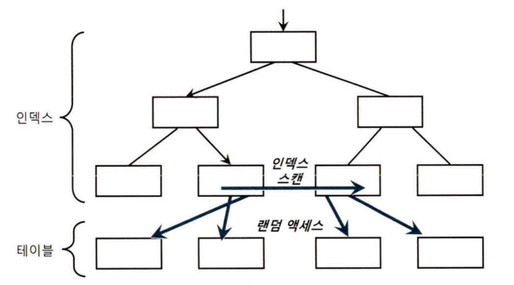

* 인덱스 스캔 효율화 튜닝과 랜덤 액세스 최소화 튜닝 둘 다 중요하지만, 더 중요한 하나를 고른다면 랜덤 액세스 최소화 튜닝이다.
* 홍길동 학생을 찾는 예만 하더라도 **학생명부를 스캔하는 과정에도 비효율이 있겠지만, 학생명부에 없는 나머지 정보를 얻기 위해 직접 교실을 찾아가는 부담이 훨씬 더 크다.**
* 이 예제가 말해주는건 인덱스 튜닝의 핵심요소이며 가장 중요한 결론은 **SQL 튜닝은 랜덤 I/O와의 전쟁이다.**

**SQL 튜닝은 랜덤 I/O 와의 전쟁**

* 데이터베이스 성능이 느린 이유는 디스크 I/O 때문이다.
* 읽어야 할 데이터량이 많고, 그 과정에 I/O가 많이 발생할 때 느리다.

### 2.1.1 인덱스 구조

* **인덱스** : 대용량 테이블에서 필요한 데이터만 빠르게 효율적으로 액세스하기 위해 사용하는 오브젝트이다. 
* 즉, 책 뒤쪽에 있는 색인과 같은 역할을 한다.
* 데이터베이스에서도 인덱스 없이 데이터를 검색하려면, 테이블을 처음부터 끝까지 모두 읽어야 한다.
* 반면, 인덱스를 이용하면 일부만 읽고 멈출 수 있으며 범위 스캔이 가능하다. 범위 스캔이 가능한 이유는 인덱스가 정렬돼 있기 때문이다.

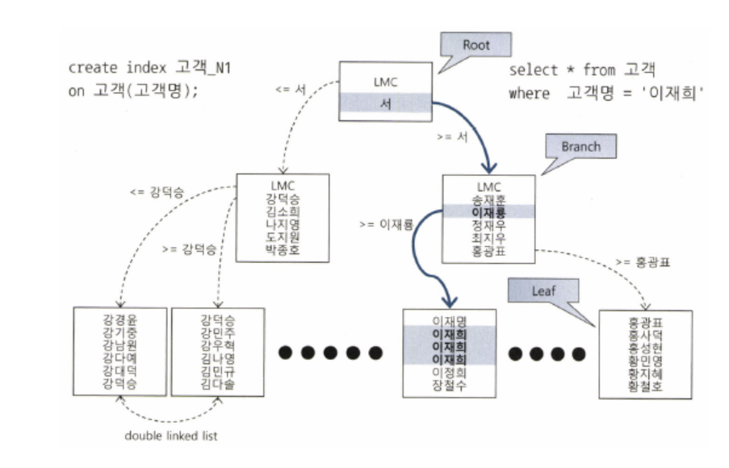

* DBMS는 일반적으로 B+Tree 인덱스를 사용하는데 구조는 위의 그림과 같다.
* 나무를 거꾸로 뒤집은 모양으로 뿌리(Root)가 위에 있고 가지(Branch)를 거쳐 맨 아래에 잎사귀(Leaf)가 존재한다.
* 리프 블록에 저장된 각 레코드는 키값 순으로 정렬돼 있을 뿐만 아니라 테이블 레코드를 가리키는 주소값 ROWID를 갖으며 인덱스 키값이 같으면 ROWID 순으로 정렬된다.
* 인덱스를 스캔하는 이유는 검색 조건을 만족하는 소량의 데이터를 빨리 찾고 거기서 ROWID를 얻기위함이다.

* ROWID = 데이터 블록 주소 + 로우 번호
* 데이터 블록 주소 = 데이터 파일 번호 + 블록 번호
* 블록 번호 : 데이터파일 내에서 부여한 상대적 순번
* 로우 번호 : 블록 내 순번 

* 수직적 탐색 : **인덱스 스캔 시작지점을 찾는 과정**
* 수평적 탐색 : **데이터를 찾는 과정**

### 2.2.2 인덱스 수직적 탐색

* 인덱스 수직적 탐색은 정렬된 인덱스 레코드 중 조건을 만족하는 첫 번째 레코드를 찾는 과정이며 즉, **인덱스 스캔 시작지점을 찾는 과정이다.**
* 루트를 포함해 브랜치 블록에 저장된 각 인덱스 레코드는 하위 블록에 대한 주소값을 갖는다. 이것이 루트에서 시작해 리프블록까지 수직적 탐색이 가능한 이유이다.
* 수직적 탐색 과정에 찾고자 하는 값보다 크거나 같은 값을 만나면, 바로 직전 레코드가 가리키는 하위 블록으로 이동한다.

* 인덱스를 수직적으로 탐색할 때는, 등산 푯말과 같은 역할을 한다.
* 이는, **조건을 만족하는 첫 번째 레코드**가 목표 지점임을 기억하자.

### 2.2.3 인덱스 수평적 탐색

* 수직적 탐색을 통해 스캔 시작점을 찾았으면, 찾고자 하는 데이터가 더 안나타날 때까지 인덱스 리프 블록을 수평적으로 스캔한다. 이는 인덱스에서 본격적으로 데이터를 찾는 과정이다.
* 인덱스 리프 블록끼리는 서로 앞뒤 블록에 대한 주소값을 갖는 양방향 연결 리스트(double linked list) 구조이다.
* 인덱스를 수평적으로 탐색하는 이유는 조건절을 만족하는 데이터를 모두 찾고 ROWID를 얻기 위해서이다.
* 필요한 컬럼을 인덱스가 모두 갖고 있어 인덱스만 스캔하고 끝나는 경우도 있지만, 일반적으로 액세스를 스캔하고서 테이블도 액세스한다. (이 때 ROWID가 필요하다.)

### 2.2.4 결합 인덱스 구조와 탐색

```SQL
SELECT 
    이름, 설명
FROM 
    사원
WHERE 
    성별 = '여자'
    AND 이름 = '유관순'
```

1. 인덱스를 **성별 + 이름** 순으로 구성한 경우

    * 총 사원 50명 중 성별 = 여자인 레코드 25건을 찾고, 이름을 검사해 최종적으로 2명 출력 -> 25번의 검사

2. 인덱스를 **이름+ 성별** 순으로 구성한 경우

    * 총 사원 50명 중 이름 = '유관순'인 레코드 2건을 찾고, 거기서 성별을 검사해 최종적으로 2명 출력 -> 2번의 검사

* 여기서 알 수 있듯, 선택도가 낮은 '이름' 컬럼을 앞쪽에 두고 결합인덱스를 생성해야 검사횟수를 줄일 수 있어 성능에 유리하다고들 알고 있다.
* 하지만 엑셀의 데이터 필터 기능과 같은 위와 달리 **B+TREE 인덱스는 엑셀처럼 평면 구조가 아니기에 어느 컬럼을 앞에 두든 일량에는 차이가 없다.**

### 2.2 인덱스 기본 사용법

* 인덱스 기본 사용법은 인덱스를 Range Scan 하는 방법을 의미한다.
* 인덱스를 Range Scan 할 수 없게 되는 이유를 알고 나면, Range Scan 하는 방법도 자연스럽게 터득한다.
* 인덱스 컬럼을 가공하지 않아야 인덱스를 정상적으로 사용할 수 있다.
* 인덱스를 정상적으로 사용한다라는 표현은 리프 블록에서 스캔 시작점을 찾아 거기서부터 스캔하다가 중간에 멈추는 것을 의미한다. **(리프블록 일부만 스캔하는 Index Range Scan)**
* 인덱스 컬럼을 가공해도 인덱스를 사용할 수는 있지만, 스캔 시작점을 찾을 수 없고 멈출 수 없어 리프 블록 전체를 스캔해야만 한다. **(일부가 아닌 전체 스캔하는 Index Full Scan)**

### 2.2.1 인덱스를 Range Scan 할 수 없는 이유

모든 SQL 튜닝 책은 이와 같이 말한다. **인덱스 컬럼을 가공하면 인덱스를 정상적으로 사용할 수 없다.**

* 기본 중에서 기본에 해당하므로 모르는 사람은 없으나, 이유에 대해서는 잘설명하지 못한다 이유는 무엇일까??
* 이를 설명하기 위해서는 앞서 말한 수직적, 수평적 탐색인 인덱스 탐색 과정을 알아야 한다.
* 인덱스 컬럼을 가공했을 때 인덱스를 정상적으로 사용할 수 없는 이유는 **인덱스 스캔 시작점을 찾을 수 없기 때문이다.**
* 쉽게 말하면 Index Range Scan은 범위를 인덱스에서 범위를 스캔한다는 뜻인데, 일정 범위를 스캔하려면 시작 지점과 끝지점이 존재해야한다.

**아래 예제를 통해서 알아보자**

* 2007년 1월 1일 이후에 태어난 첫 번째 학생을 찾는 과정이 인덱스로 말하면 수직적 탐색에 해당한다.
* 데이터베이스에서 아래 조건절을 처리할 때도 똑같은 과정을 거친다.

```sql
where 생년월일 between '20070101' and '20070131'
```

* 이번에는 년도와 상관없이 5월에 태어난 학생을 찾아보자. 스캔 시작점은 어디고 어디서 멈춰야 할까??

```sql
where substr(생년월일, 5, 2) = '05'
```

* 위와 같이 조건절을 처리할 경우 인덱스에는 가공되지 않은 값이 저장되어있어 스캔 시작점과 끝지점을 찾을 수 없다.
* 아래 예제도 전부 마찬가지로 해당한다.

```sql
where nvl(주문수량, 0) < 100
where 업체명 like '%대한%'
where (전화번호 = :tel_no OR 고객명 = :cust_nm)
where (전화번호 in :tel_no1, :tel_no2)
```

* SQL을 아래와 같이 UNION ALL 방식으로 작성하면 각 브랜치 별로 인덱스 스캔 시작점을 찾을 수 있으므로 Range Scan이 가능하다.
* 위와 같은 쿼리를 UNION ALL 방식으로 아래와 같이 작성하면 Index Range Scan 을 사용할 수 있다.

```sql
select *
from 고객
where 고객명 = :cust_nm
union all 
select *
from 고객
where 전화번호 = :tel_no
and (고객명 <> :cust_nm or 고객명 is null)

select * 
from 고객
where 전화번호 = :tel_no1
select *
from 고객
where 전화번호 = :tel_no2
```

* 번외로 IN 조건절에 대해서는 SQL 옵티마이저가 IN_List Iterator 방식을 사용하여, IN-List 개수만큼 Index Range Scan을 반복함으로써 UNION ALL 으로 변환한 것과 같은 효과를 얻을 수가 있다.
* 정리하자면 위에서 정의한 **nvl이나 like 처럼 가공한 인덱스 컬럼을 정상적으로 Index를 사용할 수 없으나, OR 또는 IN 조건절은 옵티마이저의 쿼리 변환을 통해 Index Range Scan 으로 처리되기도 한다.**

### 2.2.2 더 중요한 인덱스 사용 조건

* 인덱스를 정상적으로 사용하는데 있어 더 중요한 선행조건이 있다.
* 인덱스를 아래 그림과 같이 소속팀 + 사원명 + 연령 순으로 구성했다고 가정하자.

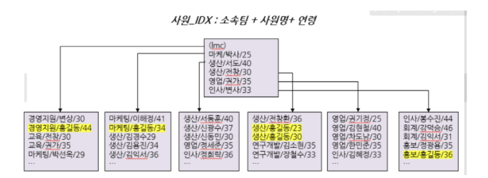

```SQL
SELECT 사원번호, 소속팀, 연령, 입사일자, 전화번호
FROM    사원
WHERE 사원명 = '홍길동'
```

* 데이터를 소속팀 순으로 정렬하고, 소속팀이 같으면 사원명 순으로 정렬하고, 사원명까지 같으면 연령순으로 정렬한다는 의미이다.
* 이름이 같은 사원이더라도 소속팀이 다르면 서로 멀리 떨어져 인덱스 스캔 시작점을 찾을 수 없고, 어디서 멈춰야 할지도 알 수 없다. (인덱스 리프 블록을 처음부터 끝까지 모두 스캔해야 한다.)
* 인덱스를 Range Scan 하기 위한 가장 첫 번째 조건은 인덱스 선두 컬럼이 조건절에 있어야 한다는 사실이다.

**아래 예제는 인덱스 컬럼을 가공했는데 Range Scan하는 경우의 예이다.**

```sql
-- TXA1234_TX02 인덱스 : 기준연도 + 과세구분코드 + 보고회차 + 실명확인번호

SELECT * FROM 
WHERE 기준연도 = :stdr_year
AND SUBSTR(과세구분코드, 1, 4) =: txtn_dcd
AND 보고회차 = :rpt_tmrd
AND 실명확인번호 = :rnm_cnfm_no
```

* 인덱스를 Range Scan 하려면 인덱스 선두 컬럼이 가공되지 않은 상태로 조건절에 있어야 한다.
* 반대로 말해 **인덱스 선두 컬럼이 가공되지 않은 상태로 조건절에 있으면 인덱스 Range Scan은 무조건 가능하다.**
* 위의 예제에서는 선두 컬럼인 '기준연도'를 가공하지 않았으므로 인덱스 Range Scan이 가능하다.

**인덱스 잘타니까 튜닝 끝??**

* SQL을 개발하면서 실행계획을 확인하지 않는 개발자가 대다수이다.
* 확인하더라도 인덱스를 타는지, 안타는지 확인하는 수준에 그친다. (인덱스를 잘 타면 성능도 문제없다고 생각한다.)
* 인덱스를 정말 잘 타는지는 인덱스 리프 블록에서 스캔하는 양을 따져봐야 알 수 있다.

```sql
SELECT *
FROM 주문상품
WHERE 주문일자 =:ord_dt
AND 상품번호 LIKE '%PING%'

SELECT *
FROM 주문상품
WHERE 주문일자 =:ord_dt
AND SUBSTR(상품번호, 1, 4) = 'PING';
```

* 위 SQL에서는 상품번호는 스캔 범위를 줄이는데 전혀 역할을 하지 못한다.
* 첫 번째 SQL은 중간 값 검색이기 때문이고, 두 번재 SQL은 컬럼을 가공했기 때문이다.

### 2.2.3 인덱스를 이용한 소트 연산 생략

* **인덱스를 Range Scan 할 수 있는 이유는 데이터가 정렬돼 있기 때문이다.**
* 찾고자 하는 데이터가 정렬된 상태로 서로 모여있기 때문에 전체가 아닌 일정 부분만 읽다가 멈출 수 있다.
* 인덱스 컬럼을 가공해도 인덱스를 사용할 수 있지만, 찾고자 하는 데이터가 전체 구간에 흩어져 있기 때문에 Range Scan이 불가능하거나 비효율이 발생한다.
* 하지만 테이블과 달리 인덱스는 정렬돼어있기 때문에 Range Scan이 가능하고, 소트 연산 생략효과도 부수적으로 얻게 된다.

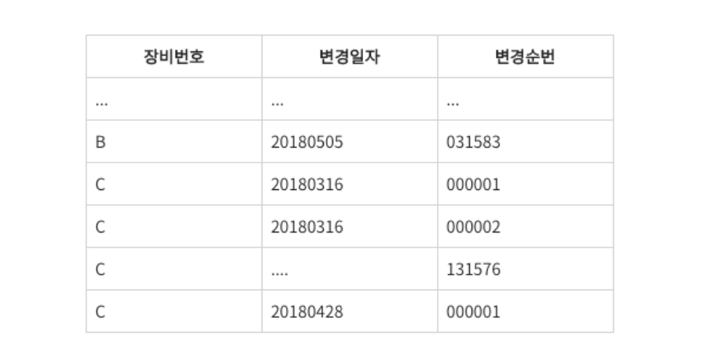

* 위 그림에서는 장비번호 + 변경일자 + 변경순번으로 PK가 구성되어있다.

```sql
SELECT *
FROM 상태변경이력
WHERE 장비번호 = 'C'
AND 변경일자 = '20180316'
```

* 위와 같이 장비번호와 변경일자를 모두 '=' 조건으로 검색할 때 PK 인덱스를 사용하면 결과집합은 변경순번 순으로 출력된다.
* 옵티마이저는 이런 속성을 활용해 SQL에 ORDER BY 가 있어도 정렬 연산을 따로 수행하지 않는다.
* PK 인덱스를 스캔하면서 출력한 결과집합은 어차피 변경순번 순으로 정렬되기 때문이다.
* 실행계획에 SORT ORDER BY 연산이 없음을 확인해보자.

### 2.2.4 ORDER BY 절에서 컬럼 가공

* **인덱스 컬럼을 가공하면 인덱스를 정상적으로 사용할 수 없다** 라고 말하는 인덱스 컬럼은 대게 조건절에 사용한 컬럼을 의미한다.
* 그런데 조건절이 아닌 ORDER BY 또는 SELECT-LIST 에서 컬럼을 가공함으로 인해 인덱스를 정상적으로 사용할 수 없는 경우도 종종 있다.

**아래와 같은 예제를 주의하자**

```SQL
SELECT * 
FROM
(
    SELECT TO_CHAR(A.주문번호, 'FM000000') AS 주문번호, A.업체번호, A.주문금액
        FROM 주문 A
    WHERE A.주문일자 = :dt
      AND A.주문번호 > NVL(:next_ord_no, 0)
    ORDER BY 주문번호
)
WHERE ROWNUM <= 30
```

* 위의 예제는 주문일자와 주문번호가 PK로 되어있음에도 정렬 연산(SORT ORDER BY) 연산이 실행계획에 나타난다. 이유는 무엇일까??
* 원인은 ORDER BY 에 기술한 주문번호는 순수 주문번호가 아니라 TO_CHAR 함수로 한 번 가공한 주문번호를 가리키기 때문이다. 해결방법은 간단하게 아래와 같이 작성하면 된다.

```SQL
SELECT * 
FROM
(
    SELECT TO_CHAR(A.주문번호, 'FM000000') AS 주문번호, A.업체번호, A.주문금액
        FROM 주문 A
    WHERE A.주문일자 = :dt
      AND A.주문번호 > NVL(:next_ord_no, 0)
    ORDER BY A.주문번호
)
WHERE ROWNUM <= 30
```

* 간단히 ORDER BY 절에 주문 테이블의 주문번호를 가리키는 Alias 를 붙여주기만 하면 된다.

### 2.2.5 SELECT-LIST 에서 컬럼 가공

* 인덱스를 장비번호 + 변경일자 + 변경순번 순으로 구성하면, 아래와 같이 변경순번 최소값을 구할 때도 옵티마이저는 정렬 연산을 따로 수행하지 않는다.
* 수직적 탐색을 통해 조건을 만족하는 가장 왼쪽 지점으로 내려가서 첫 번째 읽는 레코드가 바로 최소값이기 때문이다.

```SQL
SELECT MIN(변경순번)
FROM 상태변경이력
WHERE 장비번호 = 'C'
  AND 변경일자 = '20180316'
```

* 인덱스의 리프블록은 양방향 구조(DOUBLE LINKED LIST) 구조를 가지고 있기 때문에 최대값도 이하동문이다.
* 하지만 만약에 SQL을 아래와 같이 작성하면 정렬 연산을 생략할 수 없다. 이유는 뭘까??

```SQL
SELECT NVL(MAX(TO_NUMBER(변경순번)), 0)
FROM 상태변경이력
WHERE 장비번호 = 'C'
  AND 변경일자 = '20180316'
```

* 인덱스에는 문자열 기준으로 정렬돼 있는데, 이를 숫자값으로 변경하여 최종 변경순번을 요구하였기 때문에 SORT 연산이 추가된다.
* 이를 아래와 같이 바꾸면 정렬 연산 없이 최종 변경순번을 쉽게 찾을 수 있다.

```SQL
SELECT NVL(TO_NUMBER(MAX(변경순번)), 0)
FROM 상태변경이력
WHERE 장비번호 = 'C'
  AND 변경일자 = '20180316'
```

* 하지만 이는 애초에 변경순번 데이터타입을 숫자형으로 설계했다면 이렇게 튜닝할 일도 생기지 않는다.

**또 다른 예제를 통해 알아보자**

* 아래 SQL은 장비구분코드 = 'A001'에 해당하는 장비들의 최종 변경일자를 스칼라 서브쿼리를 이용해 상태변경이력 테이블에서 조회하고 있다.

```SQL
SELECT 장비번호, 장비명, 상태코드
      , (SELECT MAX(변경일자)
         FROM 상태변경이력
         WHERE 장비번호 = P.장비번호) 최종변경일자
FROM 장비 P
WHERE 장비구분코드 = 'A001'
```

* 정렬 연산 없이 MIN/MAX, FIRST ROW 방식으로 실행하고 있음을 실행계획에서 확인할 수 있다. 
* 하지만 최종변경일자에 더해 최종 변경순번까지 출력하고자 한다면 SQL을 어떻게 작성해야 할까?

```SQL
SELECT 장비번호, 장비명, 상태코드
      , (SELECT MAX(변경일자)
         FROM 상태변경이력
         WHERE 장비번호 = P.장비번호) 최종변경일자
      , (SELECT MAX(변경순번)
         FROM 상태변경이력
         WHERE 장비번호 = P.장비번호
         AND 변경일자 = (SELECT MAX(변경일자)
                        FROM 상태변경이력
                        WHERE 장비번호 = P.장비번호)) 최종변경순번
FROM 장비 P
WHERE 장비구분코드 = 'A001'
```

* 위와 같이 작성하면 상태변경이력 테이블을 여러 번 읽어야하므로 비효율적이며, PK 컬럼이 더 많아질 수록 복잡해지므로 성능도 나빠진다.
* 아래와 같이 작성하면 PK 컬럼이 많아져도 덜 복잡해지며 이런식으로 많이 코딩한다.

```SQL
SELECT 장비번호, 장비명, 상태코드
      , SUBSTR(최종이력, 1, 8) 최종변경일자
      , SUBSTR(최종이력, 9) 최종변경순번
FROM (
    SELECT 장비번호, 장비명, 상태코드
            ,(SELECT MAX(변경일자 || 변경순번)
              FROM 상태변경이력
              WHERE 장비번호 = P.장비번호) 최종이력
    FROM 장비 P
    WHERE 장비구분코드 = 'A001'
)
```

* 각 장비당 이력이 많지 않으면 크게 상관없지만, 이력이 많다면 성능에 문제가 될 수 있는 패턴이다. (인덱스 컬럼을 가공했기 때문)
* 각 장비에 속한 과거 이력 데이터를 모두 읽어야하므로 장비당 이력 레코드가 많다면 바로 직전에 본 복잡한 SQL보다 성능이 더 안 좋을 수 있다.
* 이럴 때 SQL은 어떻게 작성해야 효과적인지는 Top N 알고리즘을 설명하는 5장에서 소개한다.

### 2.2.6 자동 형변환

```SQL
SELECT * FROM 고객 
WHERE 생년월일 = 19821225
```

* 위의 SQL같은 경우에는 인덱스를 가공하지 않았음에도 불구하고 테이블 전체 스캔을 선택했다.
* 이유는 조건절 비교값을 숫자형으로 표현했기 때문에 나타난 현상이다. (아래와 같이 실행계획이 나타난다.)


```SQL
SELECT * FROM 고객 WHERE TO_NUMBER(생년월일) = 19821225
```

* 제대로 사용하려면 아래와 같이 날짜 포맷을 정학히 지정해 주는 코딩 습관이 필요하다.

```SQL
SELECT * FROM 고객 WHERE 가입일자 = TO_DATE('01-JAN-2018', 'DD-MON-YYYY')
```

* 숫자형과 문자형이 만날 경우 숫자형이 이기지만 연산자가 LIKE일 경우에는 다르다.
* LIKE 자체가 문자열 비교 연산자이므로 문자형 기준으로 숫자형 컬럼이 변환된다.
* 실무에서 일을 하다보면 LIKE 조건을 옵션 조건 처리 목적으로 사용하는 경우가 종종 있다.
* 예를 들어 거래 데이터 조회시 계좌번호는 사용자가 입력할 수도 안 할 수도 있는 옵션 조건인데, 이를 처리하기 위해서는 아래와 같이 두 개의 SQL이 필요하다.

```SQL
-- 사용자가 계좌번호를 입력할 경우
SELECT * FROM 거래
WHERE 계좌번호 = :acnt_no
AND 거래일자 between :trd_dt1 and :trd_dt2

-- 사용자가 계좌번호를 입력하지 않을 경우 
SELECT * FROM 거래
WHERE 거래일자 between :trd_dt1 and :trd_dt2
```

* 이를 하나의 SQL로 처리하기 위해 다양한 방식을 사용하는데 LIKE 조건을 사용하는 방식이 그 중 하나이다.
* 조회할 때 사용자가 계좌번호를 입력하지 않으면 :acnt_no 변수에 NULL 값을 입력함으로써 모든 계좌번호가 조회되도록 하는 것이다.

```SQL
SELECT * FROM 거래
WHERE 계좌번호 LIKE :acno_no || '%'
AND 거래일자 between :trd_dt1 and :trd_dt2
```

* 위의 방식을 사용하면 LIKE와 BETWEEN 조건을 같이 사용하여 인덱스 스캔 효율이 안 좋아진다.
* 숫자형 컬럼을 LIKE 조건으로 검색하면 자동 형봔으로 인해 계좌번호가 아예 인덱스 액세스 조건으로 사용되지 못하기 때문이다.

## 2.3 인덱스 확장 기능 사용법

* 인덱스 스캔 방식은 Index Range Scan 뿐만 아니라 Index Full Scan, Index Unique Scan, Index Skip Scan, Index Fast Full Scan 등이 존재한다. 각 스캔 방식의 주요 특징에 대해서 알아보자.

### 2.3.1 Index Range Scan

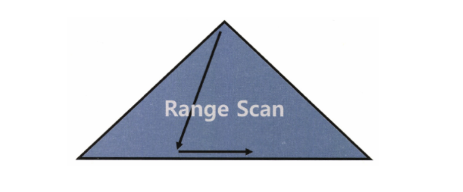

* Index Range Scan은 B+Tree 인덱스의 가장 일반적이고 정상적인 형태의 액세스 방식이다.
* 인덱스 루트에서 리프 블록까지 수직적으로 탐색한 후에 필요한 범위만 스캔한다.

```sql
SELECT * FROM EMP WHERE DEPNO = 20;
```

* 앞서 강조한 그대로 인덱스를 Range Scan 하려면 선두 컬럼을 가공하지 않은 상태로 조건절에 사용해야 한다. (선두 컬럼을 가공하지 않은 상태로 사용하면 무조건 Index Range Scan 가능)
* 가공하지 않으면 Index Range Scan을 타기 때문에 성능도 좋다라고 당연하게 생각하면 안된다.
* 성능은 인덱스 스캔 범위, 테이블 액세스 횟수를 얼마나 줄이는지가 관건이기 때문이다.


### 2.3.2 Index Full Scan

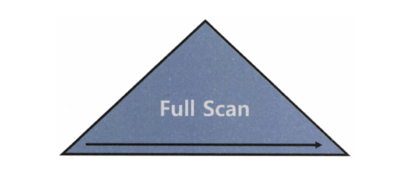

* Index Full Scan 은 위의 그림처럼 수직적 탐색없이 인덱스 리프 블록을 처음부터 끝까지 수평적으로 탐색하는 방식이다.
* 데이터 검색을 위한 최적의 인덱스가 없을 때 차선으로 선택된다.

```sql
CREATE INDEX EMP_ENAME_SAL_IDX ON EMP (ENAME, SAL);

SELECT * FROM EMP
WHERE SAL > 2000
ORDER BY ENAME;
```

* 위의 예제 SQL에서는 인덱스 선두 컬럼인 ENAME이 존재하지 않으므로 Index Range Scan은 불가능하고, 뒤쪽에 SAL이 존재하므로 Index Full Scan을 통해 Sal이 2000보다 큰 레코드를 찾을 수 있다.

### 2.3.3 Index Unique Scan

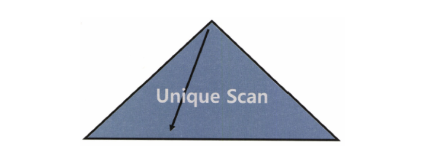

* Index Unique Scan은 그림처럼 수직적 탐색만으로 데이터를 찾는 스캔 방식이며 Unique 인덱스를 = 조건으로 탐색하는 경우에 작동한다.

```sql
CREATE UNIQUE INDEX PK_EMP ON EMP(EMPNO);

SELECT EMPNO, ENAME FROM EMP WHERE EMPNO = 7788;
```

* 해당 인덱스 키 컬럼을 모두 '=' 조건으로 검색할 때는 데이터를 한 건 찾는 순간 더 이상 탐색할 필요가 없다.
* Unique 인덱스라고 해도 범위검색 조건(between, like)으로 검색할 떄는 Index Range Scan으로 처리된다.
* 예를 들어, empno >= 7788 조건은 수직적 탐색만으로는 조건에 해당하는 레코드를 찾을 수 없고, PK 인덱스를 [주문일자 + 고객ID + 상품ID] 로 구성했는데 주문일자과 고객ID로만 검색하는 경우도 Index Range Scan에 해당한다.

### 2.3.4 Index Skip Scan

* 인덱스 선두 컬럼을 조건절에 사용하지 않으면 옵티마이저는 기본적으로 Table Full Scan을 선택한다. 또는 Table Full Scan 보다 I/O를 줄일 수 있으면 Index Full Scan을 사용한다.
* 오라클은 인덱스 선두 컬럼이 조건절에 없어도 인덱스를 활용하는 새로운 스캔 방식을 9i 버전부터 지원하는데 Index Skip Scan이 바로 그것이다.
* **인덱스 선두 컬럼의 Distinct Value 개수가 적고 후행 컬럼의 Distinct Value 개수가 많을 떄 유용하다.** 
    * ex) 고객테이블에서 성별이 Distinct Value가 적은 것, 고객번호가 Distinct Value 개수가 많은 것

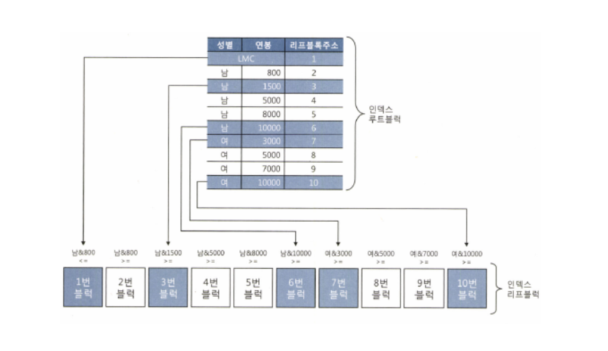

* 위의 그림은 Index Skip Scan 을 설명하기 위한 인덱스 루트 블록과 리프 블록을 그린 그림이다.
```sql
-- 성별과 연동 두 컬럼으로 구성된 결합 인덱스
SELECT * FROM 사원 WHERE 성별 = '남' AND 연봉 BETWEEN 2000 AND 4000
```

* 성별 = '남' 이면서 연동 >= 2000 인 첫 번째 레코드를 먼저 찾는다.
* 루트 블록 네 번째 레코드가 가리키는 4번 리프 블록으로 찾아가면 성별 = '남' 이면서 연봉 >= 5000 인 레코드를 만나게 되므로 바로 직전에 위치한 세 번째 레코드가 가리키는 3번 리프 블록으로 찾아가야 한다.
* 3번 리프 블록에서 성별 = '남' 이면서 연봉 >= 2000인 첫 번째 레코드를 만났다면, 거기서부터 리프 블록을 차례로 스캔하다가 성별 = '남' 이면서 연봉 > 4000인 첫 번쨰 레코드를 만나는 순간 스캔을 멈추게 된다.
* Index Skip Scan은 루트 또는 브랜치 블록에서 읽은 컬럼 값 정보를 이용해 조건절에 부합하는 레코드를 포함할 가능성이 있는 리프 블록만 골라서 액세스하는 스캔 방식이다.
* 위의 그림을 Index Skip Scan 과정에 따라가보자.
    1. 첫 번쨰 남 & 800 이하는 액세스하지 않아도 될 것 같다('남'보다 작은 성별값이 존재한다면 액세스한다)
    2. 두 번째 남 & 800 이상, 남 & 1500 이하 레코드는 2000 <= 연봉 <= 4000 에 포함하지 않으므로 Skip
    3. 세 번째 남 & 1500 이상, 남 & 5000 이하 레코드 스캔
    4. 네 번째 남 & 5000 이상, 남 & 8000 이하 레코드 Skip
    ...
    6. 여섯 번째 남 & 10000 이상은 조건절에 부합하지 않지만 여자 중에서 연봉 < 3000 이거나 남과 여 사이에 다른 성별이 혹시 존재한다면 리프 블록에 저장된다.

**특이 케이스인 여섯 번째 같은 Index Skip Scan에 주의하자**

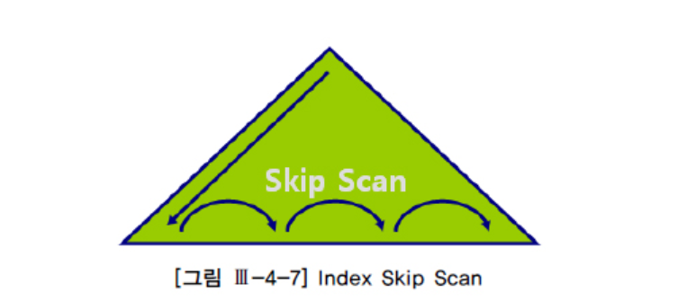

* Index Skip Scan 을 요약하자면 위의 그림과 같다.

```sql
SELECT 
    기준일자, 업종코드, 체결건수, 체결수량, 거래대금
FROM 
    일별업종별거래 A
WHERE 
    기준일자 BETWEEN '20080501' AND '20080531'
    AND 업종유형코드 = '01'
```

* 만약 위 SQL에 Index Range Scan을 사용한다면, 기준일자 BETWEEN 조건을 만족하는 인덱스 구간을 모두 스캔해야 한다.
* 하지만 Index Skip Scan을 사용하면, 기준일자 BETWEEN 조건을 만족하는 인덱스 구간에서 업종유형코드 = '01'인 레코드를 포함할 가능성이 있는 리프 블록만 골라서 액세스할 수 있다.

**인덱스는 기본적으로 최적의 Index Range Scan을 목표로 설계해야하고 다른 스캔 방식은 차선책으로 활용하는 방식이 바람직하다.**

### 2.3.5 Index Fast Full Scan

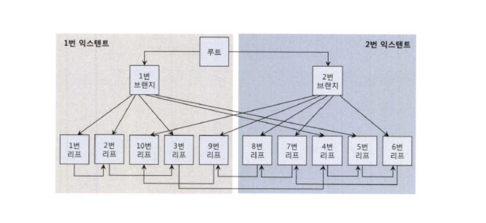

* 일반적인 Index Full Scan은 인덱스 논리적 구조를 따라 루트 -> 브랜치 1 -> 2 ~ 9 -> 109 순으로 블록을 읽어드린다.
* 하지만 Index Fast Full Scan은 Muitiblock I/O 방식으로 디스크로부터 대량의 인덱스 블록을 읽을 때 큰 효과를 발휘한다.
* 속도는 빠르지만, 인덱스 리프 노드가 갖는 연결 리스트 구조를 무시한 채 데이터를 읽기 때문에 결과 집합이 인덱스 키 순서대로 정렬되지 않는다.
* 쿼리에 사용한 컬럼이 모두 인덱스에 포함돼 있을 때만 사용할 수 있다는 점도 기억할 필요가 있다.

**Index Full Scan과 Index Fast Full Scan 차이점**


### 2.3.6 Index Range Scan Descending

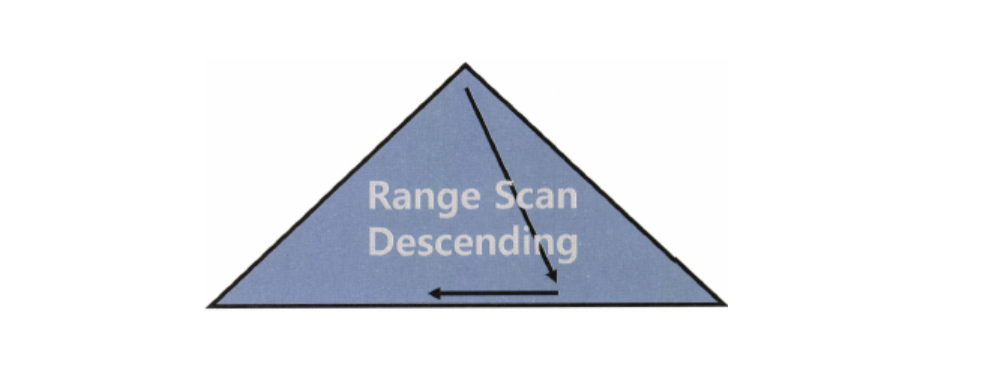

* Index Range Scan과 기본적으로 동일 스캔방식이나, 인덱스를 뒤에서 앞으로 스캔하기 때문에 내림차순으로 결과집합을 얻는다.

## 3장 인덱스 튜닝

* SQL 튜닝은 랜덤 I/O와의 전쟁임을 거듭 강요한다.
* 3장에서는 테이블 랜덤 액세스를 최소화하는 구체적인 방법에 대해 소개한다.

### 3.1.1 테이블 랜덤 액세스

* 인덱스를 이용해도 조건절에 해당하는 데이터만 골라서 읽는데 파티션 Pruning은 왜 필요할까 굳이 파티션이 필요할까? 에 대한 질문에 대한 답을 소개한다.

**인덱스로 검색해도 빠른데 왜 굳이 파티셔닝을 할까?**     
**인덱스로 검색하는데 왜 느릴까?**

* 데용량 데이터를 인덱스 사용하면 데이터가 금방 조회된다는 사실, 대량 데이터를 조회할 때 인덱스를 사용하니 테이블 전체를 스캔할 때보다 훨씬 느리다는 사실은 SQL 튜닝 핵심을 이해하면 이해할 수 있다.

**인덱스 ROWID 는 물리적 주소? 논리적 주소?**

```sql
SELECT * FROM 고객 WHERE 지역 = '서울';
```

* 위의 쿼리는 인덱스를 이용해 테이블을 액세스하는 SQL 실행계획이다.
* SQL이 참조하는 컬럼을 인덱스가 모두 포함하는 경우가 아니면, 인덱스를 스캔한 후에 반드시 테이블을 액세스한다.
* 인덱스를 스캔하는 이유는, **검색 조건을 만족하는 소량의 데이터를 인덱스에서 빨리 찾고 ROWID를 얻으려는데 있다.**
* ROWID는 물리적 주소보다는 논리적 주소에 가깝다. 

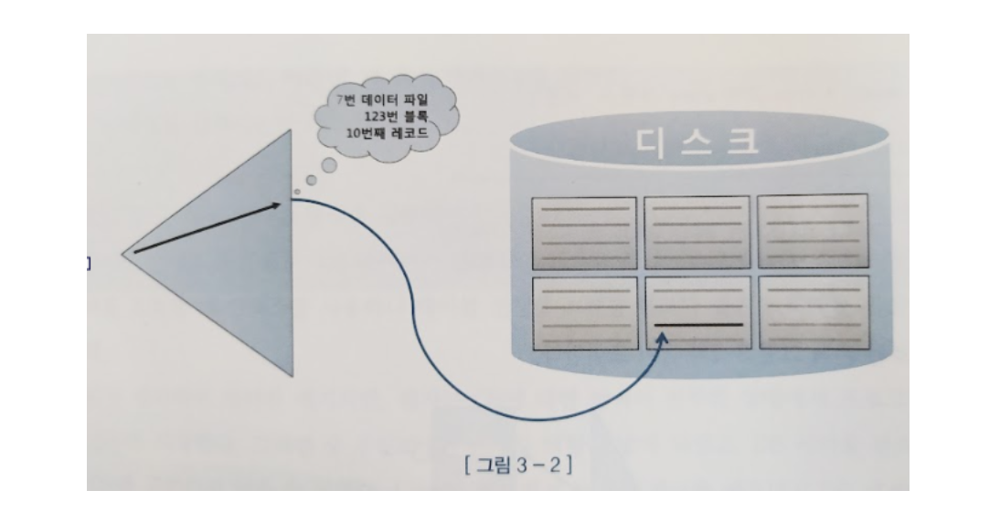

* 인덱스는 항상 도서 색인에 비유한다. 색인에 기록된 페이지 번호가 ROWID에 해당한다.
* 정리하자면 ROWID는 논리적 주소이며, 테이블 레코드를 찾아가기 위한 위치 정보를 담는다.

**I/O 메커니즘 복습**

* DBA(데이터 파일 번호 + 블록번호)는 디스크 상에서 블록을 찾기 위한 주소 정보이다.
* 그렇다고 매번 블록을 읽을 수는 없기에 I/O 성능을 높이려면 버퍼캐시를 활용해야 한다.
* 그래서 블록을 읽을 때는 디스크로 가기전에 항상 버퍼 캐시부터 찾아본다.
* 읽고자 하는 DBA를 해시 함수에 입력해서 해시 체인을 찾고 거기서 버퍼 헤더를 찾는다.

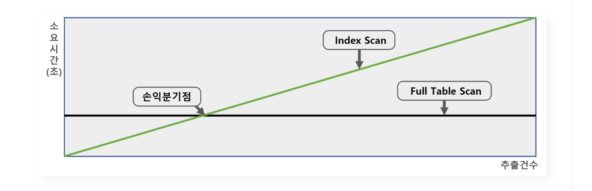

* 인덱스 ROWID를 이용한 테이블 액세스는 고비용 이기에 읽어야 할 데이터가 일정량을 넘는 순간, 테이블 전체를 스캔하는 것보다 오히려 느려진다.
* 인덱스를 이용한 테이블 액세스가 Table Full Scan보다 더 느려지게 만드는 가장 핵심적인 두 가지 요인은 아래와 같다.

1. Table Full Scan 은 시퀀셜 액세스인 반면, 인덱스 ROWID를 이용한 액세스는 랜덤 액세스 방식이다.
2. Table Full Scan은 Multiblock I/O인 반면, 인덱스 ROWID를 이용한 테이블 액세스는 Single Block I/O 방식이다.

### 3.1.2 인덱스 컬럼 추가

* 테이블 액세스 최소화를 위해 일반적으로 사용하는 튜닝 기법은 인덱스에 컬럼을 추가 하는 것이다.
* EMP 테이블에 DEPTNO + JOB 순으로 구성한 EMP_X01 인덱스가 있는 상태에서 수행하려고 한다.

```sql
SELECT /*+ INDEX(EMP EMP_X01) */
    *
FROM 
    EMP
WHERE 
    DEPTNO = 30
    AND SAL >= 2000
```

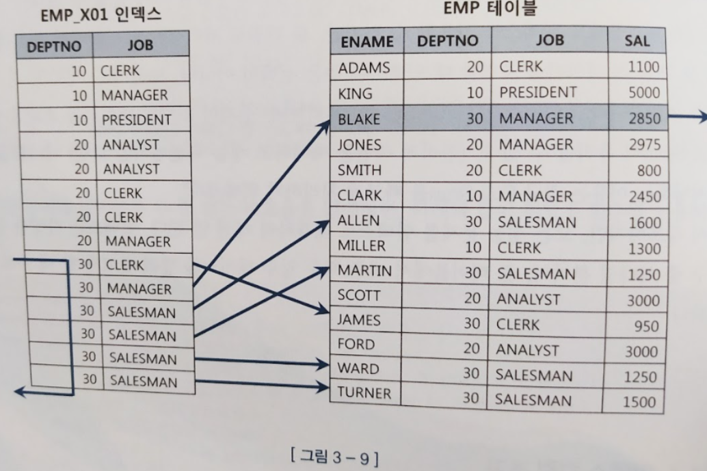

* 만족하는 사원은 한 명인데 한 명을 찾기 위해 테이블을 여섯 번 액세스 하고 있다.
* 인덱스 구성을 DEPTNO + SAL 순으로 변경하면 좋겠지만 실 운영 환경에서는 사용하는 인덱스의 경우도 있을 수 있기 때문에 쉽지 않다.
* 할 수 없이 인덱스를 새로 만들어야겠지만 계속 인덱스를 추가하다보면 관리 비용은 물론 DML 부하에 따른 트랜잭션 성능 저하가 생길 수 있다.
* 이럴 때는 기존 인덱스에 SAL 컬럼을 추가하는 것만으로 큰 효과를 얻을 수가 있다. (**인덱스 스캔량은 줄지 않지만 테이블 랜덤 액세스 횟수를 줄여주기 때문**)

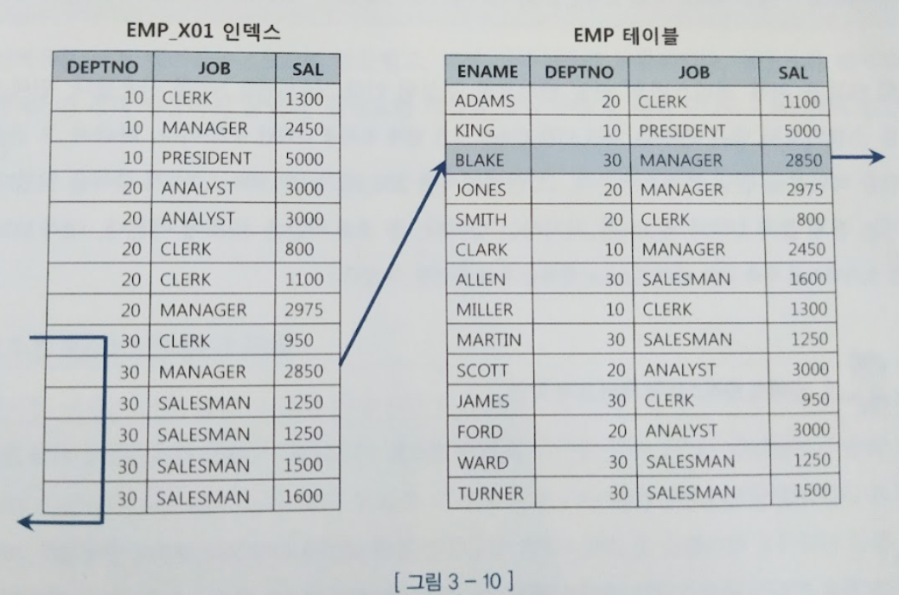

* 기존 인덱스에 SAL 컬럼 하나만 추가해도 테이블 액세스 횟수가 1회로 준다.

**인덱스에 컬럼을 추가해서 튜닝했던 실제 사례**

```SQL
SELECT 
    렌탈관리번호, 고객명, 서비스번호 ...
FROM
    로밍렌탈 
WHERE 
    서비스번호 LIKE '010%'
    AND 사용여부 'Y'
```

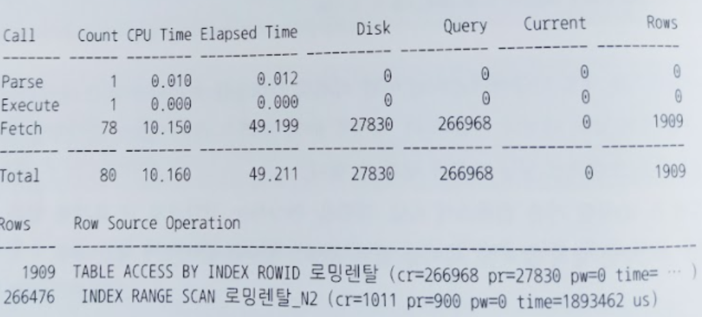

* 서비스번호 단일 컬럼으로 구성된 인덱스를 사용했을 때 스캔 건수는 266,476이다.
* 이 단계에서만 266,968 - 1,011 개 블록으로 265,957개 블록을 읽었다.
* 이는 테이블을 총 266,476 번 반복하는 동안 블록 I/O가 265,957개 발생했다. (클러스터링 팩터가 매우 안좋은 상태)
* 데이터량이 워낙 많다보니 서비스번호 조건을 만족하는 데이터가 뿔뿔이 흩어져 있음을 알 수 있다.
* 여기서 더 큰 문제는 테이블을 총 266,476번 방문했지만, 최종 결과집합이 1,909건뿐이라는 데에 있다. 테이블을 방문하고서 사용여부 = 'Y'조건을 체크하는 과정에서 대부분 걸러진 것을 유추할 수 있다.
* 아래는 로밍렌탈_N2 인덱스에 사용여부 컬럼을 추가하고 나서의 SQL 트레이스 결과이다.

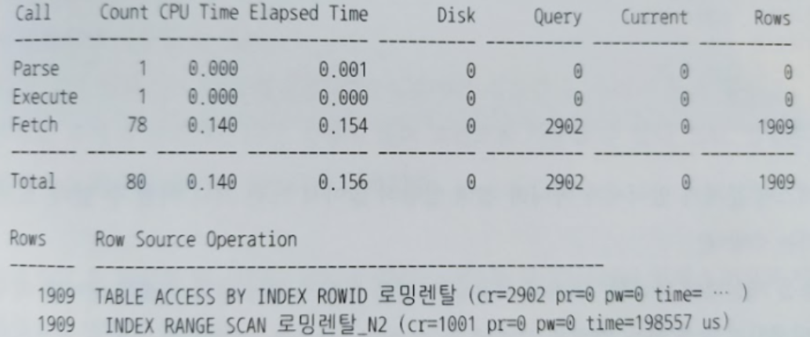

* 인덱스를 거쳐 테이블을 1,909번 방문했고, 모두 결과집합에 포함되었으며 불필요한 테이블 액세스가 전혀 발생하지 않았다.
또한 불필요한 작업을 줄인 만큼 총 블록 I/O도 2,902개로 줄었다.

### 3.2 부분범위 처리 활용

* 테이블 랜덤 액세스가 성능에 미치고 인덱스에 컬럼을 추가하여 테이블 저장 구조를 개선하는 방법을 살펴보았다.
* 3.2장에서 설명하는 부분범위 처리 활용은 테이블 랜덤 액세스로 인한 인덱스 손익분기점의 한계를 극복할 히든카드를 추가로 소개한다.
* 예를 들어 공사장에서 미장공이 시멘트를 이용해 벽돌을 쌓는 동안 운반공이 벽돌을 실어 나르고 있다고 생각해보자.
* 운반공은 미장공이 벽돌을 더 가져오라는 요청이 있을 때만 벽돌을 실어 나르고 추가 요청이 없으면 운반작업은 거기서 멈춘다.(미장공이 DB클라이언트, 운반공은 데이터를 읽어 클라이언트에 전송하는 서버 프로세스)
* DBMS가 클라이언트에 데이터를 전송할 때도 일정량씩 나누어 전송하는데, 전체 결과 집합 중 아직 전송하지 않은 분량이 많이 남아있어도 서버 프로세스는 클라이언트로부터 추가 Fetch Call을 받기 전까지 그대로 멈춰 서서 기다린다.
* 1억 건짜리 테이블인데도 결과를 빨리 출력할 수 있는 이유는, DBMS가 데이터를 모두 읽어 한 번에 전송하지 않고 먼저 읽는 일정량을 전송하고 멈추기 때문이다.(데이터를 전송하고 나면 서버 프로세스는 CPU를 OS에 반환하고 대기 큐에서 잠을 잔다.)
* **위와 같이 전체 쿼리 결과집합을 쉼 없이 연속적으로 전송하지 않고 사용자로부터 Fetch Call이 있을 때마다 일정량씩 나누어 전송하는 것을 부분범위 처리라고 한다.**
* 이러한 부분범위 처리 활용 특징을 이용해 중간에 멈췄다가 사용자의 추가 요청이 있을 때마다 데이터를 가져오도록 하고 앞쪽 일부만 출력하고 멈출 수 있는가에 따라 성능개선 활용이 가능하다. 아래는 부분범취 처리를 활용한 예제이다.

```sql
SELECT 
    게시글ID, 제목, 작성자, 등록일시
FROM 
    게시판
WHERE 
    게시판구분코드 = 'A'
ORDER BY 
    등록일시 DESC
```

1. INDEX 를 게시판구분코드 + 등록일시 로 구성하지 않았을 경우
    * 소트 연산을 생략할 수 없어 게시판구분코드 = 'A' 조건을 만족하는 모든 레코드를 인덱스에서 읽어야 하므로 많은 테이블 랜덤 엑세스가 발생한다.
2. INDEX 를 게시판구분코드 + 등록일시 로 구성한 경우 
    * Sort Order By 오퍼레이션이 자동으로 제거된다. 전체 로우를 읽지 않고도 결과집합 출력을 시작할 수 있다.

```
인덱스 ROWID를 이용한 테이블 랜덤 엑세스는 고비용 구조이다. 인덱스를 이용해 대량 데이터를 조회하면, 디스크 I/O 발생량도 함꼐 증가하므로 성능이 급격히 나빠진다.

하지만 부분범위 처리 원리를 활용해 상위 N개의 집합을 빠르게 출력한다면 아무리 대상 레코드가 많아도 빠른 응답속도를 낼 수 있다. 
```

### 3.3 인덱스 스캔 효율화

* IOT, 클러스터, 파티션은 테이블 랜덤 액세스를 최소화하는데 효과적인 저장 구조이지만, 운영 시스템 환경에서는 많은 테스트를 진행해야 하므로 어려움이 따른다.
* 운영 환경에서 가능한 일반적인 튜닝 기법은 인덱스 컬럼 추가이다.
* 인덱스 컬럼 추가에 이어서 인덱스 스캔 효율화에 대해서 알아보자.

### 3.3.1 인덱스 탐색 

* 인덱스 스캔 효율화 튜닝을 이해해서는 인덱스 수직적 탐색과 수평적 탐색을 좀 더 깊이 있게 다룰 필요가 있다. 

**인덱스 선행 컬럼이 등치(=) 조건이 아닐 때 생기는 비효율**

* 인덱스 스캔 효율성은 인덱스 컬럼을 조건절에 모두 등치(=) 조건으로 사용할 때 가장 좋다.
* 리프 블록을 스캔하면서 읽은 레코드는 하나도 걸러지지 않고 모두 테이블 액세스로 이어지므로 인덱스 스캔 단계에서 비효율은 전혀 없다.
* 인덱스 컬럼 중 일부가 조건절에 없거나 등치 조건이 아니더라도, 그것이 뒤쪽 컬럼일 떄는 비효율이 없다.
* 인덱스를 [ 아파트시세코드 + 평형 + 평형타입 + 인터넷매물 ] 순으로 구성했을 때 아래와 같은 경우를 말한다.
```SQL
WHERE 아파트시세코드 = :a
WHERE 아파트시세코드 = :a AND 평형 = :b
WHERE 아파트시세코드 = :a AND 평형 = :b AND 평형타입 = :c
WHERE 아파트시세코드 = :a AND 평형 = :b AND 평형타입 = :c BETWEEN :c AND :d
```

* 반면 인덱스 선행 컬럼이 조건절에 없거나 부등호, BETWEEN, LIKE 같은 범위검색 조건이면 , 인덱스를 스캔하는 단계에서 비효율이 생긴다.
* 예를 들어, 인덱스를 [ 아파트시세코드 + 평형 + 평형타입 + 인터넷매물 ] 순으로 구성한 상황에서 아래의 SQL 을 수행하는 경우를 살펴보자.

```SQL
SELECT  
    해당층, 평단가, 입력일, 해당동 ...
FROM
    매물아파트매매
WHERE 
    아파트시세코드 = 'A01245124140'
    AND 평형 = '59'
    AND 평형타입 = 'A'
    AND 인터넷매물 BETWEEN '1' AND '3'
ORDER BY 입력일 DESC
```

* 인터넷 매물이 BETWEEN 조건이지만 선행 컬럼들 모두 '=' 조건이기 때문에 전혀 비효율 없이 조건을 만족하는 세 건을 빠르게 찾았다. 여기서 비효율이 없다는 것은 세 건을 찾기 위해 단 네건만 스캔했음을 의미한다.
* **인덱스 선행 컬럼이 모두 '=' 조건일 때 필요한 범위만 스캔하고 멈출 수 있는 것은, 조건을 만족하는 레코드가 모두 한데 모여 있기 때문이다.**
* 인덱스 구성은 [ 인터넷매물 + 아파트시세코드 + 평형 + 평형타입 ] 순으로 바꾼 후 SQL을 수행하면 인덱스 스캔 범위가 넓어진다.

### 3.3.2 BETWEEN을 IN_LIST 전환

* 범위검색 컬럼이 맨 뒤로 가도록 인덱스를 [ 아파트시세코드 + 평형 + 평형타입 + 인터넷매물 ] 순으로 변경하면 좋겠지만 운영 시스템에서 인덱스 구성을 바꾸기는 쉽지 않다. 이럴 때 BETWEEN 조건을 아래와 같이 IN_LIST 로 바꿔주면 큰 효과를 얻는다.
* 아래의 SQL과 그림, 실행계획을 보자.

```SQL
SELECT  
    해당층, 평단가, 입력일, 해당동 ...
FROM
    매물아파트매매
WHERE 
    인터넷 매물 IN ('1', '2', '3')
    AND 아파트시세코드 = 'A01245124140'
    AND 평형 = '59'
    AND 평형타입 = 'A'
ORDER BY 입력일 DESC
```


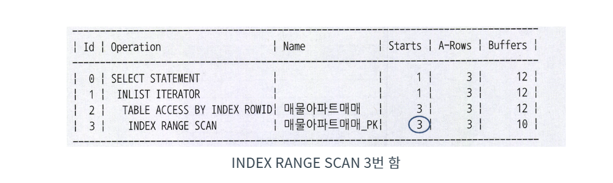

* 왼쪽 화살표가 세 개인 이유는 인덱스 수직적 탐색이 세 번 발생하기 때문이다.
* 이 때의 실행계획은 아래 INLIST ITERATOR 와 같다.
* 이는 인덱스를 세 번 탐색한다는 사실이며 세 번 탐색한다는 것은 SQL을 아래와 같이 작성한 것과 같으며 모든 컬럼이 '=' 조건인 것에 주목하자.

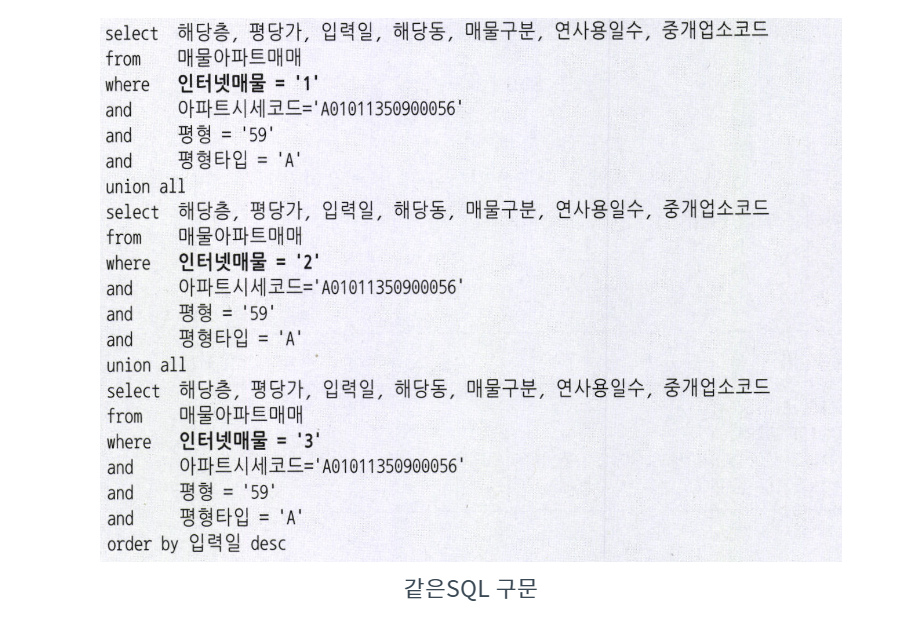

* IN-LIST 개수만큼 UNION ALL 브랜치가 생성되고 각 브랜치마다 모든 컬럼을 '=' 조건으로 검색하므로 앞서 선두 컬럼에 BETWEEN을 사용할 때와 같은 비효율이 사라진다.
* 하지만 IN-List 항목 개수가 늘어날 수 있다면 BETWEEN 을 IN-List 전환하는 방식은 사용하기 곤란하므로 아래와 같이 NL 방식의 조인문이나 서브쿼리로 구현하면된다. (IN-List 값들을 코드 테이블로 관리하고 있을 때 가능)

```sql
SELECT /*+ ORDERED USE_NL(B)*/
    B.해당층, B.평당가, B.입력일, B.해당동...
FROM 
    통합코드 A, 매물아파트매매 B
WHERE 
    1=1
    AND A.코드구분 = 'CD064'
    AND A.코드 BETWEEN '1' AND '3'
    AND B.인터넷매물 = A.코드
    AND B.아파트시세코드 = 'A010113500056'
    AND B.평형 = '59'
    AND B.평형타입 = 'A'
ORDER BY 
    B.입력일 DESC
```

* NL조인을 아직 정확히 모르지만 인터넷매물을 '=' 조건으로 조인하고 있다는데 주목하자.

**BETWEEN 조건은 IN-LIST로 전환할 때 주의 사항**

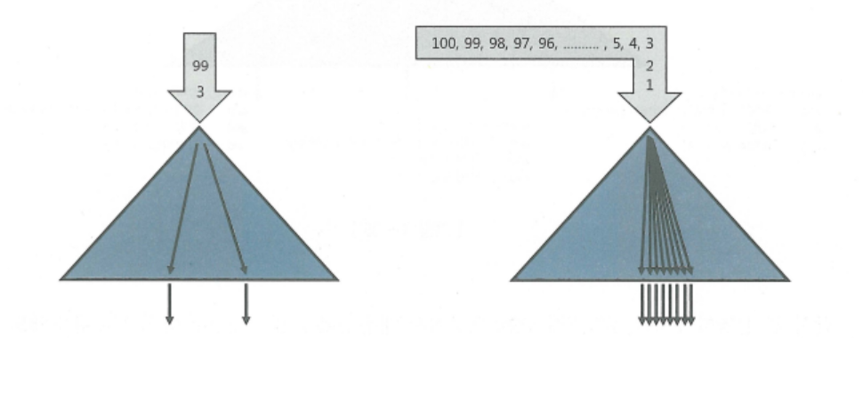

* 단 BETWEEN 조건을 IN-LIST 조건으로 전환할 때는 IN-LIST 개수가 많지 않아야 한다는 것이다. IN-LIST 개수가 많아지면 대량의 수직적 탐색이 발생하므로 BETWEEN 조건의 리프 블록을 많이 탐색하는 비효율보다 IN-LIST 조건의 브랜치 블록을 반복 탐색하는 비효율이 더 클 수 있다.
* 인덱스 스캔 과정에 선택되는 레코드들이 서로 멀리 떨어져 있을 때만 유용하다는 사실은 기억해야 한다.
* 아래 조건절을 예로 들면 [고객등급 + 고객번호] 순으로 구성한 인덱스에서 고객번호 = 123 조건을 만족하는 레코드가 서로 멀리 떨어져 있을 때만 BETWEEN 조건을 IN-LIST 로 전환하는 기법이 유용하다.

```SQL
WHERE 고객등급 BETWEEN 'C' AND 'D'
AND 고객번호 = 123
```

* 위의 쿼리의 조건을 만족하는 레코드가 2건밖에 없을 때 이 두건에 대해 인덱스 리프 블록을 많이 스캔해야한다. (이럴 때 BETWEEN 을 IN-LIST 로 변환하면 효과가 크다.)


* 위의 그림은 둘 사이에 놓인 인덱스 블록이 소량이기에 BETWEEN을 IN-LIST로 변환하면 효과가 전혀 없거나 수직적 탐색 때문에 오히려 블록 I/O가 더 많이 발생한다.
* 정리하자면, BETWEEN 조건 때문에 인덱스를 비효율적으로 스캔하더라도 블록 I/O 측면에서는 소량으로 그치는 경우가 많고 IN-LIST 개수가 많으면 수직적 탐색 과정에서 많은 블록을 읽게 된다. 따라서 데이터 분포나 수직적 탐색 비용을 고려하여 BETWEEN 과 IN-LIST를 사용하자.

### 3.3.3 Index Skip Scan 활용

* 위에 그림 처럼 BETWEEN 조건을 IN-List 조건으로 변환하지 않아도 Index Skip Scan을 활용하면 된다.

```sql
SELECT 
    COUNT(*)
FROM 
    월별고객별판매집계 T
WHERE 
    판매구분 = 'A'
    AND 판매월 BETWEEN '201801' AND '201812'
```

* 위에 쿼리의 INDEX는 아래와 같이 구성한다.

```SQL
CREATE INDEX 월별고객별판매집계_IDX1 ON 월별고객별판매집계 (판매구분, 판매월);
```

* 위와 같이 인덱스를 사용하면 281개의 블록 I/O가 발생함을 알 수 있고 테이블 액세스는 전혀 발생하지 않는다.
* 이번에는 BETWEEN 조건의 판매월 컬럼이 선두인 인덱스를 이용해보자.

```SQL
CREATE INDEX 월별고객별판매집계_IDX2 ON 월별고객별판매집계 (판매월, 판매구분);
```

* 판매구분 = 'A' 레코드는 2018년 1월부터 12월까지 각 판매월 앞쪽에 위치하게되어 3,090개 블록 I/O 가 발생한다. 
* 이유는 인덱스 선두 컬럼이 BETWEEN 조건이어서 판매구분이 'B'인 레코드까지 모두 스캔하고서 버렸기 때문이다.
* BETWEEN 방식은 IN-LIST 방식을 적용하고 다시 실행시켜보자.

```SQL
SELECT 
    COUNT(*)
FROM 
    월별고객별판매집계 T
WHERE 
    판매구분 = 'A'
    AND 판매월 IN ('201801' ... '201812')
```

* 3,090개 였던 블록 I/O 개수가 314개로 감소했다. 인덱스 브랜치 블록을 열두 번 반복 탐색했지만, 리프 블록을 스캔할 때의 비효율을 제거함으로써 성능이열 배 좋아졌다. 마지막으로 INDEX SKIP SCAN을 유도해보자.

```SQL
SELECT /*+ INDEX_SS(T 월별고객별판매집계_IDX2)*/
    COUNT(*)
FROM 
    월별고객별판매집계 T
WHERE 
    판매구분 = 'A'
    AND 판매월 BETWEEN '201801' AND '201812'
```

* 인덱스 선두 컬럼이 BETWEEN 조건인데도 단 300블록만 읽고 일을 마쳤다.
* 결론적으로는 INDEX SKIP SCAN이 IN-LIST 보다 오히려 낫고 IDX1 을 사용했을 때와 비슷한 성능을 보여준다.

### 3.3.4 IN 조건은 '='인가

* SQL 튜닝 입문자들은 흔히들 IN 조건을 '=' 조건과 동등시한다는 점이다.
* SQL에 대한 인덱스를 [상품ID + 고객번호] , [고객번호 + 상품ID] 로 설계했을 때의 차이점을 통해 쉽게 알 수 있다.
* 흔히 차이가 없다고 생각하지만 면밀히 말하자면 IN 조건은 '='이 아니다.
* 즉, 인덱스의 구성에 따라 성능이 달라진다.

```SQL
SELECT  *
FROM    고객별가입상품
WHERE   고객번호 = :CUST_NO
AND     상품ID IN ('NH00037', 'NH00041', 'NH00050')
```

**인덱스 [상품ID + 고객번호] 인 경우**

* 인덱스가 [상품ID + 고객번호] 로 구성되어있을 경우 IN-LIST 조건으로 푸는 것이 효과적이다.
* 상품 ID가 인덱스 선두 컬럼인 상황에서 IN-LIST 방식으로 풀지 않으면, 상품ID는 필터 조건이므로 테이블 전체 또는 인덱스 전체를 스캔하면서 필터링해야 한다.

**인덱스 [고객번호 + 상품ID] 인 경우**

* 상품ID 조건절을 IN-LIST 방식으로 풀지 않으면, 상품ID 조건절은 필터로 처리한다.
* 이렇게되면 고객번호만 액세스 조건이므로 고객번호에 해당하는 레코드를 모두 스캔한다.
* 같은 고객은 한 블록이거나 연속된 두 블록에 모여있으므로 블록 I/O는 수직적 탐색 과정을 포함해 총 세 개 또는 네 개만 발생한다.

### 3.3.5 BETWEEN과 LIKE 스캔 범위 비교

* LIKE와 BETWEEN은 둘 다 범위검색 조건으로서, 앞서 설명한 비효율 원리가 똑같이 적용되지만, 데이터 분포와 조건절 값에 따라 인덱스 스캔량이 서로 다를 수 있다.
* 결론부터 말하면, LIKE보다 BETWEEN을 사용하는 게 낫다. BETWEEN을 사용하면 적어도 손해는 안본다.
* 예를 들어 인덱스를 [판매월 + 판매구분] 순으로 구성했다고 가정하자.
* 판매구분으로는 'A'와 'B' 두 개 값이 존재하고, 각각 90%, 10% 비중을 차지하는 상황에서 두 조건절에 대해 인덱스 스캔량을 비교해 보자.

```SQL
WHERE 판매월 BETWEEN '201901' AND '201912'
AND   판매구분 = 'B'

WHERE 판매월 LIKE '2019%'
AND   판매구분 = 'B'
```

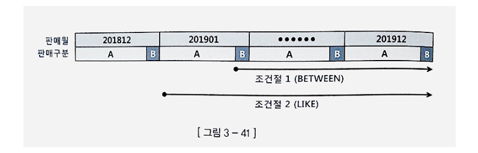

* 그림 3-41 조건절1처럼 BETWEEN은 판매월 = '201901' 이고 판매구분 = 'B' 인 첫 번째 레코드에서 스캔을 시작한다.
* 반면 조건절2는 판매월 = '201901' 인 첫 번째 레코드에서 스캔을 시작하고, '201900' 이 저장돼 있다면 그 값도 읽어야 하므로 판매구분 = 'B'인 지점으로 바로 내려갈 수 없다.

```SQL
WHERE 판매월 BETWEEN '201901' AND '201912'
AND   판매구분 = 'A'

WHERE 판매월 LIKE '2019%'
AND   판매구분 = 'A'
```

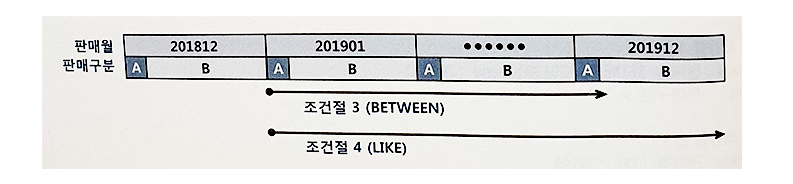

* 조건절 3은 판매월 = '201912'이고 판매구분 'B' 인 첫 번째 레코드를 만나는 순간 스캔을 멈춘다. 
* 반면 조건절 4는 판매월 = '201912'인 레코드를 모두 스캔하고 나서야 멈춘다, 혹시라도 '201913'이 저장돼 있다면 그 값도 읽어야 하므로 중간에 멈출 수가 없기 때문이다.

**범위검색 조건을 남용할 때 생기는 비효율**

* 사용자 입력과 선택에 따라 편리하게 사용하기 위해 종종 개발자는 조건절에 BETWEEN 과 LIKE 를 무분별하게 사용한다.
* 하지만 옵션 조건을 처리하기 위해 대량 테이블을 넓은 범위로 검색할 때는 영향이 클 수도 있기 때문에 데이터 분포에 따라 인덱스 컬럼에 대한 비교 연산자를 신중하게 선택해야 한다.

### 3.3.6 다양한 옵션 조건 처리 방식의 장단점 비교

* 방금 살펴본 BETWEEN 과 LIKE 이외에도 다양한 방식으로 옵션 조건을 처리하는 방식이 존재한다.

**OR조건 활용**

```SQL
SELECT * FROM 거래
WHERE :CUST_ID IS NULL OR 고객ID = :CUST_ID
AND   거래일자 BETWEEN :DT1 AND :DT2
```

* 흔히 사용하는 이 방식의 문제점은 쿼리 변환이 기본적으로 작동하지 않아 인덱스가 존재해도 사용할 수 없다는 문제점이다.
* 따라서 인덱스 선두 컬럼에 대한 옵션 조건에는 OR조건을 사용해선 안 된다.
* 인덱스에 포함되지 않은 컬럼에 대한 옵션 조건은 어차피 테이블에서 필터링할 수 밖에 없으므로 그럴 때는 OR조건을 사용해도 무방하다.
* OR 조건을 활용한 옵션 조건 처리를 정리하면 아래와 같다.
    * 인덱스 액세스 조건으로 사용 불가
    * 인덱스 필터 조건으로도 사용 불가
    * 테이블 필터 조건으로만 사용 가능

**LIKE/BETWEEN 조건 활용**

* LIKE와 BETWEEN 도 옵션 조건 처리를 위해 많이 사용하는 방식 중 하나이다.
* 필수 조건 컬럼을 인덱스 선두에 두고 액세스 조건으로 사용하면, LIKE/BETWEEN 이 인덱스 필터 조건이어도 충분히 좋은 성능을 낼 수 있기 때문이다.

```SQL
-- 인덱스 : 등록일시 + 상품분류코드
SELECT * FROM 상품
WHERE 등록일시 >= TRUNC(SYSDATE)            -- 필수 조건
AND   상품분류코드 LIKE :PRD_CLS_CD || '%'  -- 옵션 조건

-- 인덱스 : 상품명 + 상품분류코드
SELECT * FROM 상품
WHERE 상품명 = :PRD_NM
AND   상품분류코드 LIKE :PRD_CLS_CD || '%'
```

* 위와 같은 필수 조건은 좋은 성능을 나타낼 수 있으나 문제는 필수 조건의 번별력이 좋지 않을 경우이다.

```SQL
-- 인덱스 : 상품대분류코드 + 상품코드 
SELECT * FROM 상품
WHERE 상품대분류코드 = :PRD_LCLS_CD
AND   상품코드 LIKE :PRD_CD || '%'
```

* 위 SQL에서 상품대분류코드만으로 조회할 때는 TABLE FULL SCAN이 유리하다.
* 하지만 옵티마이저는 상품코드까지 입력할 때를 기준으로 INDEX RANGE SCAN을 선택한다.
* 사용자가 상품코드까지 입력하면 최적의 성능을 내지만, 그렇지 않을 때는 성능에 문제가 생긴다.

* LIKE/BETWEEN 조건을 활용할 때는 아래 네 가지 경우에 속하는지 반드시 점검해야 한다.
    * 인덱스 선두 컬럼
    * NULL 허용 컬럼
    * 숫자형 컬럼
    * 가변 길이 컬럼

### 3.3.7 함수호출부하 해소를 위한 인덱스 구성 

**PL/SQL 함수의 성능적 특성**

* PL/SQL 사용자 정의 함수는 개발자들이 일반적으로 생각하는 것보다 매우 느리다.
* PL/SQL 사용자 정의 함수가 느린 데에는 아래 3가지 이유가 존재한다.
    1. 가상머신에서 실행되는 인터프리터 언어
    2. 호출 시마다 컨텍스트 스위칭 발생
    3. 내장 SQL에 대한 Recursive Call 발생
* 오라클은 PL/SQL로 작성한 함수와 프로시저를 컴파일하면 JAVA 언어처럼 바이트코드를 생성해서 데이터 딕셔너리에 저장하며, PL/SQL 엔진만 있으면 어디서든 실행할 수 있으며 PL/SQL 엔진은 바이트 코드를 런타임 시 해석하면서 실행한다.
* 대게 PL/SQL 함수에는 SQL이 내장돼어있어 일반적으로 인터프리팅, 컨텍스트 스위칭보다 Recursive Call 부하가 가장 크다.

```SQL
SELECT 회원번호, 회원병, 생년, GET_ADDR(우편번호)
FROM 회원
WHERE 생월일 LIKE '01%'
```

```SQL
SELECT A.회원번호, A.회원명, A.생년
        (SELECT B.시도 || ' ' || B.구군 
         FROM 기본주소 B
         WHERE B.우편번호 = A.우편번호
         AND B.순번 = 1) 기본주소
FROM 회원 A
WHERE A.생월일 LIKE '01%'
```

* 두 가지 쿼리를 비교해봤을 때 아래와 같이 조인문으로 처리하면 성능 차이가 매우크며 당연히 아래 SQL이 더 빠르다.
* 하지만 PL/SQL 함수 내부 로직이 너무 복잡하면 그대로 쓸 수 밖에 없는데, 그럴 때 함수 호출 횟수를 줄이는 여러 방법이 바로 액세스 조건을 고려한 인덱스 구성이다.

**효과적인 인덱스 구성을 통한 함수호출 최소화**

```SQL
SELECT /*+ FULL(A) */ 회원번호, 회원명, 생년
FROM 회원 A
WHERE 암호화된_전화번호 = ENCRYPTION( :PHONE_NO)
```

* FULL SCAN 방식으로 읽으면 ENCRYPTION 함수는 테이블 건수만큼 수행된다.
* 하지만 아래와 같이 다른 조건절이 존재하면 조건적을 만족하는 건수만큼 수행된다.

```SQL
SELECT /*+ FULL(A) */ 회원번호, 회원명, 생년
FROM 회원 A
WHERE 생년 = '1987' 
AND 암호화된_전화번호 = ENCRYPTION( :PHONE_NO)
```

### 3.4 인덱스 설계

* 온라인 트랜잭션을 처리하는 시스템에서 인덱스 설계의 중요성은 인덱스 튜닝, 더 나아가 SQL 튜닝의 하이라이트라고도 할 수 있다.

### 3.4.1 인덱스 설계가 어려운 이유

* SQL에 각각 최적화된 인덱스를 마음껏 생성할 수 있다면 인덱스 설계만큼 쉬운 일도 없다. 하지만 인덱스를 많으면 아래와 같은 문제가 발생한다.

1. DML 성능 저하 (TPS 저하)
2. 데이터베이스 사이즈 증가
3. 데이터베이스 관리 및 운영 비용 상승

* 예를 들어 한 테이블에 인덱스가 여섯 개 달려 있으면, 신규 데이터를 입력할 때마다 여섯 개 인덱스에도 데이터를 입력해야 한다.
* 테이블과 달리 인덱스는 정렬 상태를 유지해야 하므로 수직적 탐색을 통해 입력할 블록부터 찾는다. 
* 데이터를 지울 떄도 마찬가지이다. 여섯 개 인덱스에서 레코드를 일일이 찾아 지워야하고 이는 DML 성능 저하이며 TPS 저하로 이어진다.
* 또한 꼭 필요하지 않은 인덱스를 많이 만들면 디스크 공간을 낭비하고, 데이터베이스 사이즈가 커지는 만큼 백업, 복제, 재구성 등을 위한 운영 비용도 상승한다.

### 3.4.2 가장 중요한 두 가지 선택 기준 

* 인덱스 스캔 방식에 여러 가지가 존재하지만, 가장 정상적이고 일반적인 방식은 Index Range Scan 이며 인덱스 선두 컬럼을 조건절에 반드시 사용해야 한다.
* 따라서 결합 인덱스를 구성할 떄 첫 번쨰 기준은, 조건절에 항상 사용하거나, 자주 사용하는 컬럼을 선정하는 것이다.
* 두 번째 기준은 그렇게 선정한 컬럼 중 '=' 조건으로 자주 조회하는 컬럼을 앞쪽에 두어야 한다는 것이다.
* **인덱스 설계할 때 기본적으로 두 가지 사항은 공식처럼 외우자.**

```
1. 조건절에 항상 사용하거나, 자주 사용하는 컬럼을 선정한다.
2. '=' 조건으로 자주 조회하는 컬럼을 앞쪽에 둔다.
```

### 3.4.3 스캔 효율성 이외의 판단 기준

* 위에서 제시한 두 가지 선택기준에만 해당하면 좋겠지만 그렇지만은 않다. 일반적으로 인덱스 개수가 더 늘어나는 현상도 경험하게 된다.
* 인덱스 스캔 효율성 이외에 고려해야 할 판단 기준은 아래와 같다.

1. 수행 빈도
2. 업무상 중요도
3. 클러스터링 팩터
4. 데이터량
5. DML부하
6. 저장 공간
7. 인덱스 관리 비용 등

* 위에 7가지 중에 가장 중요한 하나를 꼽으라면 수행 빈도이다.
* 수행빈도가 매우 높은 SQL 이라면, 테스트 과정에 당장 성능이 좋게 나오더라도 인덱스를 최적으로 구성해 줘야 한다.
* NL 조인 Inner 쪽 인덱스는 '=' 조건 컬럼을 선두에 두는 것이 중요하고, 될 수 있으면 테이블 액세스 없이 인덱스에서 필터링을 마치도록 구성해야 한다.
* 데이터량도 인덱스를 설계할 때 중요한 판단 기준이다. 데이터량이 적다면 굳이 인덱스를 많이 만들 필요가 없다. (Full Scan 으로도 충분히 빠르기 때문이다.)
* 반대로 초대용량 테이블일 때는 트랜잭션 성능에 직접적인 영향을 주기에 인덱스 설계할 때 가장 중요하다.

### 3.4.4 소트 연산을 생략하기 위한 컬럼 추가

* 인덱스는 항상 정렬 상태를 유지하므로 ORDER BY, GROUP BY 를 위한 소트 연산을 생략할 수 있게 해준다.
* 조건절에 사용하지 않더라도 소트 연산 생략을 위한 목적으로 인덱스 구성에 포함시킴으로써 성능 개선을 도모할 수도 있다.
* 성능을 고려하지 않는다면 인덱스는 ORDER BY 절 순서대로 구성하면 된다.
* 이 때 주의사항으로는 **'=' 이 아닌 조건절 컬럼들은 반드시 ORDER BY 컬럼보다 뒤쪽에** 두어야 소트 연산을 생략할 수 있다.
* 인덱스를 이렇게 구성하면 소트는 생략할 수는 있지만 조건을 만족하는 데이터를 맨 뒤쪽에서 만나면 많은 I/O가 발생할 것이다.

**IN조건은 '='이 아니다**

```SQL
SELECT 고객번호, 고객명, 거주지역, 혈액형, 연령
FROM 고객
WHERE 거주지역 = '서울'
AND 혈액형 IN ('A', 'O')
ORDER BY 연령
```

* 위의 SQL을 예로 들어보자. 인덱스는 [거주지역 + 혈액형 + 연령] 순으로 구성되어있다.
* IN 조건이 '='가 되려면 IN-List Iterator 방식으로 풀려야 한다.
* UNION ALL 절로 두 집합을 묶어 연령순으로 정렬해야하기에 소트 연산을 생략하려면 IN 조건절을 인덱스 액세스 조건으로 사용하면 안 된다.
* 필터 조건으로 사용해야하므로 이 때는 인덱스를 [거주지역 + 연령 + 혈액형] 순으로 구성해야 한다.

**컬럼 순서 결정 시, 선택도 이슈**

* 선택도란 전체 레코드 중에서 조건절에 의해 선택되는 레코드 비율이다.
* 인덱스 선택도는 인덱스 컬럼을 모두 '=' 로 조회할 때 평균적으로 선택되는 비율을 의미한다.
* 인덱스를 설계할 때 하는 일은 항상 사용하는 컬럼을 앞쪽에 두고 그 중 '=' 조건을 앞쪽에 위치시키는 것 뿐이다.
* 결합 인덱스 컬럼 간 순서를 정할 때는 선택도는 중요하지 않다.

```SQL
WHERE 성별 = :GENDER
AND 고객번호 = :CUST_NO
```

* 위의 SQL문에서 어떤 컬럼이 앞에 오든 인덱스 스캔 효율에는 전혀 차이가 없다는 말이다.
* 마찬가지로 뒤에 필터링 조건 BETWEEN 이나 IN 조건간에도 인덱스 스캔 효율에는 영향을 주지 않는다.

### 3.4.5 중복 인덱스 제거 

* 아래 세 인덱스는 중복이다.

```sql
1. X01 : 계약ID + 청약일자
2. X02 : 계약ID + 청약일자 + 보험개시일자
3. X03 : 계약ID + 청약일자 + 보험개시일자 + 보험종료일자
```

* X02 인덱스 선두 컬럼이 X01 인덱스 전체를 포함하고, X03 인덱스 선두 컬럼이 X01, X02 인덱스 전체를 완전히 포함하기 때문이다.
* 이를 **완전 중복**이라고 부르며, X03 인덱스를 남기고, X01, X02 인덱스는 삭제해도 된다.

```SQL
1. X01 : 계약ID + 청약일자
2. X02 : 계약ID + 보험개시일자
3. X03 : 계약ID + 보험종료일자
4. X04 : 계약ID + 데이터생성일시
```

* 위에 4개의 인덱스는 얼핏 보기엔 중복이 아니다. 하지만 카디널리티가 매우 낮다면 사실상 중복이다.
* 계약ID 평균 카디널리티가 5라고 가정했을 때, 계약 ID를 '='조건으로 조회하면, 평균 다섯 건이 조회된다는 뜻이다.
* 그렇다면 인덱스를 네 개씩이나 만들 이유가 없으며 아래와 같이 하나만 만들면 충분하다.

```SQL
1. X01 : 계약ID + 청약일자 + 보험개시일자 + 보험종료일자 + 데이터생성일시
```

* 이는 **완전중복**과 대비해 **불완전 중복**이라고 부른다.

**중복 제거 실습1**

* 아래 다섯 인덱스 중에서 중복 인덱스를 찾아 재설계해 보자.

```SQL
1. PK : 거래일자 + 관리지점번호 + 일련번호
2. N1 : 계좌번호 + 거래일자
3. N2 : 결제일자 + 관리지점번호
4. N3 : 거래일자 + 종목코드
5. N4 : 거래일자 + 계좌번호
```

* 거래일자, 결제일자는 항상 BETWEEN 또는 부등호 조건으로 조회한다.
* NDV는 Number Of Distinct Values 의 약자이며 컬럼에 입력된 값의 종류 개수를 의미한다.
* 거래일자가 항상 BETWEEN 또는 부등호 조건이면 N3와 N4 인덱스는 둘 다 거래일자가 인덱스 액세스 조건이다.
* 그렇기에 인덱스를 두 개나 만들 필요 없이 N4 인덱스를 제거하고, N3 인덱스 뒤쪽에 계좌번호를 추가하면 된다.
* 두 번쨰 방안으로는 N3 인덱스 변경 없이 그냥 N4 인덱스를 제거해도 된다.


## 4장 조인 튜닝

### 4.1.1 NL 조인 기본 메커니즘

```SQL
SELECT E.사원명, C.고객명, C.전화번호
FROM 사원 E, 고객 C
WHERE E.입사일자 >= '19960101'
AND C.관리사원번호 = E.사원번호
```

* 위 테이블에서 1996년 1월 1일 이후 입사한 사원이 관리하는 고객 데이터를 추출하는 데이터를 만들어 보자.
* 가장 쉽게 생각하는 방법은 사원 테이블로부터 1996년 1월 1일 이후 입사한 사원을 찾은 후, 고객 테이블에서 사원번호가 일치하는 레코드를 찾는 것 이것이 **Nested Loop 조인이 사용하는 알고리즘**이다.
* 아래 수행 구조를 통해 쉽게 이해할 수 있다.

```SQL
<C ,JAVA>
for(i=0; i<100; i++){
    for(j=0; j<100; j++){
        ...
    }
}

<PL/SQL>
for outer in 1..100 loop
    for inner in 1..100 loop
        dbms_output.put_line(outer || ' : ' || inner);
    end loop;
end loop;

begin 
    for outer in(select 사원번호, 사원명 from 사원 where 입사일자 >= '19960101')
    loop
        for inner in (select 고객명, 전화번호 from 고객
                      where 관리사원번호 = outer.사원번호)
        loop
            dbms_output.put_line(
                outer.사원명 || ' : ' || inner.고객명 || ' : ' || inner.전화번호);
        end loop
    end loop;
end;
```

* NL 조인은 위 중첩 루프문과 같은 수행 구조를 사용한다.
* Outer와 Inner 양쪽 테이블 모두 인덱스를 이용하며 Outer쪽 테이블은 사이즈가 크지 않으면 인덱스를 이용하지 않을 수도 있다.
* 반면 Inner 쪽 테이블은 인덱스를 사용해야 한다.
* 관리사원번호로 고객 데이터를 검색할 때 Outer 루프에서 읽은 건수만큼 Table Full Scan을 반복하기 때문이다.
* 결국 **NL조인은 인덱스를 이용한 조인 방식**이라고 할 수 있다.

### 4.1.2 NL 조인 실행계획 제어 

* NL 조인을 제어할 때는 아래와 같이 use_nl 힌트를 사용한다.

```sql
select /*+ordered use_nl(c)*/
    e. 사원명, c.고객명, c.암호화된_전화번호
from 사원 e, 고객 c
where e.입사일자 >= '19960101'
and c.관리사원번호 = e.사원번호
```

* 위의 힌트는 사원 테이블(Driving Table)을 기준으로 고객 테이블(Inner Table)과 NL 방식으로 조인하라는 뜻이다.
* 세 개 이상 테이블을 조인할 때는 힌트를 아래처럼 사용한다.

```sql 
select /*+ordered use_nl(B) use_nl(C) use_hash(D)*/
from A, B, C, D
where ...
```

* A->B->C->D 순으로 조인하되 B와 조인할 때 그리고 C와 조인할 때는 NL방식으로 D와 조인할 때는 해시 방식으로 조인하라는 뜻이다.
* ordered 대신 아래와 같이 leading 힌트를 사용하면 FROM 절을 바꾸지 않고도 마음껏 순서를 제어할 수 있다.

```sql 
select /*+ leading(C,A,D,B) use_nl(A) use_nl(D) use_hash(B)*/
from A,B,C,D
where ...
```

### 4.1.5 NL 조인 특징 요약

* NL 조인의 첫 번째 특징
    * 랜덤 액세스 위주의 조인 방식
    * 레코드 하나를 읽으려고 블록을 통쨰로 읽는 랜덤 액세스 방식은 메모리 버퍼에서 빠르게 읽더라고 비효율이 존재한다.
    * 인덱스 구성이 아무리 완벽해도 대량 데이터 조인할 때 NL 조인이 불리한 이유이다.
* NL 조인의 두 번쨰 특징
    * 조인을 한 레코드씩 순차적으로 진행한다.
    * 대량 데이터 처리 시 첫 번재 특징으로 불리하지만 두 번째 특징 때문에 아무리 큰 테이블이어도 빠른 응답 속도를 낼 수 있다.

### 4.2 소트 머지 조인

* 조인 컬럼에 인덱스가 없을 때, 대량 데이터 조인이어서 인덱스가 효과적이지 않을 때, 옵티마이저는 NL 조인 대신 소트 머지 조인이나 해시 조인을 선택한다.
* 해시 조인의 등장으로 소트 머지 조인 쓰임이 적지만 해시 조인을 사용할 수 없는 상황에서 대량 데이터를 조인하고자 할 때 여전히 유용하다.

### 4.2.1 SGA vs PGA 

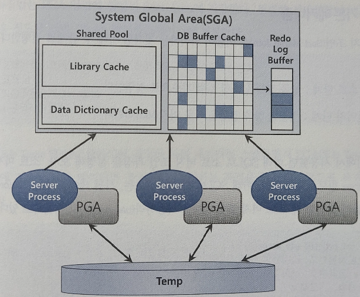

* System Glolbal Area(SGA) 공유 메모리 영역인 SGA에 캐시된 데이터는 여러 프로세스가 공유 가능하다.
* 동시에 직렬화하여 액세스 하기 위한 Lock 메커니즘으로 래치가 존재한다.
* 오라클 서버 프로세스는 SGA에 공유된 데이터를 읽고 각 오라클 서버 프로세스에 할당된 메모리 영역을 PGA라고 부른다.
* PGA는 독립적인 메모리 공간으로 래치 메커니즘이 불필요하므로 같은 양의 데이터를 읽더라도 SGA 버퍼캐시에서 읽을 때보다 훨씬 빠르다.

### 4.2.2 소트 머지 조인 기본 메커니즘

1. 소트 단계 : 양쪽 집합을 조인 컬럼 기준으로 정렬한다.
2. 머지 단계 : 정렬한 양쪽 집합을 서로 머지한다.

* 소트 머지 조인은 아래와 같은 use_merge 힌트로 유도한다.

```SQL
SELECT /*+ ordered use_merge(c)*/
    E.사원번호, E.사원명, E.입사일자, C.고객번호, C고객명, C.전화번호, C.최종주문금액
FROM 사원 E, 고객 C
WHERE C.관리사원번호 = E.사원번호
AND E.입사일자 >= '19960101'
AND E.부서코드 = 'Z123'
AND C.최종주문금액 >= 20000
```

* 위 SQL 수행 과정은 아래와 같은 과정으로 풀어서 설명 가능하다.

1. 조건에 해당하는 사원 데이터를 읽어 조인컬럼인 사원번호 순으로 정렬하여 PGA 영역에 할당된 Sort Area에 저장한다. 만약에 PGA에 담을 수 없을 정도로 크면 Temp 테이블 스페이스에 저장한다.
2. 조건에 해당하는 고객 데이터를 읽어 조인컬럼인 관리사원번호 순으로 정렬한다. 마찬가지로 PGA 영역에 할당.
3. PGA에 저장한 사원 데이터와 고객 데이터를 조인한다. (아래 SQL 문 참고)

```SQL
BEGIN 
    FOR OUTER IN (SELECT * FROM PGA_정렬된_사원_데이터)
    LOOP -- OUTER 루프
        FOR INNER IN (SELECT * FROM PGA_정렬된_고객_데이터
                      WHERE 관리사원번호 = OUTER.사원번호)
        LOOP -- INNER 루프   
            DBMS_OUTPUT.PUT_LINE(...);
        END LOOP;
    END LOOP;
END;
```

* 위에 SQL에서 볼 수 있듯이 정렬한 데이터를 NL조인과 같이 사용한다는 것을 볼 수 있다.
* Sort Area에 저장한 데이터 자체가 인덱스 역할을 하므로 인덱스가 없어도 사용할 수 있는 대용량에 적합한 것이 소트 머지이다.

### 4.2.3 대량 데이터를 조인할 때 소트 머지 조인이 빠른 이유

* NL 조인은 인덱스를 이용한 조인 방식으로 액세스하는 모든 블록을 랜덤 액세스 방식으로 DB 버퍼캐시를 경유해서 읽는다.
* 즉, 읽는 모든 블록에 래치 획득 및 캐시버퍼 체인 스캔 과정을 거치며 버퍼 캐시에 없으면 디스크에서 읽어 들인다.
* 인덱스를 이용하기 때문에 인덱스 손익분기점 한계를 그대로 드러내어 대량 데이터 조인에 NL조인이 불리한 이유이다.
* 반면, 소트 머지 조인은 양쪽 테이블로부터 조인 대상 집합을 일괄적으로 읽어 PGA에 저장한 후 조인한다.
* PGA는 프로세스만을 위한 독립적인 메모리 공간이므로 데이터를 읽을 때 래치 획득 과정이 없어 ```소트 머지 조인이 대량 데이터 조인에 유리한 이유이다.```

### 4.2.4 소트 머지 조인의 주용도

* 랜덤 액세스 위주의 NL조인이 대량 데이터 처리에 한계를 보일 떄 소트 머지 조인이 인기 있었으나 더 빠른 해시조인의 등장으로 소트 머지 조인의 쓰임새는 예전만 못하다.
* 하지만 해시 조인은 조인 조건식이 등치(=) 조건이 아닐 떄 사용할 수 없다는 단점이 존재한다.
* 그러므로 소트 머지 조인은 아래와 같은 상황에 주로 사용된다.
1. **조인 조건식이 등치(=) 조건이 나닌 대량 데이터 조인**
2. **조인 조건식이 아예 없는 조인**

### 4.2.5 소트 머지 조인 이해하기 

```SQL
SELECT /*+ ordered use_merge(c)*/
    E.사원번호, E.사원명, E.입사일자, C.고객번호, C고객명, C.전화번호, C.최종주문금액
FROM 사원 E, 고객 C
WHERE C.관리사원번호 = E.사원번호
AND E.입사일자 >= '19960101'
AND E.부서코드 = 'Z123'
AND C.최종주문금액 >= 20000
```

* ordered는 FROM 절에 기술한 순서대로 조인하라고 옵티마이저에 지시하는 힌트이다.
* ordered와 use_merge(c) 힌트를 같이 사용했으므로 양쪽 테이블을 조인 컬럼 순으로 각각 정렬한 후 '정렬된 사원' 기준으로 '정렬된 고객'과 조인하라는 뜻으로 해석하면 된다.
* 소트 머지의 시행계획은 아래와 같다.

```SQL
Execution Plan
----------------------------------------------------
SELECT STATEMENT Optimizer=ALL_ROWS
    MERGE JOIN 
        SORT(JOIN)
            TABLE ACCESS (BY INDEX ROWID) OF '사원' (TABLE)
                INDEX (RANGE SCAN) OF '사원_X1' (INDEX)
        SORT(JOIN)
            TABLE ACCESS (BY INDEX ROWID) OF '고객' (TABLE)
                INDEX (RANGE SCAN) OF '고객_X1' (INDEX)
```

### 4.2.6 소트 머지 조인 특징 요약

* 소트 머지 조인은 조인을 위해 실시간으로 인덱스를 생성하는 것과 같다.
* 양쪽 집합을 정렬한 다음에 NL조인과 같은 방식으로 사용하지만, PGA영역에 저장한 데이터를 이용하기 때문에 빠르다.
* NL 조인은 조인 컬럼에 대한 인덱스 유무에 크게 영향을 받지만, 소트 머지 조인은 영향을 크게 받지 않는다.
* 따라서 ```조인 컬럼에 인덱스가 없는 상황에서 대용량 테이블을 각각 읽어 조인 대상 집합을 줄일 수 있을 때 아주 유리하다.```
* 스캔 위주의 액세스 방식을 사용한다는 점도 중요한 특징이지만, 모든 처리가 스캔 방식으로 이루어지지는 않고 이는 해시 조인도 마찬가지이다.

### 4.3 해시 조인 

* 소트 머지 조인과 해시 조인은 조인 과정에 인덱스를 이용하지 않아 대량 데이터 조인할 때 NL조인보다 훨씬 빠르다.
* 소트 머지 조인은 양쪽 테이블을 정렬하는 부담이 있지만, 해시 조인은 그런 부담도 없다.

### 4.3.1 해시 조인 기본 메커니즘

1. Build 단계 : 작은 쪽 테이블을 읽어 해시 테이블을 생성한다.
2. Probe 단계 : 큰 쪽 테이블을 읽어 해시 테이블을 탐색하며 조인한다.

```SQL
SELECT /*+ ordered use_hash(c)*/
    E.사원번호, E.사원명, E.입사일자, C.고객번호, C고객명, C.전화번호, C.최종주문금액
FROM 사원 E, 고객 C
WHERE C.관리사원번호 = E.사원번호
AND E.입사일자 >= '19960101'
AND E.부서코드 = 'Z123'
AND C.최종주문금액 >= 20000
```

* 소트 머지 조인에서 사용했던 SQL에서 처럼 해시 조인은 use_hash 힌트로 유도한다.

1. Build 단계 : 아래 조건에 해당하는 사원 데이터를 읽어 조인 컬럼인 사원번호를  해시 테이블 키 값으로 사용한다. 즉, 사원번호를 해시 함수에 입력해서 반환된 값으로 해시 체인을 찾고, 그 해시 체인에 데이터를 연결한다. 해시 테이블은 PGA 영역에 할당된 Hash Area에 저장한다. 
2. Probe 단계 : 고객 데이터에 해당하는 조건식으로 고객 데이터를 하나씩 읽어 해시 테이블을 탐색한다. 즉, 관리사원번호를 해시 함수에 입력해서 반환된 값으로 해시 체인을 찾고, 그 해시 체인을 스캔해서 값이 같은 사원번호를 찾는다.

```SQL
BEGIN 
    FOR OUTER IN (SELECT 고객번호, 고객명... 
                  FROM 고객 
                  WHERE 최종주문금액 >= 20000)
    LOOP -- OUTER 루프
        FOR INNER IN (SELECT 사원번호, 사원명, 입사일자 
                      FROM PGA_정렬된_사원 해시맵
                      WHERE 사원번호 = OUTER.관리사원번호)
        LOOP -- INNER 루프   
            DBMS_OUTPUT.PUT_LINE(...);
        END LOOP;
    END LOOP;
END;
```

* Probe 단계에서 조인하는 과정을 PL/SQL 코드로 표현하면 위와 같다.

### 4.3.2 해시 조인이 빠른 이유

* Hash Area에 생성한 해시 테이블을 이용한다는 점만 다를 뿐 해시 조인도 프로세싱 자체는 NL 조인과 같다.
* 해시 조인도 소트 머지 조인과 같이 해시 테이블을 PGA 영역에 할당하기 때문이다.
* NL 조인은 Outer 테이블 레코드마다 Inner 쪽 테이블 레코드를 읽기 위해 래치 획득 및 캐시버퍼 체인 스캔 과정을 반복하지만, 해시 조인은 래치 획득 과정 없이 PGA에서 빠르게 데이터를 탐색하고 조인한다.
* 즉 정리하자면 해시 조인은, NL 조인처럼 조인 과정에서 발생하는 랜덤 액세스 부하가 없고, 소트 머지 조인처럼 양쪽 집합을 미리 정렬하는 부하도 없다.
* 해시 테이블을 생성하는 비용이 수반되지만, 둘 중 작은 집합을 Build Input 으로 선택하므로 대게는 부담이 크지 않다.

### 4.3.3 대용량 Build Input 처리

* 대용량 테이블 두 개를 조인할 때 인메모리 해시조인이 아니라 불가능한 상황에서는 ```분할, 정복``` 방식을 통해 조인한다.


1. 파티션 단계 : 조인하는 양쪽 집합의 조인 컬럼에 해시 함수를 적용하고, 반환된 해시 값에 따라 동적으로 파티셔닝한다. 독립적으로 처리할 수 있는 여러 개의 작은 서브 집합으로 분할함으로써 파티션 짝을 생성한다.
2. 조인 단계 : 파티션 단계를 완료하면, 각 파티션 짝에 대해 하나씩 조인을 수행한다. 이 때 Build Input과 Probe Input은 독립적으로 각 파티션별로 작은 쪽을 선택하여 해시 테이블을 선택한다.

### 4.3.5 조인 메서드 선택 기준

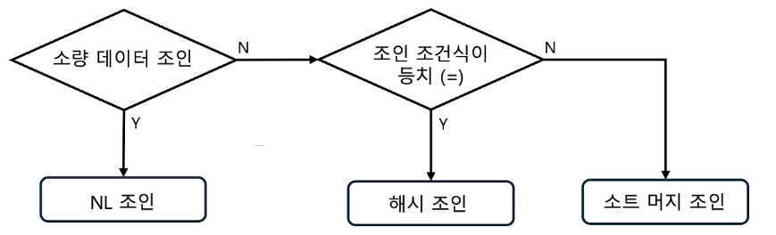

1. 소량 데이터 조인 -> NL 조인
2. 대량 데이터 조인 -> 해시 조인
3. 대량 데이터 조인 but 해시 조인으로 처리 불가능(등치 조건 =이 아닐 때, 조인 조건식이 없을 경우) -> 소트 머지 조인

* 여기서 소량과 대량의 기준은 데이터의 양이 아니라 랜덤 액세스가 많아 성능이 나오지 않는 경우도 대량 데이터 조인에 해당한다.
* ```수행 빈도가 높은 쿼리는 해시조인 보다는 NL 조인을 선택```하라고 한다. 왜냐하면 NL 조인은 인덱스를 통해 쿼리의 성능을 영구적으로 유지하며 재사용하는 반면에 해시 테이블은 단 하나의 쿼리를 위해 소멸하는 자료구조이기 떄문이다.

* 즉 결론적으로 해시 조인은 아래 세 가지 조건을 만족하는 SQL문에 주로 사용한다.

```SQL
1. 수행 빈도가 낮음.
2. 쿼리 수행 시간이 오래 걸림
3. 대량 데이터 조인하는 경우
```

### 4.4 서브쿼리 조인

* 옵티마이저는 Cost를 평가하고 조인에 대한 실행계획을 생성하기에 앞서 사용자가 사용하는 SQL을 최적하에 유리한 형태로 변환하는 작업부터 진행한다.

**필터 오퍼레이션**

* 아래 쿼리는 서브 쿼리를 필터 방식으로 처리할 때의 실행계획이다. no_unnest 힌트를 사용하면 서브 쿼리를 풀어내지 말고 수행하라고 옵티마이저에 지시하는 힌트이다.

```sql
select c.고객번호, c.고객명
from 고객 c
where c.가입일시 >= trunc(add_months(sysdate, -1), 'mm')
and exists(
            select /*+ no_unnest */
            from 거래
            where 고객번호 = c.고객번호
            and 거래일시 >= trunc(sysdate, 'mm') )
          )
Execution Plan
------------------------------------------------------
0       SELECT STATEMENT OPTIMIZER = ALL_ROWS 
1   0       FILTER          
2   1           TABLE ACCESS(BY INDEX ROWID) OF '고객' (TABLE)
3   2               INDEX (RANGE SCAN) OF '고객_X01' (INDEX)
4   1           INDEX (RANGE SCAN) OF '거래_X01' (INDEX)
```

* 필터 오퍼레이션은 기본적으로 NL조인과 루틴이 같으나 차이점이 존재하다면 메인쿼리의 한 로우가 서브쿼리의 한 로우와 조인에 성공하는 순간 멈추고, 메인쿼리의 다음 로우를 계속 처리한다는 점이다.

### 4.4.4 스칼라 서브쿼리 조인 

* 아래와 같은 GET_DNAME 함수가 있다.

```SQL
CREATE OR REPLACE FUNCTION GET_DNAME(P_DEPTNO NUMBER) RETURN VARCHAR2
IS 
    L_DNAME DEPT.DNMAE%TYPE;
BEGIN
    SELECT DNAME INTO L_DNAME FROM DEPT WHERE DEPTNO = P_DEPTNO;
    RETURN L_DNAME;
EXCEPTION 
    WHEN OTHERS THEN
        RETURN NULL;
END;
```

* GET_DNAME 함수를 사용하는 아래 쿼리를 실행하면 함수 안에 있는 SELECT 쿼리를 메인쿼리 건 수 만큼 재귀적으로 반복 실행한다.

```SQL
SELECT EMPNO, ENAME, SAL, HIREDATE, GET_DNAME(E.DEPTNO) AS DNAME
FROM EMP E
WHERE SAL >= 2000
```

* 위에 코드는 아래 처럼 풀어서 사용가능하다.

```SQL
SELECT EMPNO, ENAME, SAL, HIREDATE,
        ,(SELECT D.NAME FROM DEPT D WHERE D.DEPTNO = E.DEPTNO) AS DNAME
FROM EMP E
WHERE SAL >= 2000
```

* 이는 아래 OUTER 조인문처럼 하나의 문장으로 이해하라는 뜻이며, 아래 처럼 NL 조인 방식으로 실행된다.

```SQL
SELECT EMPNO, ENAME, SAL, HIREDATE, D.DNAME
FROM EMP E LEFT OUTER JOIN DEPT D ON E.DEPTNO = D.DEPTNO
WHERE E.SAL >= 2000
```

**스칼라 서브쿼리 캐싱 효과**

* 스칼라 서브쿼리로 조인하면 오라클은 조인 횟수를 최소화하려고 입력 값과 출력 값을 내부 캐시에 저장해 둔다.
* 조인할 때마다 캐시에서 입력 값을 찾아보고 찾으면 저장된 출력 값을 반환한다.
* 캐시에서 찾지 못할 때만 조인을 수행하며, 결과는 버리지 않고 캐시에 저장해준다.
* 스칼라 서브쿼리의 입력 값은, 그 안에서 참조하는 메인 쿼리의 컬럼 값이다.

```SQL
SELECT EMPNO, ENAME, SAL, HIREDATE
        ,(SELECT D.NAME -- 출력 값 : D.NAME
          FROM DEPT D 
          WHERE D.DEPTNO = E.DEPTNO -- 입력 값 : E.EMPNO
        ) AS DNAME
FROM EMP E
WHERE SAL >= 2000
```

* 캐싱은 쿼리 단위로 이루어지며, 쿼리를 시작할 때 PGA 메모리에 공간을 할당하고, 쿼리를 수행하면서 공간을 채워나가고, 쿼리를 마치는 순간 공간을 반환한다.
* 아래의 예제는 많이 활용 되는 튜닝 기법에 해당한다.

```SQL
SELECT EMPNO, ENAME, SAL, HIREDATE
        ,(SELECT GET_DNAME(E.DEPTNO) FROM DUAL) AS DNAME
FROM EMP E
WHERE SAL >= 2000
```

* 위와 같이 SELECT-LIST에 사용한 함수는 메인 쿼리 결과 건 수 만큼 반복 수행되는데, 스칼라 서브쿼리를 덧씌우면 호출 횟수를 최소화할 수 있다. 
* 하지만 캐시 공간은 늘 부족하고, 스칼라 서브쿼리 캐싱 효과는 입력 값의 종류가 소수여서 해시 충돌 가능성이 작을 때 효과가 있다.
* 즉, 캐시를 매번 확인하는 비용 때문에 오히려 성능이 더 나빠지고 CPU 사용률만 높게 만들어 메모리도 더 사용한다.
* 아래 쿼리를 예로 들어서 보자.

```sql
SELECT 거래번호, 고객번호, 영업조직ID, 거래구분코드,
    , (SELECT 거래구분명 FROM 거래구분 WHERE 거래구분코드 = T.거래구분코드) 거래구분명
FROM 거래 T
WHERE 거래일자 >= TO_CHAR(add_months(SYSDATE, -3), 'YYYYMMDD')  -- 50,000건
```

* 거래구분코드로 20개 값이 존재할 때 20개면 캐시에 모두 저장하고도 남아 메인 쿼리에서 50,000개를 읽는 동안 거래구분코드별 조인 액세스는 최초 한 번씩만 발생하여 이후에는 모두 캐시에서 데이터를 찾아 조인 성능을 높이는 데 큰 도움이 된다.
* 위 쿼리에서 스칼라 서브쿼리가 성능에 도움이 되려면, 최근 3개월간 수백 명 이내 일부 고객만 거래를 발생시켰어야 한다.
* 또한, 메인 쿼리 집합이 매우 작으면 캐싱은 쿼리 단위로 이루어지므로 캐시 재사용성이 낮다.


```SQL
SELECT C.고객번호, C.고객명
    , (SELECT ROUND(AVG(거래금액), 2) 평균거래금액
        FROM 거래 
        WHERE 거래일시 >= TRUNC(SYSDATE, 'MM')
        AND 고객번호 = C.고객번호)
FROM 고객 C 
WHERE C.가입일시 >= TRUNC(add_months(SYSDATE, -1), 'MM')

Execution Plan
------------------------------------------------------------
0       SELECT STATEMENT OPTIMIZER=ALL_ROWS
1   0       SORT 
2   1           TABLE ACCESS (BY INDEX ROWID BATCHED) OF '거래'
3   2               INDEX (RANGE SCAN) OF '거래_X02'
4   0       TABLE ACCESS (FULL) OF '고객'
5   4           INDEX (RANGE SCAN) OF '고객_X01'
```

**실행순서**

1. 고객_X01 인덱스 범위 스캔 , 가입일시 >= C.가입일시 >= TRUNC(add_months(SYSDATE, -1), 'MM') 를 만족하는 고객 위치 정보를 찾습니다.
2. 찾은 고객 정보를 기반으로 고객번호와 고객명을 메모리에 로드합니다.
3. 거래_X02 인덱스 범위 스캔 , 거래일시 >= TRUNC(SYSDATE, 'MM') 거래 데이터를 조회합니다.
4. 조회한 데이터를 기반으로 거래금액을 메모리에 로드합니다.
5. 각 고객별로 가져온 거래 데이터를 정렬 및 그룹화하여 거래금액의 평균을 계산하고 , ROUND합니다.
6. 최종적으로 결과를 수집하여 사용자에게 반환합니다.

## 5장 소트 튜닝

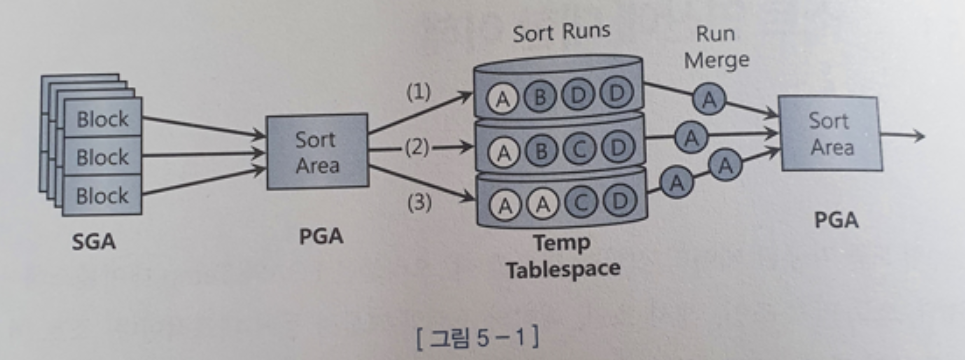

* 소트할 대상 집합을 SGA 버퍼캐시를 통해 읽어 Sort Area에서 정렬을 시도한다.
* Sort Area안에서 정렬을 마무리하는 것이 최적이지만, 양이 많을 때는 Temp 테이블 스페이스에 임시 세그먼트를 만들어 저장한다. Sort Area가 찰 때마다 Temp 영역에 저장해 둔 중간 단계의 집합을 Sort Run 이라고 부르며 정렬된 최종 결과집합을 얻으려면 다시 Merge 해야 한다.
* 소트 연산은 메모리 집약적일 뿐 아니라 CPU 집약적이기도 하여 데이터량이 많으면 I/O 까지 발생하여 쿼리 성능을 좌우하는 중요한 요소이다.
* ```부분범위 처리를 불가능하게 함으로써 OLTP 환경에서 애플리케이션 성능을 저하시키는 주요인```이 되기도 한다.

### 5.1.2 소트 오퍼레이션

**Sort Aggregate**

* Sort Aggregate는 전체 로우를 대상으로 집계를 수행할 때 나타난다. Sort 라는 표현을 사용하지만 ```실제로는 데이터를 정렬하지는 않으며 Sort Area를 사용한다는 의미```로 이해하면 된다.
* 각각의 집계함수에 NULL이 아닌 레코드를 만나면 COUNT 변수에 담아 1씩 증가시킨다.

**Sort Order By**

* 데이터를 정렬할 때 나타나는 실행 계획 

**Sort Group By**

* 그룹별 집계를 수행할 때 나타나는 실행 계획

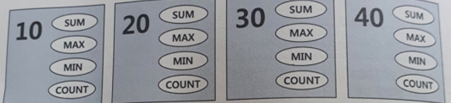

* Group By 부서번호로 틀을 만들어 정보를 읽으면서 변수들의 Aggregate 를 수행하고 갱신하여 결과값을 출력한다.
* 부서(그룹 개수)가 많지 않다면 Sort Area가 클 필요가 없으며 이는 Temp 테이블스페이스를 쓰지 않는다는 것이다.
* Group by 절 뒤에 Order By 절을 명시하지 않으면 Hash Group By 방식으로 처리된다.

**Sort Unique**

* 옵티마이저가 서브쿼리를 풀어 일반 조인문으로 변환하는 것을 서브쿼리 Unnesting 이라고 한다.
* Unnesting된 서브쿼리가 조인 컬럼에 Unique 인덱스가 없을 때 M쪽 집합이면 조인하기전에 중복 레코드부터 제거하는데 이 때 Sort Unique 오퍼레이션이 나타난다.

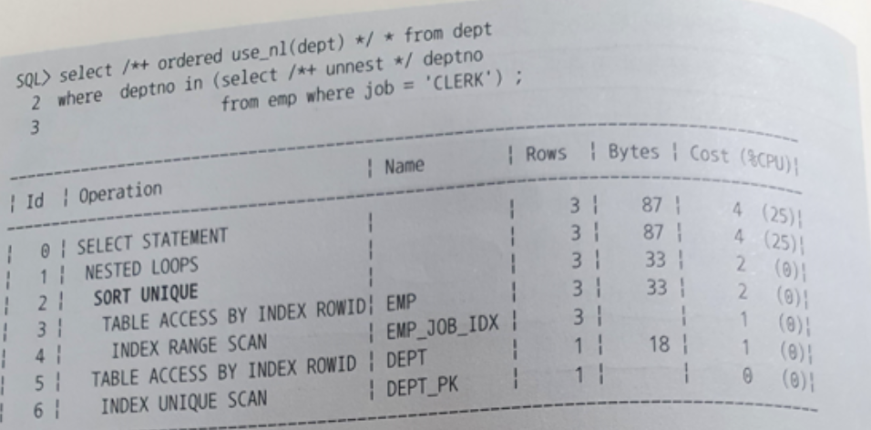

* 만약 PK/Unique 제약 또는 Unique 인덱스를 통해 서브쿼리의 유일성이 보장된다면, Sort Unique 오퍼레이션은 생략된다.
* Union, Minus, Intersect 같은 집합 연산자를 사용할 때도 Sort Unique 오퍼레이션이 나타난다.
* Distinct 연산에도 Sort Unique 오퍼레이션이 나타나지만 오라클 10gR2 부터는 Distinct 연산에는 Hash Unique 방식을 사용한다. 

**Sort Join**

* Sort Join 오퍼레이션은 소트 머지 조인을 수행할 때 나타난다.

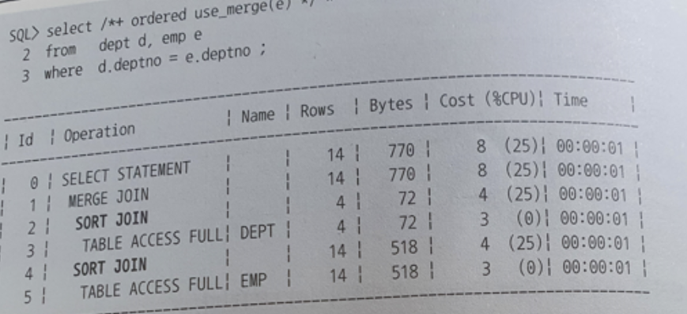

### 5.2 소트가 발생하지 않도록 SQL 작성

* ```Union, Minus, Distinct 연산자는 중복 레코드를 제거하기위한 소트 연산을 발생하므로 꼭 필요한 경우에만 사용해야한다.```

### 5.2.1 Union vs Union All 

* SQL에 Union을 사용하면 상단과 하단 두 집합 간 중복을 제거하려고 소트 작업을 수행한다.
* 반면 Union All 은 중복을 확인하지 않고 단순히 결합하므로 소트 작업을 수행하지는 않는다. (될 수 있으면 Union All을 사용해야하는 이유)

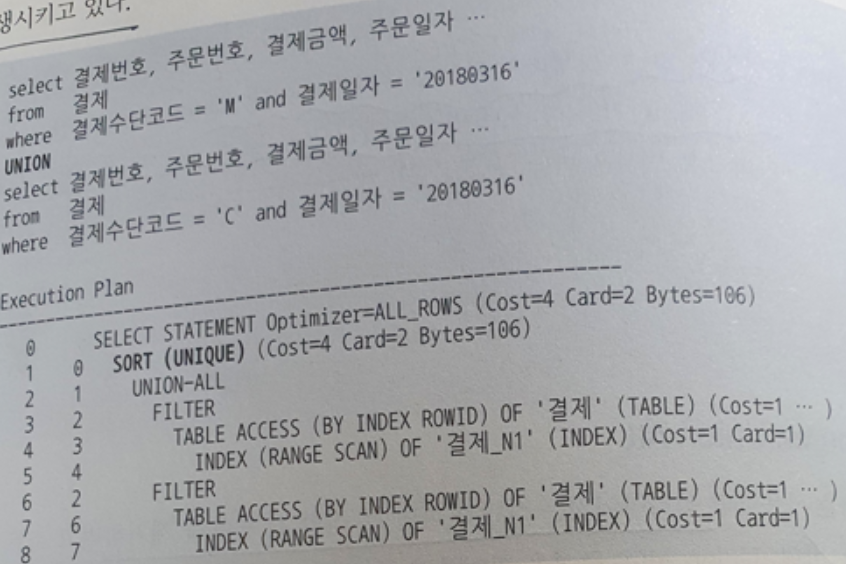

* 위의 쿼리는 결제수단코드가 달라 중복 가능성이 없음에도 불구하고 UNION 을 사용하고 있다. 이렇게 되면 소트 연산이 발생함으로 성능을 위해 UNION ALL 을 사용하는 것이 좋다.

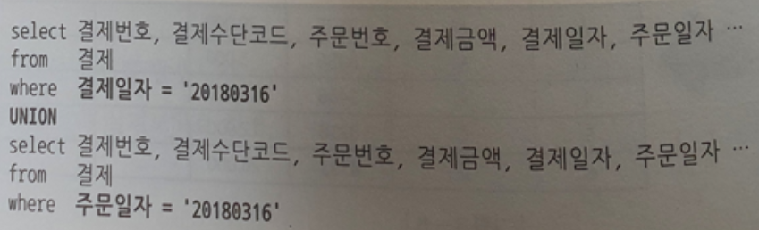

* 위에 쿼리는 인스턴스 중복 가능성이 있는 쿼리이다. 이 같은 경우에 UNION ALL 을 사용하게 되면 같은 결제 데이터가 중복해서 나오게 된다. 이 같은 경우는 소트 연산이 발생하지 않으면서 UNION ALL 을 사용해야하므로 쿼리를 아래와 같이 변환해야한다.

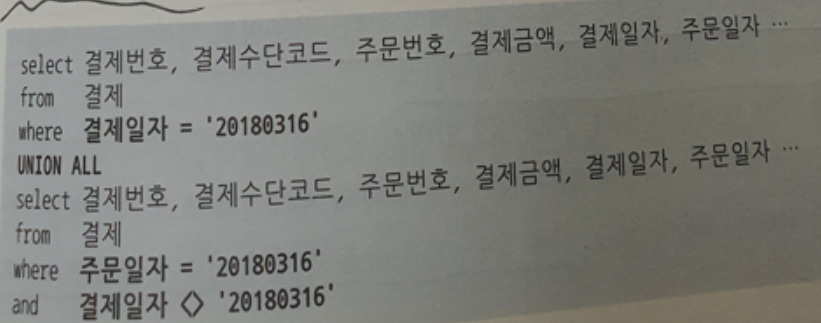

### 5.2.2 Exists 활용

* 중복 레코드를 제거할 목적으로 Distinct 연산자를 종종 사용하는데, 이는 조건에 해당하는 데이터를 모두 읽어서 중복을 제거한다. 이렇게 되면 부분범위 처리는 불가하고, 이 과정에 많은 I/O가 발생한다.

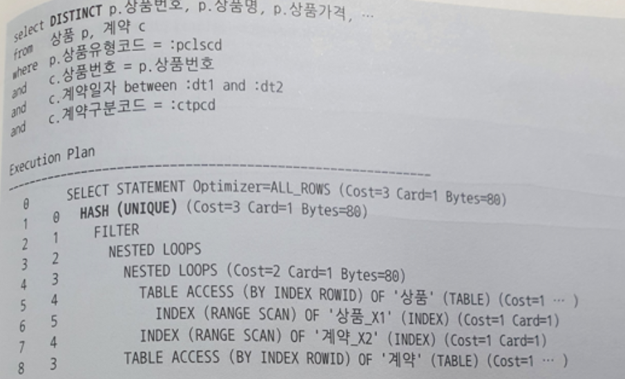

* 위에 쿼리는 상품유형코드 조건절에 해당하는 상품에 대해 계약일자 조건 기간에 발생한 계약 데이터를 모두 읽는 비효율이 존재한다. 상품 수는 적고 계약 건수가 많을 수록 비효율이 큰 패턴이다. 이를 Exists 를 이용하여 튜닝하면 아래와 같다.

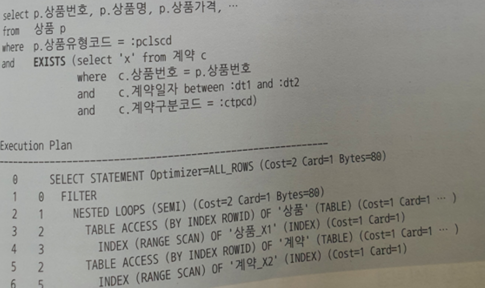

* Exists 서브쿼리는 데이터 존재 여부만 확인하면 되기 때문에 조건절을 만족하는 데이터를 모두 읽지 않는다.
* ```상품유형코드 조건절에 해당하는 상품에 대해 계약일자 조건 기간에 발생한 계약 중 계약구분코드 조건절을 만족하는 데이터가 한건이라도 존재하는지만 확인```한다.
* Distinct 연산자를 사용하지 않았으므로 상품 테이블에 대한 부분범위 처리도 가능하다.

* Minus 연산자를 Exists 서브쿼리로 변환하는 경우는 아래와 같이 변환한다.

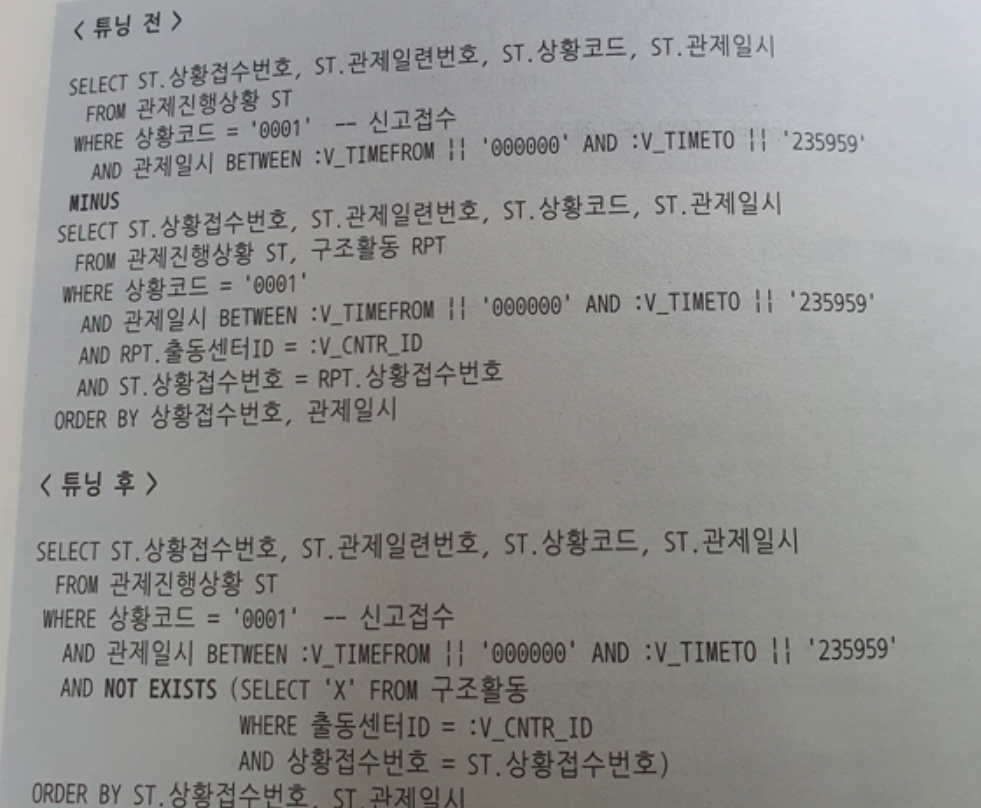

* 계약_X01 인덱스가 지점id + 계약일시 순이면 소트 연산을 생략할 수 있지만, 해시 조인이기 때문에 Sort Order By 로 옵티마이저가 선택했다.

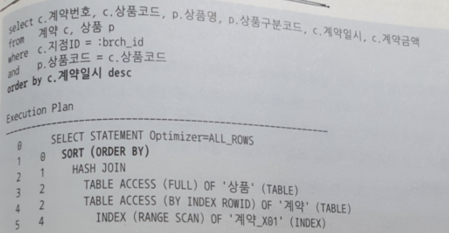

* 아래와 같이 계약 테이블을 기준으로 상품 테이블과 NL조인하도록 조인 방식을 변경하면 소트 연산을 생략할 수 있어 큰 성능 개선 효과를 얻을 수 있다.

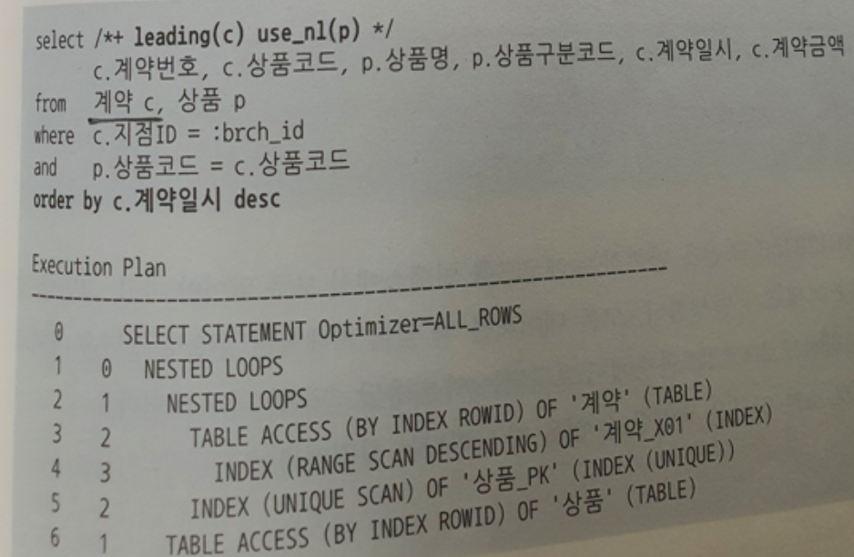

* 정렬 기준이 조인 키 컬럼이면 소트 머지 조인도 Sort Order By 연산을 생략할 수 있다.

### 5.3 인덱스를 이용한 소트 연산 생략

* 인덱스는 항상 키 컬럼 순으로 정렬된 상태를 유지하므로 Order By 또는 Group By 절이 있어도 소트 연산을 생략할 수 있다.

### 5.3.1 Sort Order By 생략

* 인덱스 선두 컬럼을 [ 종목코드 + 거래일시 ] 순으로 구성하지 않으면 아래 쿼리에서 소트 연산을 생략할 수 없다.

```SQL
SELECT 거래일시, 체결건수, 체결수량, 거래대금
FROM 종목거래
WHERE 종목코드 = 'KR123456'
ORDER BY 거래일시 
```

* 종목코드 = 'KR123456' 조건을 만족하는 레코드를 인덱스에서 모두 읽어 많은 테이블 랜덤 액세스가 발생한다. 이 때 거래일시 순으로 정렬을 마치고 출력을 시작하므로 OLTP 환경에서 빠른 응답 속도를 내기는 어렵다.

**부분범위 처리 활용 튜닝 기법**

* 부분범위 처리는 쿼리 수행 결과 중 앞쪽 일부를 우선 전송하고 멈추었다가 클라이언트가 추가 전송을 요청할 때마다 남은 데이터를 조금씩 나눠 전송하는 방식을 말한다.
* 요즘 DB는 ```3-Tier 환경```(클라이언트 프로그램이 DB에 직접 접속하는 2-Tier 환경이 아닌 ```클라이언트와 DB 사이에 WAS, AP 서버 등이 존재하는 환경```)으로 클라이언트가 특정 DB 커넥션을 독점할 수 없다.
* 이 때 부분범위 처리 활용은 첫째, 결과집합 출력을 바로 시작할 수 있느냐, 둘째, 앞쪽 일부만 출력하고 멈출 수 있느냐가 핵심으로 3-Tier 환경에서는 의미 없다 생각할 수 있지만, ```Top N 쿼리에 있어서 3-Tier 환경에서는 아직도 유효하다.``` Top N 쿼리에 대해서 알아보자.

### 5.3.2 Top N 쿼리

* Top N 쿼리는 전체 결과집합 중 상위 N개 레코드만 선택하는 쿼리이다.

```sql
SELECT * FROM (
    SELECT 거래일시, 체결건수...
    FROM 종목거래
    WHERE 종목코드 = 'KR123456'
    AND 거래일시 >= '20180304'
    ORDER BY 거래일시
)
WHERE ROWNUM <= 10
```

* 인라인 뷰로 정의한 집합을 모두 읽어 거래일시 순으로 정렬한 중간 집합을 우선적으로 만들고 상위 열 개 레코드를 취하는 형태이다.
* 위 쿼리에 [ 종목코드 + 거래일시 ] 순으로 구성된 인덱스를 사용하면 옵티마이저는 소트 연산을 생략하며 열 개 레코드를 읽는 순간 바로 멈춘다.
* 이는 조건절에 부합하는 레코드가 아무리 많아도 그 중 ROWNUM 으로 지정한 건수만큼 결과 레코드를 얻으면 거기서 바로 멈춘다는 뜻이며 이 기능을 ```Top N Stopkey``` 알고리즘이라고 부른다.

**페이징 처리**

* 3-Tier 환경에서 대용량 결과집합을 조회할 때 부분 범위 처리는 페이징 처리를 사용한다.
* 일반적으로 사용하는 패턴을 알아보자.

```SQL
SELECT *
FROM(
    SELECT ROWNUM NO, A.*
    FROM (
        SELECT 거래일시, 체결건수...
        FROM 종목거래
        WHERE 종목코드 = 'KR123456'
        AND 거래일시 >= '20180304'
        ORDER BY 거래일시
        ) A
    )
    WHERE ROWNUM <= (:PAGE * 10)
    )
WHERE NO >= (:PAGE - 1) * 10 + 1
```

* Top N 쿼리로 ROWNUM 으로 지정한 건수만큼 결과 레코드를 얻으면 거기서 바로 멈춘다.
* 주로 카페 게시글 목록을 조회하거나 은행 사이트에서 입출금 내역을 조회할 때 1~2 페이지만 확인한다.
* 부분 범위 처리가 가능하도록 SQL을 작성한다는 의미는 ```인덱스 사용이 가능한 조건절, 조인은 NL조인 위주로 처리, 소트 연산을 생략할 수 있도록 인덱스를 구성``` 하는 것이다.

## 6장 DML 튜닝

### 6.1.1 DML 성능에 영향을 미치는 요소 

1. 인덱스
2. 무결성 제약
3. 조건절
4. 서브쿼리
5. Redo 로깅 
6. Undo 로깅
7. Lock
8. 커밋

**인덱스와 DML성능**

* 테이블에 레코드를 입력하면 인덱스에도 입력해야 한다.
* 인덱스는 정렬된 자료구조이므로 수직적 탐색을 통해 입력할 블록을 찾아야하므로 DML 성능에 미치는 영향도 더 크다.
* INSERT, DELETE는 테이블에서 레코들르 모두 찾아 삽입, 삭제해 줘야 한다. UPDATE할 때는 변경된 컬럼을 참조하는 인덱스만 찾아서 변경해 주면 된다.
* 간단한 100만개 레코드를 만든 테이블에서 인덱스를 1개 추가 할 때마다 8배가 느려진다. 이를 통해 인덱스 하나라도 줄이면 TPS(Transaction Per Second)는 그만큼 향상된다는 것을 의미한다.

**무결성 제약과 DML 성능**

* PK, FK 제약은 실제 데이터를 조회해 봐야 하기 때문에 Check, Not Null 제약보다 성능에 더 큰 영향을 미친다.
* 위와 같이 똑같이 100만개 레코드를 INSERT할 때 PK 제약 조건이 없으면 약 3배 빨라진다.
* 소요시간 : PK (O), 일반 인덱스 (O) > PK (O), 일반 인덱스 (X) > PK (X), 일반 인덱스 (X)

**Redo 로깅과 DML 성능**

* 오라클은 데이터파일과 컨트롤 파일에 가해지는 모든 변경사항을 Redo 로그에 기록한다.
* Redo 로그는 트랜잭션 데이터가 어떤 이유에서건 유실됐을 때, 트랜잭션을 재현함으로써 유실 이전 상태로 복구하는데 사용한다.
* DML을 수행할 때마다 Redo 로그를 생성하므로 Redo 로깅은 DML성능에 영향을 미친다.

```SQL
-- Redo 로그 사용 목적 세 가지

1. 물리적으로 디스크가 깨지는 등 작업이 발생할 시 데이터베이스를 복구하기 위해 사용
2. 캐시에 저장된 변경사항이 데이터 블록에 기록되지 않은 상태에서 정전 등이 발생해 인스턴스가 비정상적으로 종료되면, 그때까지의 작업 내용을 모두 잃는 것을 대비해 Redo 로그 사용
3. 트랜잭션에 의한 변경사항을 빠른 Append 방식으로 기록하여 빠르게 커밋을 완료한다는 의미에서의 Fast Commit 작업 수행
```

**트랜잭션**

```SQL
-- 트랜잭션 개념 정리

트랜잭션 정의 : 여러 SQL 작업을 하나의 묶음으로 처리하는 하나의 논리적인 작업 단위 ACID 특성을 기반으로 일관된 처리를 보장.

1. Atomicity (원자성)
-- 트랜잭션 내의 작업이 모두 수행되거나, 모두 취소되는 것.
2. Consistency (일관성)
-- 트랜잭션이 성공적으로 완료되어 일관된 상태 유지. 데이터의 무결성이 보장.
-- 특정 제약 조건을 위반되는 DML작업이 발생할 경우, 롤백.
3. Isolation (고립성)
-- 트랜잭션이 독립적으로 수행되어, 동시에 여러 트랜잭션이 수행되어도 다른 트랜잭션의 중간 결과를 볼 수 없습니다.
-- 일반적으로 많은 데이터베이스의 격리 수준인 Read Committed.
4. Durability (지속성)
-- 트랜잭션이 성공적으로 커밋되면 영구적으로 데이터베이스에 반영됩니다.
```

**Lock 과 DML성능**

* Lock은 필요 이상으로 자주, 길게 사용하거나 레벨을 높일수록 DML성능은 느려진다. 그렇다고 너무 적게, 짧게 사용하거나 레벨 이하로 낮추면 데이터 품질이 낮아진다.
* 동시성 제어를 통해 트랜잭션 수를 최대화하며 데이터 무결성을 유지하기 위해 노력해야 한다.

**DB 버퍼캐시**

* DB에 접속한 사용자를 대신해 모든 일을 처리하는 서버 프로세스는 버퍼캐시를 통해 데이터를 읽고 쓴다. 
* 버퍼캐시에서 변경된 블록을 모아 주기적으로 데이터파일에 일괄 기록하는 작업은 DBWR 프로세스가 진행한다.

**Redo 로그 버퍼**

* 버퍼캐시는 휘발성이므로 DBWR 프로세스가 Dirty 블록들을 반영할 떄까지 불안한 상태라고 생각하겠지만, 버퍼캐시에 가한 변경사항을 Redo 로그에도 기록하므로 언제든 복구 가능한 강점이 존재한다. 

**트랜잭션 데이터 저장 과정**

1. DML문 실행 시 Redo 로그버퍼에 변경사항을 기록한다.
2. 버퍼블록에서 데이터를 변경한다.
3. 커밋한다.
4. LGWR 프로세스가 Redo 로그버퍼 내용을 로그파일에 일괄 저장한다.
5. DBWR 프로세스가 변경된 버퍼블록들을 데이터파일에 일괄 저장한다.

### 6.2 Direct Path I/O

* 트랜잭션은 버퍼캐시가 성능 향상에 도움을 주지만, 대용량의 배치에서 사용하는 SQL은 버퍼캐시를 경유함으로써 I/O 메커니즘이 오히려 성능을 떨어뜨릴 수 있다. 그래서 오라클은 ```버퍼캐시를 경유하지 않고 곧바로 데이터 블록을 읽고 쓸 수 있는 Direct Path I/O``` 기능을 제공한다.

### 6.2.1 Direct Path I/O

* 일반적인 블록 I/O는 DB 버퍼캐시를 경유하고, 읽고자 하는 블록을 찾아보고 없을 때만 디스크에서 읽는다.
* 자주 읽는 블록에 대한 반복적인 I/O Call을 줄임으로써 성능을 높이려고 버퍼캐시를 이용하지만, 대량 데이터를 읽고 쓸 때는 오히려 성능에 좋지 않다.
* Direct Path I/O 기능은 아래와 같은 경우에 작동한다.

1. 병렬 쿼리로 Full Scan 수행 시
2. 병렬 DML 수행 시
3. Direct Path Insert 수행 시
4. Temp 세그먼트 블록 읽고 쓸 때
5. Direct 옵션 지정 후 Export 수행 시
6. Nocache 옵션 지정한 LOB 컬럼 읽을 시

### 6.2.2 Direct Path Insert

**일반적인 INSERT 가 느린 이유**

1. 데이터를 입력할 수 있는 아래쪽에 있는 블록 중 입력 가능한 블록을 목록으로 관리한다.
2. 목록 중 할당받은 블록을 버퍼캐시에서 찾는다.
3. 버퍼캐시에 없으면, 데이터파일에서 읽어 버퍼캐시에 적재한다.
4. INSERT 내용을 Undo 세그먼트에 기록한다.
5. INSERT 내용을 Redo 로그에 기록한다.

**Direct Path Insert 방식**

1. 아래쪽에 있는 블록 중 입력 가능한 블록을 참조하지 않고 HWM 바깥 영역에 데이터를 순차적으로 입력한다.
2. 블록을 버퍼캐시에서 탐색하지 않는다.
3. 버퍼캐시에 적재하지 않고, 데이터파일에 직접 기록한다.
4. Undo 로깅을 안 한다.
5. Redo 로깅을 안하게 할 수 있다. 
  
### 6.4 Lock 트랜잭션 동시성 제어

**DML 로우 Lock**

* DML 로우 Lock은 두 개의 동시 트랜잭션이 같은 로우를 변경하는 것을 방지한다. 하나의 로우를 변경하려면 로우 Lock을 먼저 설정해야 한다.
* DML 수행전 항상 테이블 Lock 을 먼저 설정하며 밑의 세 가지 옵션을 통해 Lock을 컨트롤 할 수 있다.

1. Lock이 해제될 때 까지 기다린다. (select * from t for update)
2. 일정 시간만 기다리다 포기한다. (select * from t for update wait3)
3. 기다리지 않고 포기한다. (select * from t for update nowait)

**블로킹과 교착상태 Lock을 푸는 열쇠, 커밋**

* 블러킹 : 선행 트랜잭션의 Lock 때문에 작업을 진행하지 못하고 멈춰있는 상태. 해소하는 방법은 커밋과 롤백뿐이다.
* 교착상태 : 두 트랜잭션이 Lock을 설정한 상태에서 다른 트랜잭션이 같은 리소스에 또 Lock을 설정하려고 진행하는 상황을 말한다. 교착상태가 발생하면, 트랜잭션이 교착상태를 발생시킨 문장 하나만 롤백한다.
* 교착상태는 해소됐지만 블로킹 상태에 놓이므로, 커밋 또는 롤백을 결정해야하며, 프로그램내에서 에러에 대한 예외처리(커밋, 롤백)를 하지 않는다면 무한 대기 상태가 지속된다.

**채번 방식에 따른 INSERT 성능 비교**

**1. 채번 테이블**
* 각 테이블 식별자의 단일컬럼 일련번호 또는 구분 속성별 순번을 채번하기 위해 별도 테이블을 관리하는 방식이다.
* 가장 큰 단점은 로우 Lock 경합으로 인하여 다른 채번 방식에 비해 성능이 안 좋다는 데 있다.
* 동시 INSERT가 많으면 채번 테이블 블록 자체에도 경합이 발생하므로 동시 INSERT가 많으면 이 방식은 사용하기 어렵다.

**2. 시퀀스 오브젝트**
* 시퀀스는 성능이 빠르다는 큰 장점이 있고 중복 레코드 발생에 크게 신경 쓰지 않아도 된다는 장점이 존재한다.
 * 시퀀스 오브젝트도 오라클 내부에서 관리하는 채번 테이블이므로 똑같이 Lock에 의한 성능 이슈가 생길 수도 있다. 하지만 캐시 사이즈를 적절히 설정함으로써 트랜잭션과 빠른 성능을 유지할 수 있다.

**1. MAX + 1 조회**
* 시퀀스나 채번 테이블을 관리하는 부담과 동시 트랜잭션에 의한 충돌이 많지 않으면 성능이 2개 중에 가장 빠르다. 
* 하지만 레코드 중복에 의한 예외처리와 다중 트랜잭션에 의한 동시 채번이 심하면 성능이 더 나빠질 수 있다.
* 채번 방식에 따른 Lock 경합 요소는 아래와 같이 정리할 수 있다.

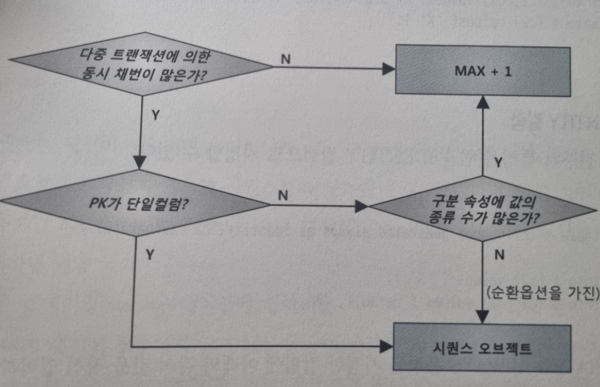

```
1. 채번 테이블이나 시퀀스 오브젝트 관리 부담을 고려한다면 -> MAX + 1
2. 다중 트랜잭션에 의한 동시 채번이 많고 PK가 단일 컬럼이라면 -> 시퀀스
3. 다중 트랜잭션에 의한 동시 채번이 많고 값 종류 수가 많으면 -> MAX + 1
```

## 7장 SQL 옵티마이저
