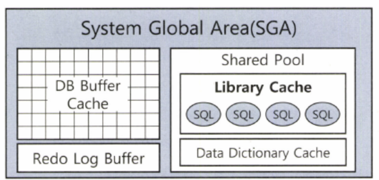

# 친절한 SQL 튜닝 - 조시형

## 1장 SQL 처리 과정과 I/O

### 1.1 SQL 파싱과 최적화

* SQL 튜닝을 시작하기에 앞서 옵티마이저가 SQL을 어떻게 처리하는지, 서버 프로세스는 어떻게 읽고 저장하는지 살펴보자.

**옵티마이저**

* SQL 옵티마이저는 SQL쿼리를 최적하기 위해 최적의 실행 계획을 결정하며 아래와 같은 과정을 통해 이루어집니다. (네비게이션과 같은 역할을 해주는 최적의 실행 계획을 해주는 내부 엔진으로 기억하자)

1. 쿼리 파싱 및 분석 : SQL문을 분석하고 파싱하여 내부 표현으로 변환하여 분석.
2. 통계 정보 수집 : 테이블 및 인덱스 통계 정보 수집.
3. 실행 계획 생성 : 테이블 및 인덱스 액세스 방법, 조인 순서, 조인 방법 포함 실행.
4. 최적 실행 계획 선택 : 생성된 실행 계획 중에서 가장 효율적 선택함으로써 쿼리 실행 시간, 리소스 사용량 최소

**서버 프로세스**

1. 클라이언트 연결 수립.
2. SQL 쿼리 수신.
3. 쿼리 실행
4. 결과 반환
5. 연결 종료

**프로시저**

* 프로시저 : 데이터베이스 내에서 미리 컴파일되어 저장된 하나 이상의 SQL문과 프로그래밍 논리를 가진 데이터베이스 객체입니다.

```SQL
CREATE OR REPLACE PROCEDURE calculate_sum (
    num1 IN NUMBER,
    num2 IN NUMBER
)
IS
    total NUMBER;
BEGIN
    -- 입력된 두 숫자의 합을 계산합니다.
    total := num1 + num2;
    
    -- 결과를 출력합니다.
    DBMS_OUTPUT.PUT_LINE('두 숫자의 합: ' || total);
END;

-- 호출방법
BEGIN
    calculate_sum(10, 20);
END;
```

* SQL은 Structured Query Language 의 줄임말이다. PL/SQL 처럼 절차적 프로그래밍 기능을 구현할 수 있는 확장 언어도 제공하지만, 기본적으로 구조적이고 집합적이고 선언적인 질의 언어이다.
* 결과적으로는 구조적, 집합적이지만 결과집합을 만드는 과정은 절차적일 수 밖에 없기 때문에 프로시저가 필요하다. 그런 프로시저를 만들어 내는 DBMS 내부 엔진이 바로 SQL 옵티마이저이다.
* DBMS 내부에서 프로시저를 작성하고 컴파일해서 실행 가능한 상태로 만드는 전 과정을 **SQL 최적화**라고 한다.

**SQL최적화**

1. SQL 파싱

* **SQL파서**가 파싱을 진행. 파싱을 요약하면 아래와 같음.
    * 파싱 트리 생성 : SQL 문의 구성요소를 분석하여 파싱 트리 생성
    * Syntax 생성 : 문법적 오류 유무 확인
    * Semantic 체크 : 의미상 오류 확인 (존재하지 않는 테이블 또는 컬럼 사용 유무 파악)

2. SQL 최적화

* 옵티마이저가 수집한 시스템 및 통계정보를 바탕으로 다양한 실행경로를 생성 비교 후 효율적인 하나 선택

3. 로우 소스 생성

* 실행경로를 실제 실행 가능한 코드, 프로시저 형태로 포맷팅 하는 단계

**SQL옵티마이저**

* SQL옵티마이저 : 작업을 가장 효율적으로 수행할 수 있는 최적의 데이터 액세스 경로를 선택해주는 DBMS 핵심 엔진

1. 쿼리를 수행하는 데 후보군이 될만한 실행계획 탐색
2. 데이터 딕셔너리에 수집해 둔 통계를 이용하여 각 실행계획의 예상비용 선택
3. 최저 비용을 나타내는 실행계획 선택

**실행계획과 비용**

* DBMS에는 SQL 실행경로 미리보기를 통해 SQL이 테이블을 스캔하는지 인덱스를 스캔하는지, 인덱스 스캔을 한다면 어떤 인덱스인지를 확인할 수 있다.

```SQL
CREATE INDEX tt1_x01 ON tt1(NO, id);
CREATE INDEX tt1_x02 ON tt1(NO, id, name);

SELECT 
	*
FROM
	tt1
WHERE
	NO = 2
	AND id = 9;

SELECT /*+ index(tt1 tt1_x02) */
	*
FROM
	tt1
WHERE
	NO = 2
	AND id = 9;

SELECT /*+ full(tt1) */
	*
FROM
	tt1
WHERE
	NO = 2
	AND id = 9;
```

* 위와 같이 인덱스를 생성하였을 때 옵티마이저는 T_X01 인덱스를 선택했다. 선택한 근거는 무엇일까?
* tt1_x02 인덱스를 선택했을 때는 코스트가 2, full scan을 선택했을 때는 코스트가 20으로 선택한 근거가 비용임을 알 수 있다.
* 비용은 쿼리를 수행하는 동안 발생할 것으로 예상되는 I/O 횟수 또는 예상 소요시간을 표현한 값이다.
* 하지만 네비게이션과 동일하게 목적지에 도착하기까지 걸리는 시간은 예상보다 늦게 도착할 수도 일찍 도착하기도 한다.
* SQL 실행계획에 표시되는 Cost도 어디까지나 예상치이며 옵티마이저가 통계정보를 활용해서 계산해 낸 값이다.

```SQL
/*+ INDEX(A A_X01) INDEX(B B_X01) */    -- 두 유효
/*+ INDEX(C), FULL(D)*/     -- 첫 번째 힌트만 유효

-- 스키마명 명시 X
SELECT /*+ FULL(SCOTT.EMP)*/    -- 무효
    FROM EMP

-- FROM 절 옆에 ALIAS 사용 시 힌트에도 ALIAS 사용
SELECT /*+ FULL(EMP)*/
    FROM EMP e
```

* 옵티마이저가 제공해주는 힌트를 사용할 때는 위와 같은 주의사항들에 맞춰서 사용하자.

```SQL
SELECT /*+ LEADING(A) USE_NL(B) INDEX(A (주문일자)) INDEX(B 고객_PK) */
    A. 주문번호, A.주문금액, B.고객명, B.연락처, B.주소
FROM 주문 A, 고객 B
WHERE A.주문일자 = :ORD_DT
AND   A.고객ID = B.고객ID
```

* 옵티마이저의 작은 실수가 기업에 큰 손실을 끼치는 시스템 같은 경우 위와 같이 빈틈없는 힌트 기술을 통해 다른 방식을 선택하지 못하도록 기술해준다.
* **자주 사용하는 힌트 목록은 27P 참고**

### 1.2 SQL 공유 및 재사용

* SQL 내부 최적화 과정을 알고나면 동시성이 높은 트랜잭션 처리 시스템에서 바인드 변수가 왜 중요한지 이해하자.

**소프트파싱 vs 하드파싱**

* **SQL 파싱, 최적화, 로우 소스 생성 과정**을 거쳐 생성한 내부 프로시저를 반복 재사용할 수 있도록 캐싱해 두는 메모리 공간을 **라이브러리 캐시**라고 한다.



* 라이브러리 캐시는 위의 그림과 같은 구조이며 SGA구성요소이고, 서버 프로세스와 백그라운드 프로세스가 공통으로 액세스하는 데이터와 제어 구조를 캐싱하는 메모리 공간이다.


* 소프트 파싱과 하드 파싱은 위의 도식화한 그림으로 설명이 된다.

* **소프트파싱** : SQL을 캐시에서 찾아 바로 실행단계로 넘어가는 것
* **하드파싱** : 찾는 데 실패해 최적화 및 로우 소스 생성 단계까지 모두 거치는 것

**SQL 최적화 과정은 왜 하드한가?**

* 네비게이션을 예로 들어 가장 빠른 길을 선택하는 방식은 최적 경로 탐색이 꽤 어렵고 무거운 작업임을 알 수가 있다.
* 마찬가지로 옵티마이저 SQL을 최적할 때도 훨씬 많은 일을 수행한다.
    * ex) 다섯 개 테이블 조인 쿼리문 5! 가지 수, NL, 소트 머지, 해시, 테이블 전체, 인덱스 스캔 등등.. 고려해야 할 일이 상당히 많다.
* 데이터베이스에서 이루어지는 처리 과정은 대부분 I/O 작업에 집중되는 반면, 하드 파싱은 **CPU를 많이 소비하는 몇 안되는 작업** 중 하나이다.
* 어려운 하드파싱 작업을 거쳐 생성한 내부 프로시저를 **한 번만 사용하고 버린다면** 이만저만한 **비효율**이기 때문에 **라이브러리 캐시가 필요**하다

### 1.2.1 바인드 변수의 중요성

* 사용자 정의 함수/프로시저, 트리거, 패키지 등은 생성할 때부터 이름을 갖는다.
* 컴파일 상태로 딕셔너리에 저장되며, 사용자가 삭제하지 않는 한 영구적으로 보관된다.
* 실행할 때 라이브러리 캐시에 적재함으로써 여러 사용자가 공유하면서 재사용한다.

**이름없는 SQL문제**

* 반면에 SQL은 이름이 따로 없기 때문에 딕셔너리에 저장하지 않으며, 처음 실행할 때 최적화 과정을 거쳐 동적으로 생성한 내부 프로시저를 라이브러리 캐시에 적재함으로써 재사용한다.
* 캐시 공간이 부족하게되면 버려졌다가 다음에 다시 실행할 떄 똑같은 과정을 거쳐 캐시에 적재된다.
* 라이브러리 캐시에서 SQL을 찾기 위해 사용하는 키 값이 SQL문 그 자체이므로 각각 최적화를 진행하고 라이브러리 캐시에서 별도 공간을 사용한다.

**아래 중요한 예제를 통해 알아보자**

* 500만 고객을 보유한 어떤 쇼핑몰에서 로그인 모듈 담당 개발자가 프로그램을 아래와 같이 작성했다고 하자.

```SQL
public void login(String login_id) throws Exception{
    String SQLStmt = "SELECT * FROM CUSTOMER WHERE LOGIN_ID = '" + login_id + "'";
    Statement st = con.createStatement();
    ResultSet rs = st.executeQuery(SQLStmt);
    if(rs.next()){
        // do anything
    }
    rs.close();
    st.close();
}
```

* 위와 같이 코드를 작성할 경우 100만 고객이 동시에 시스템 접속을 하면 무슨 일이 발생할까?
* DBMS에 발생하는 부하는 대게 과도한 I/O가 원인이기 때문에 여러 종류의 경합 떄문에 로그인 처리가 제대로 처리되지 않을 것이다.
* 이유는 SQL 하드파싱 때문이다. 내부 라이브러리 캐시(V$SQL)를 조회해보자.

```SQL
SELECT * FROM CUSTOMER WHERE LOGIN_ID = 'oraking'
SELECT * FROM CUSTOMER WHERE LOGIN_ID = 'javaking'
SELECT * FROM CUSTOMER WHERE LOGIN_ID = 'tommy'
...
...

-- 내부 프로시저
create procedure LOGIN_ORAKING() {...}
create procedure LOGIN_JAVAKING() {...}
create procedure LOGIN_TOMMY() {...}
...
...
```

* 로그인 프로그램을 이렇게 작성하게 되면 고객이 로그인할 때마다 DBMS 내부 프로시저를 하나씩 만들어서 라이브러리 캐시에 적재하는 셈이다.
* 이런식으로 여러 개 생성할 것이 아니라 로그인ID를 파라미터로 받는 프로시저 하나를 공유하면서 재사용 하는 것이 유리하다.

```SQL
-- 로그인 ID를 파라미터로 받는 프로시저를 하나로 공유한다면?
create procedure LOGIN (login_id in varchar2) {...}

public void login(String login_id) throws Exception{
    String SQLStmt = "SELECT * FROM CUSTOMER WHERE LOGIN_ID = ?";
    PreparedStatement st = con.prepareStatement(SQLStmt);
    st.setString(1, login_id);
    ResultSet rs = st.executeQuery();
    if(rs.next()){
        // do anything
    }
    rs.close();
    st.close();
}

-- 아래와 같은 로그인과 관련해서 아래 SQL 하나만 발견된다.
SELECT * FROM CUSTOMER WHERE LOGIN_ID = :1
```

* 이처럼 파라미터 Driven 방식으로 SQL을 작성하는 방법이 제공되는데 이 것이 바로 바인드 변수이다.
* 종합해보자면 하드파싱은 하나만 사용함으로써 캐싱된 SQL을 100만 고객이 공유하고 재사용함으로써 부담을 줄이는 것이다.


## 2장 인덱스 기본

## 3장 인덱스 튜닝

## 4장 조인 튜닝

## 5장 소트 튜닝

## 6장 DML 튜닝

## 7장 SQL 옵티마이저