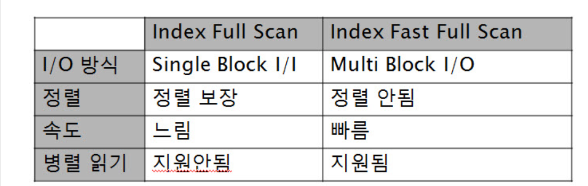
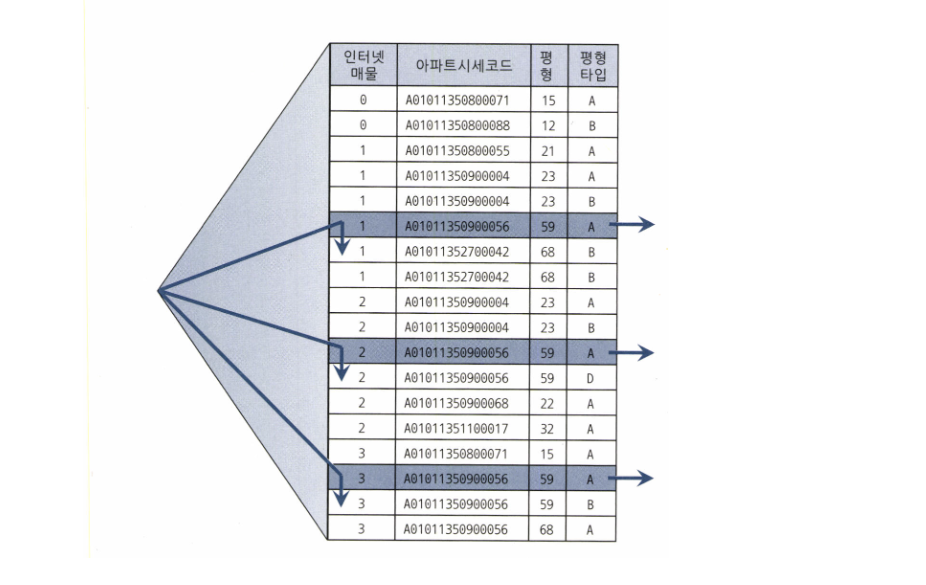

# 친절한 SQL 튜닝 - 조시형

## 1장 SQL 처리 과정과 I/O

### 1.1 SQL 파싱과 최적화

* SQL 튜닝을 시작하기에 앞서 옵티마이저가 SQL을 어떻게 처리하는지, 서버 프로세스는 어떻게 읽고 저장하는지 살펴보자.

**옵티마이저**

* SQL 옵티마이저는 SQL쿼리를 최적하기 위해 최적의 실행 계획을 결정하며 아래와 같은 과정을 통해 이루어집니다. (네비게이션과 같은 역할을 해주는 최적의 실행 계획을 해주는 내부 엔진으로 기억하자)

1. 쿼리 파싱 및 분석 : SQL문을 분석하고 파싱하여 내부 표현으로 변환하여 분석.
2. 통계 정보 수집 : 테이블 및 인덱스 통계 정보 수집.
3. 실행 계획 생성 : 테이블 및 인덱스 액세스 방법, 조인 순서, 조인 방법 포함 실행.
4. 최적 실행 계획 선택 : 생성된 실행 계획 중에서 가장 효율적 선택함으로써 쿼리 실행 시간, 리소스 사용량 최소

**서버 프로세스**

1. 클라이언트 연결 수립.
2. SQL 쿼리 수신.
3. 쿼리 실행
4. 결과 반환
5. 연결 종료

**프로시저**

* 프로시저 : 데이터베이스 내에서 미리 컴파일되어 저장된 하나 이상의 SQL문과 프로그래밍 논리를 가진 데이터베이스 객체입니다.

```SQL
CREATE OR REPLACE PROCEDURE calculate_sum (
    num1 IN NUMBER,
    num2 IN NUMBER
)
IS
    total NUMBER;
BEGIN
    -- 입력된 두 숫자의 합을 계산합니다.
    total := num1 + num2;
    
    -- 결과를 출력합니다.
    DBMS_OUTPUT.PUT_LINE('두 숫자의 합: ' || total);
END;

-- 호출방법
BEGIN
    calculate_sum(10, 20);
END;
```

* SQL은 Structured Query Language 의 줄임말이다. PL/SQL 처럼 절차적 프로그래밍 기능을 구현할 수 있는 확장 언어도 제공하지만, 기본적으로 구조적이고 집합적이고 선언적인 질의 언어이다.
* 결과적으로는 구조적, 집합적이지만 결과집합을 만드는 과정은 절차적일 수 밖에 없기 때문에 프로시저가 필요하다. 그런 프로시저를 만들어 내는 DBMS 내부 엔진이 바로 SQL 옵티마이저이다.
* DBMS 내부에서 프로시저를 작성하고 컴파일해서 실행 가능한 상태로 만드는 전 과정을 **SQL 최적화**라고 한다.

**SQL최적화**

1. SQL 파싱

* **SQL파서**가 파싱을 진행. 파싱을 요약하면 아래와 같음.
    * 파싱 트리 생성 : SQL 문의 구성요소를 분석하여 파싱 트리 생성
    * Syntax 생성 : 문법적 오류 유무 확인
    * Semantic 체크 : 의미상 오류 확인 (존재하지 않는 테이블 또는 컬럼 사용 유무 파악)

2. SQL 최적화

* 옵티마이저가 수집한 시스템 및 통계정보를 바탕으로 다양한 실행경로를 생성 비교 후 효율적인 하나 선택

3. 로우 소스 생성

* 실행경로를 실제 실행 가능한 코드, 프로시저 형태로 포맷팅 하는 단계

**SQL옵티마이저**

* SQL옵티마이저 : 작업을 가장 효율적으로 수행할 수 있는 최적의 데이터 액세스 경로를 선택해주는 DBMS 핵심 엔진

1. 쿼리를 수행하는 데 후보군이 될만한 실행계획 탐색
2. 데이터 딕셔너리에 수집해 둔 통계를 이용하여 각 실행계획의 예상비용 선택
3. 최저 비용을 나타내는 실행계획 선택

**실행계획과 비용**

* DBMS에는 SQL 실행경로 미리보기를 통해 SQL이 테이블을 스캔하는지 인덱스를 스캔하는지, 인덱스 스캔을 한다면 어떤 인덱스인지를 확인할 수 있다.

```SQL
CREATE INDEX tt1_x01 ON tt1(NO, id);
CREATE INDEX tt1_x02 ON tt1(NO, id, name);

SELECT 
	*
FROM
	tt1
WHERE
	NO = 2
	AND id = 9;

SELECT /*+ index(tt1 tt1_x02) */
	*
FROM
	tt1
WHERE
	NO = 2
	AND id = 9;

SELECT /*+ full(tt1) */
	*
FROM
	tt1
WHERE
	NO = 2
	AND id = 9;
```

* 위와 같이 인덱스를 생성하였을 때 옵티마이저는 T_X01 인덱스를 선택했다. 선택한 근거는 무엇일까?
* tt1_x02 인덱스를 선택했을 때는 코스트가 2, full scan을 선택했을 때는 코스트가 20으로 선택한 근거가 비용임을 알 수 있다.
* 비용은 쿼리를 수행하는 동안 발생할 것으로 예상되는 I/O 횟수 또는 예상 소요시간을 표현한 값이다.
* 하지만 네비게이션과 동일하게 목적지에 도착하기까지 걸리는 시간은 예상보다 늦게 도착할 수도 일찍 도착하기도 한다.
* SQL 실행계획에 표시되는 Cost도 어디까지나 예상치이며 옵티마이저가 통계정보를 활용해서 계산해 낸 값이다.

```SQL
/*+ INDEX(A A_X01) INDEX(B B_X01) */    -- 두 유효
/*+ INDEX(C), FULL(D)*/     -- 첫 번째 힌트만 유효

-- 스키마명 명시 X
SELECT /*+ FULL(SCOTT.EMP)*/    -- 무효
    FROM EMP

-- FROM 절 옆에 ALIAS 사용 시 힌트에도 ALIAS 사용
SELECT /*+ FULL(EMP)*/
    FROM EMP e
```

* 옵티마이저가 제공해주는 힌트를 사용할 때는 위와 같은 주의사항들에 맞춰서 사용하자.

```SQL
SELECT /*+ LEADING(A) USE_NL(B) INDEX(A (주문일자)) INDEX(B 고객_PK) */
    A. 주문번호, A.주문금액, B.고객명, B.연락처, B.주소
FROM 주문 A, 고객 B
WHERE A.주문일자 = :ORD_DT
AND   A.고객ID = B.고객ID
```

* 옵티마이저의 작은 실수가 기업에 큰 손실을 끼치는 시스템 같은 경우 위와 같이 빈틈없는 힌트 기술을 통해 다른 방식을 선택하지 못하도록 기술해준다.
* **자주 사용하는 힌트 목록은 27P 참고**

### 1.2 SQL 공유 및 재사용

* SQL 내부 최적화 과정을 알고나면 동시성이 높은 트랜잭션 처리 시스템에서 바인드 변수가 왜 중요한지 이해하자.

**소프트파싱 vs 하드파싱**

* **SQL 파싱, 최적화, 로우 소스 생성 과정**을 거쳐 생성한 내부 프로시저를 반복 재사용할 수 있도록 캐싱해 두는 메모리 공간을 **라이브러리 캐시**라고 한다.


* 라이브러리 캐시는 위의 그림과 같은 구조이며 SGA구성요소이고, 서버 프로세스와 백그라운드 프로세스가 공통으로 액세스하는 데이터와 제어 구조를 캐싱하는 메모리 공간이다.


* 소프트 파싱과 하드 파싱은 위의 도식화한 그림으로 설명이 된다.

* **소프트파싱** : SQL을 캐시에서 찾아 바로 실행단계로 넘어가는 것
* **하드파싱** : 찾는 데 실패해 최적화 및 로우 소스 생성 단계까지 모두 거치는 것

**SQL 최적화 과정은 왜 하드한가?**

* 네비게이션을 예로 들어 가장 빠른 길을 선택하는 방식은 최적 경로 탐색이 꽤 어렵고 무거운 작업임을 알 수가 있다.
* 마찬가지로 옵티마이저 SQL을 최적할 때도 훨씬 많은 일을 수행한다.
    * ex) 다섯 개 테이블 조인 쿼리문 5! 가지 수, NL, 소트 머지, 해시, 테이블 전체, 인덱스 스캔 등등.. 고려해야 할 일이 상당히 많다.
* 데이터베이스에서 이루어지는 처리 과정은 대부분 I/O 작업에 집중되는 반면, 하드 파싱은 **CPU를 많이 소비하는 몇 안되는 작업** 중 하나이다.
* 어려운 하드파싱 작업을 거쳐 생성한 내부 프로시저를 **한 번만 사용하고 버린다면** 이만저만한 **비효율**이기 때문에 **라이브러리 캐시가 필요**하다

### 1.2.1 바인드 변수의 중요성

* 사용자 정의 함수/프로시저, 트리거, 패키지 등은 생성할 때부터 이름을 갖는다.
* 컴파일 상태로 딕셔너리에 저장되며, 사용자가 삭제하지 않는 한 영구적으로 보관된다.
* 실행할 때 라이브러리 캐시에 적재함으로써 여러 사용자가 공유하면서 재사용한다.

**이름없는 SQL문제**

* 반면에 SQL은 이름이 따로 없기 때문에 딕셔너리에 저장하지 않으며, 처음 실행할 때 최적화 과정을 거쳐 동적으로 생성한 내부 프로시저를 라이브러리 캐시에 적재함으로써 재사용한다.
* 캐시 공간이 부족하게되면 버려졌다가 다음에 다시 실행할 떄 똑같은 과정을 거쳐 캐시에 적재된다.
* 라이브러리 캐시에서 SQL을 찾기 위해 사용하는 키 값이 SQL문 그 자체이므로 각각 최적화를 진행하고 라이브러리 캐시에서 별도 공간을 사용한다.

**아래 중요한 예제를 통해 알아보자**

* 500만 고객을 보유한 어떤 쇼핑몰에서 로그인 모듈 담당 개발자가 프로그램을 아래와 같이 작성했다고 하자.

```SQL
public void login(String login_id) throws Exception{
    String SQLStmt = "SELECT * FROM CUSTOMER WHERE LOGIN_ID = '" + login_id + "'";
    Statement st = con.createStatement();
    ResultSet rs = st.executeQuery(SQLStmt);
    if(rs.next()){
        // do anything
    }
    rs.close();
    st.close();
}
```

* 위와 같이 코드를 작성할 경우 100만 고객이 동시에 시스템 접속을 하면 무슨 일이 발생할까?
* DBMS에 발생하는 부하는 대게 과도한 I/O가 원인이기 때문에 여러 종류의 경합 떄문에 로그인 처리가 제대로 처리되지 않을 것이다.
* 이유는 SQL 하드파싱 때문이다. 내부 라이브러리 캐시(V$SQL)를 조회해보자.

```SQL
SELECT * FROM CUSTOMER WHERE LOGIN_ID = 'oraking'
SELECT * FROM CUSTOMER WHERE LOGIN_ID = 'javaking'
SELECT * FROM CUSTOMER WHERE LOGIN_ID = 'tommy'
...
...

-- 내부 프로시저
create procedure LOGIN_ORAKING() {...}
create procedure LOGIN_JAVAKING() {...}
create procedure LOGIN_TOMMY() {...}
...
...
```

* 로그인 프로그램을 이렇게 작성하게 되면 고객이 로그인할 때마다 DBMS 내부 프로시저를 하나씩 만들어서 라이브러리 캐시에 적재하는 셈이다.
* 이런식으로 여러 개 생성할 것이 아니라 로그인ID를 파라미터로 받는 프로시저 하나를 공유하면서 재사용 하는 것이 유리하다.

```SQL
-- 로그인 ID를 파라미터로 받는 프로시저를 하나로 공유한다면?
create procedure LOGIN (login_id in varchar2) {...}

public void login(String login_id) throws Exception{
    String SQLStmt = "SELECT * FROM CUSTOMER WHERE LOGIN_ID = ?";
    PreparedStatement st = con.prepareStatement(SQLStmt);
    st.setString(1, login_id);
    ResultSet rs = st.executeQuery();
    if(rs.next()){
        // do anything
    }
    rs.close();
    st.close();
}

-- 아래와 같은 로그인과 관련해서 아래 SQL 하나만 발견된다.
SELECT * FROM CUSTOMER WHERE LOGIN_ID = :1
```

* 이처럼 파라미터 Driven 방식으로 SQL을 작성하는 방법이 제공되는데 이 것이 바로 바인드 변수이다.
* 종합해보자면 하드파싱은 하나만 사용함으로써 캐싱된 SQL을 100만 고객이 공유하고 재사용함으로써 부담을 줄이는 것이다.

### 1.3 데이터 저장 구조 및 I/O 메커니즘

* I/O 튜닝이 곧 SQL 튜닝이라고 해도 과언이 아닐만큼 I/O 이해에 대한 이해가 중요할 수 밖에 없다. 데이터 저장 구조, 디스크 및 메모리에서 데이터를 읽는 메커니즘을 제대로 살펴보자.

**SQL이 느린이유**

* SQL이 느린 이유는 십중팔구 I/O 때문이다. 구체적으로 디스크 I/O 때문이다.
* 그렇다면 I/O란 무엇일까 이 책의 저자는 I/O 를 잠(SLEEP) 이라고 설명한다.
* OS 또는 I/O 시스템이 처리하는 동안 프로세스는 잠을 자기 때문이다.


* 프로세스는 실행 중인 프로그램이며 위와 같은 생명주기를 같는다.
* 생성 이후 종료 전까지의 준비와 실행과 대기 상태를 반복한다.(new -> ready -> running -> wait -> terminated)
* 여러 프로세스가 하나의 CPU를 공유할 수 있지만 특정 순간에는 하나의 프로세스만 CPU를 사용할 수 있기 때문에 이런 메커니즘이 필요하다.
* interrupt 없이 일하는 프로세스도 디스크에서 데이터를 읽을 때는 CPU를 OS에 반환하고 수면상태에서 I/O가 완료되기를 기다린다.
* 열심히 일해야 할 프로세스가 잠을 자고 있으니 I/O가 많으면 성능이 느려질 수 밖에 없다.
* 일반적으로 I/O Call 속도는 Single Block I/O 기준 평균 10ms 

### 1.3.1 데이터베이스 저장 구조

* 데이터를 저장하려면 먼저 테이블스페이스를 생성해야 한다.
* 테이블스페이스는 세그먼트를 담는 콘테이너로서, **여러 개의 데이터파일**로 구성된다.


* 위와 같이 테이블스페이스를 생성했으면 그림처럼 세그먼트(테이블, 저장공간이 필요한 오브젝트)를 생성한다.
* 세그먼트는 여러 익스텐트로 구성되어있다. 파티션 구조가 아니라면 테이블도 하나의 세그먼트이고 인덱스도 하나의 세그먼트이다. (즉 각 파티션이 하나의 세그먼트)
* 익스텐트는 연속된 블록들의 집합이기도 하다. 연속된 여러 개의 데이터 블록으로 구성되어있다.
* 실제로 저장하는 공간은 데이트 블록이고 한 블록에 저장된 레코드는 모두 같은 테이블 레코드이다.
* 데이터베이스에서 데이터를 읽고 쓰는 단위는 블록이며, 특정 레코드 하나를 읽는다하더라도 해당 블록을 통째로 읽는다.
* 각 용어에 대해 간단히 정의하자면 아래와 같다.

1. 블록 : 데이터를 읽고 쓰는 단위
2. 익스텐트 : 공간을 확장하는 단위, 연속된 블록 집합
3. 세그먼트 : 데이터 저장공간이 필요한 오브젝트
4. 테이블스페이스 : 세그먼트를 담는 콘테이너
5. 데이터파일 : 디스크 상의 물리적인 OS 파일

### 1.3.2 시퀀셜 액세스 vs 랜덤 엑세스

* 테이블 또는 인덱스 블록을 액세스하는 방식으로는 **시퀀셜 액세스와 랜덤 액세스** 두 가지가 있다.
* 시퀀셜 엑세스는 단어의 의미와 같이 연결된 순서에 따라 차례대로 블록을 읽는 방식이다.
* 인덱스 리프 블록은 앞뒤를 가리키는 주소값을 통해 논리적으로 연결되어있는데 이 주소 값에 따라 앞 또는 뒤로 순차적으로 스캔하는 방식이 시퀀셜 액세스에 해당한다.

**데이터 블록 간에는 서로 논리적인 연결고리를 갖고 있지 않은데 어떻게 액세스할까?**

* 오라클은 세그먼트에 할당된 익스텐트 목록을 세그먼트 헤더에 맵으로 관리한다.
* 익스텐트 맵은 각 인스텐트의 첫 번째 블록 주소 값을 갖는다.
* 읽어야 할 익스텐트 목록을 익스텐트 맵에서 얻고, 연속해서 저장된 블록을 순서대로 읽으면 이것이 Full Table Scan 이다.
* 랜덤 액세스는 논리적, 물리적인 순서를 따르지 않고, 레코드 하나를 읽기 위해 한 블록씩 접근하는 방식이다.

### 1.3.3 논리적I/O vs 물리적 I/O

**DB 버퍼캐시**

* 디스크 I/O가 SQL 성능을 결정하는 것은 거듭 강조한다.
* 자주 읽는 블록을 매번 디스크에서 읽는 것은 비효율적이고 DBMS에 데이터 캐싱 매커니즘이 필수인 이유이다.
* 앞서 알아본 라이브러리 캐시가 SQL과 실행계획, DB 저장형 함수/프로시저 등을 캐싱하는 **코드 캐시**라고 한다면, **DB 버퍼 캐시는 데이터 캐시**라고 할 수 있다(같은 블록에 대한 반복적인 I/O Call을 줄이는 목적)
* 서버 프로세스와 데이터 파일 사이에 위치함으로써 데이터 블록을 읽기 전에 버퍼캐시부터 탐색한다.
* 운 좋게 캐시에서 블록을 찾으면 프로세스가 잠을 자지 않아도 되니 속도는 당연히 빠르고, 찾지 못하더라도 한 번은 I/O Call을 하고 잠을 자겠지만 두 번째 부터는 잠을 자지 않아도 되는 공유메모리 영역으로 같은 블록을 읽는 다른 프로세스도 득을 본다.

**논리적 I/O vs 물리적 I/O**

* 논리적 블록 I/O : SQL문을 처리하는 과정에 메모리 버퍼캐시에서 발생한 총 블록 I/O (메모리 I/O)
* 물리적 블록 I/O : 디스크에서 발생한 총 블록 I/O (디스크 I/O)

* SQL 처리 도중 읽어야 할 블록을 버퍼캐시에서 찾지 못할 때만 디스크를 액세스하므로 논리적 블록 I/O 중 일부를 물리적으로 I/O 한다.
* 메모리 I/O는 전기적 신호인데 반해, 디스크 I/O는 액세스 암을 통해 물리적 작용이 일어나므로 논리적 I/O보다 10,000배쯤 느리다.
* SQL을 수행하려면 데이터가 담긴 블록을 읽어야 하는데 데이터를 입력하거나 삭제하지 않는 상황에서 조건절에 같은 변수 값을 입력하면, 아무리 여러 번 실행해도 매번 읽는 블록 수는 같다.
* **SQL을 수행하면서 읽은 총 블록 I/O**가 **논리적 I/O**이다.
* DB 버퍼캐시에서 블록을 찾지 못해 **디스크에서 읽은 블록 I/O**가 **물리적 I/O** 이다.

**버퍼캐시 히트율**

* 버퍼캐시 효율을 측정하는 데 전통적으로 가장 많이 사용해 온 지표는 **버퍼캐시 히트율(BCHR)**이다.

**BCHR = (논리적 I/O - 물리적 I/O / 논리적 I/O) * 100**

* BCHR은 읽은 전제 블록 중에서 물리적인 디스크 I/O를 수반하지 않고 곧바로 메모리에서 찾은 비율을 나타낸다.
* 일반적으로 시스템 레벨에서 평균 99% 히트율을 달성해야 한다.
* 실제 SQL 성능을 향상하려면 물리적 I/O 가 아닌 논리적 I/O를 줄여야 한다. 공식을 아래와 같이 변경하면 쉽게 알 수 있다.

**물리적 I/O = 논리적 I/O * (100 - BCHR)**

* 즉 논리적 I/O는 일정하여 물리적 I/O는 BCHR에 의해 결정되는데 시스템 상황에 의해 결정되기 때문에 SQL 성능을 높이기 위해서는 **논리적 I/O를 줄이는 일뿐이다.**
* **논리적 I/O를 줄임으로써 물리적 I/O를 줄이는 것이 곧 SQL 튜닝이다.**

### 1.3.4 SingleBlock I/O vs MultiBlock I/O

* 메모리 캐시가 클수록 좋지만, 데이터를 모두 캐시에 적재할 수는 없으므로 캐시에서 찾지 못한 데이터 블록은 I/O Call을 통해 디스크에서 DB 버퍼캐시로 적재하고서 읽는다.
* I/O Call을 할 때, 한 번에 한 블록씩 요청하기도 하고, 여러 블록씩 요청하기도 하는데 **한 번에 한블록씩 요청해서 메모리에 적재하는 방식을 Single Block I/O** 라고한다.
* 반면에 **한 번에 여러 블록씩 요청해서 메모리에 적재하는 방식을 Multiblock I/O** 라고 한다.
* 인덱스를 이용할 때는 기본적으로 인덱스와 테이블 모두 Single Block I/O 방식을 사용한다.
* 반대로 많은 데이터 블록을 읽을 때는 Multiblock I/O 방식이 효율적이다(Full Scan).
* 정리하자면 MultiBlock I/O는 캐시에서 찾지 못한 특정 블록을 읽으려고 할 때 캐시에 미리 적재하는 기능이며 Full Scan 할 때 성능이 좋다.

### 1.3.5 Table Full Scan vs Index Range Scan

* 테이블에 저장된 데이터를 읽는 방식은 크게 두 가지다. 테이블 전체를 스캔해서 읽는 방식과 인덱스를 이용해서 읽는 방식이다. 
* Tabls Full Scan 은 말그대로 테이블에 속한 블록 '전체'를 읽어서 사용자가 원하는 데이터를 찾는 방식이다.
* 인덱스를 이용한 테이블 액세스는 인덱스에서 일정량을 스캔하면서 얻은 ROWID로 테이블 레코드를 찾아가는 방식이다.

**무조건적으로 Index Scan 을 사용하는 것이 빠르진 않다?**

여지껏 무조건 Index Scan 을 타야 속도가 빠른 줄 알았는데 이 책에서는 그렇지 않다라고 정의하고 있다. 이유에 대해서 알아보자.

* **Table Full Scan**은 시퀀셜 액세스와 Multiblock I/O 방식으로 디스크 블록을 읽는다.한 블록에 속한 모든 레코드를 한 번에 읽어 들이고, 캐시에서 찾지 못하면 한 번의 수면을 통해 수십 ~ 수백 개 블록을 한꺼번에 I/O 하는 메커니즘이다.
* 하지만 수십 ~ 수백 건의 소량 데이터를 찾을 때 수백만 ~ 수천만 건 데이터를 스캔하는건 비효율적이므로 소량 데이터를 검색할 때는 반드시 인덱스를 이용해야 한다.
* **Index Range Scan**을 통한 테이블 액세스는 랜덤 액세스와 Single Block I/O 방식으로 디스크 블록을 읽는다. 캐시에서 블록을 못찾으면, '레코드 하나를 읽기 위해 매번 잠을 자는 I/O 메커니즘이다. 따라서 많은 데이터를 읽을 때는 Table Full Scan보다 불리하다.

## 2장 인덱스 기본

* 인덱스에 대한 개념만 알고있을 뿐 명확한 그림이 없는 상태에서 설계하고 개발하니 성능이 좋을 리 없다.
* 인덱스 탐색 과정이 **수직적 탐색과 수평적 탐색** 두 단계로 이루어진다는 사실에 대해 유념하며 알아보자.

### 2.1 인덱스 구조 및 탐색

**데이터를 찾는 두 가지 방법**

* 어떤 초등학교를 방문해 '홍길동' 학생을 찾는 방법은 두 가지다.
* 첫째는, 1학년 1반부터 6학년 맨 마지막 반까지 모든 교실을 돌며 홍길동 학생을 찾는 것이다.
* 둘째는, 교무실에서 학생 명부를 조회해 홍길동 학생이 있는 교실만 찾아가는 것이다.
* 결과는 홍길동 학생이 많으면 첫째, 몇 안 되면 후자가 빠르다.

* 데이터베이스 테이블에서 데이터를 찾는 방법도 크게 아래 두 가지에 해당한다.

1. 테이블 전체를 스캔한다.
2. 인덱스를 이용한다.

* 모든 교실을 돌며 학생을 찾는 경우가 전자이고, 학생부를 이용한 경우가 후자인 것이다.
* 테이블 전체 스캔과 관련해서는 튜인 요소가 많지 않지만, 인덱스와 관련해서는 튜닝 요소가 매우 많고 기법도 다양하다.

**인덱스 튜닝의 두 가지 핵심요소**

1. 인덱스 스캔 과정에서 발생하는 비효율을 줄이는 것. 즉, **인덱스 스캔 효율화 튜닝**

* 학생명부에서 시력이 1.0 ~ 1.5 인 홍길동 학생을 찾는 경우를 예로 들어보자.
* 학생명부를 이름과 시력순으로 정렬해 두었다면 소량만 스캔하면 되지만 학생명부를 시력과 이름순으로 정렬해 두었다면 똑같이 두명을 찾는데도 많은 양을 스캔해야 한다.

2. 테이블 액세스 횟수를 줄이는 것. 즉, **랜덤 액세스 최소화 튜닝**

* 시력이 1.0 ~ 1.5인 학생은 50명이고 이름이 홍길동인 학생은 5명이고, 시력이 1.0 ~ 1.5인 홍길동 학생은 2명이다.
    * 이름과 시력만으로 각각 정렬한 학생명부가 있다면 어느 쪽이 더 효과적일까?
    * 당연히, 이름순으로 정렬한 학생명부를 선택하면 교실을 다섯 번만 찾아가면 되기 때문에 유리하다.
    * 어떤 학생명부를 사용하느냐에 따라 교실 방문 횟수는 다르다.


* 인덱스 스캔 효율화 튜닝과 랜덤 액세스 최소화 튜닝 둘 다 중요하지만, 더 중요한 하나를 고른다면 랜덤 액세스 최소화 튜닝이다.
* 홍길동 학생을 찾는 예만 하더라도 **학생명부를 스캔하는 과정에도 비효율이 있겠지만, 학생명부에 없는 나머지 정보를 얻기 위해 직접 교실을 찾아가는 부담이 훨씬 더 크다.**
* 이 예제가 말해주는건 인덱스 튜닝의 핵심요소이며 가장 중요한 결론은 **SQL 튜닝은 랜덤 I/O와의 전쟁이다.**

**SQL 튜닝은 랜덤 I/O 와의 전쟁**

* 데이터베이스 성능이 느린 이유는 디스크 I/O 때문이다.
* 읽어야 할 데이터량이 많고, 그 과정에 I/O가 많이 발생할 때 느리다.

### 2.1.1 인덱스 구조

* **인덱스** : 대용량 테이블에서 필요한 데이터만 빠르게 효율적으로 액세스하기 위해 사용하는 오브젝트이다. 
* 즉, 책 뒤쪽에 있는 색인과 같은 역할을 한다.
* 데이터베이스에서도 인덱스 없이 데이터를 검색하려면, 테이블을 처음부터 끝까지 모두 읽어야 한다.
* 반면, 인덱스를 이용하면 일부만 읽고 멈출 수 있으며 범위 스캔이 가능하다. 범위 스캔이 가능한 이유는 인덱스가 정렬돼 있기 때문이다.


* DBMS는 일반적으로 B+Tree 인덱스를 사용하는데 구조는 위의 그림과 같다.
* 나무를 거꾸로 뒤집은 모양으로 뿌리(Root)가 위에 있고 가지(Branch)를 거쳐 맨 아래에 잎사귀(Leaf)가 존재한다.
* 리프 블록에 저장된 각 레코드는 키값 순으로 정렬돼 있을 뿐만 아니라 테이블 레코드를 가리키는 주소값 ROWID를 갖으며 인덱스 키값이 같으면 ROWID 순으로 정렬된다.
* 인덱스를 스캔하는 이유는 검색 조건을 만족하는 소량의 데이터를 빨리 찾고 거기서 ROWID를 얻기위함이다.

* ROWID = 데이터 블록 주소 + 로우 번호
* 데이터 블록 주소 = 데이터 파일 번호 + 블록 번호
* 블록 번호 : 데이터파일 내에서 부여한 상대적 순번
* 로우 번호 : 블록 내 순번 

* 수직적 탐색 : **인덱스 스캔 시작지점을 찾는 과정**
* 수평적 탐색 : **데이터를 찾는 과정**

### 2.2.2 인덱스 수직적 탐색

* 인덱스 수직적 탐색은 정렬된 인덱스 레코드 중 조건을 만족하는 첫 번째 레코드를 찾는 과정이며 즉, **인덱스 스캔 시작지점을 찾는 과정이다.**
* 루트를 포함해 브랜치 블록에 저장된 각 인덱스 레코드는 하위 블록에 대한 주소값을 갖는다. 이것이 루트에서 시작해 리프블록까지 수직적 탐색이 가능한 이유이다.
* 수직적 탐색 과정에 찾고자 하는 값보다 크거나 같은 값을 만나면, 바로 직전 레코드가 가리키는 하위 블록으로 이동한다.

* 인덱스를 수직적으로 탐색할 때는, 등산 푯말과 같은 역할을 한다.
* 이는, **조건을 만족하는 첫 번째 레코드**가 목표 지점임을 기억하자.

### 2.2.3 인덱스 수평적 탐색

* 수직적 탐색을 통해 스캔 시작점을 찾았으면, 찾고자 하는 데이터가 더 안나타날 때까지 인덱스 리프 블록을 수평적으로 스캔한다. 이는 인덱스에서 본격적으로 데이터를 찾는 과정이다.
* 인덱스 리프 블록끼리는 서로 앞뒤 블록에 대한 주소값을 갖는 양방향 연결 리스트(double linked list) 구조이다.
* 인덱스를 수평적으로 탐색하는 이유는 조건절을 만족하는 데이터를 모두 찾고 ROWID를 얻기 위해서이다.
* 필요한 컬럼을 인덱스가 모두 갖고 있어 인덱스만 스캔하고 끝나는 경우도 있지만, 일반적으로 액세스를 스캔하고서 테이블도 액세스한다. (이 때 ROWID가 필요하다.)

### 2.2.4 결합 인덱스 구조와 탐색

```SQL
SELECT 
    이름, 설명
FROM 
    사원
WHERE 
    성별 = '여자'
    AND 이름 = '유관순'
```

1. 인덱스를 **성별 + 이름** 순으로 구성한 경우

    * 총 사원 50명 중 성별 = 여자인 레코드 25건을 찾고, 이름을 검사해 최종적으로 2명 출력 -> 25번의 검사

2. 인덱스를 **이름+ 성별** 순으로 구성한 경우

    * 총 사원 50명 중 이름 = '유관순'인 레코드 2건을 찾고, 거기서 성별을 검사해 최종적으로 2명 출력 -> 2번의 검사

* 여기서 알 수 있듯, 선택도가 낮은 '이름' 컬럼을 앞쪽에 두고 결합인덱스를 생성해야 검사횟수를 줄일 수 있어 성능에 유리하다고들 알고 있다.
* 하지만 엑셀의 데이터 필터 기능과 같은 위와 달리 **B+TREE 인덱스는 엑셀처럼 평면 구조가 아니기에 어느 컬럼을 앞에 두든 일량에는 차이가 없다.**

### 2.2 인덱스 기본 사용법

* 인덱스 기본 사용법은 인덱스를 Range Scan 하는 방법을 의미한다.
* 인덱스를 Range Scan 할 수 없게 되는 이유를 알고 나면, Range Scan 하는 방법도 자연스럽게 터득한다.
* 인덱스 컬럼을 가공하지 않아야 인덱스를 정상적으로 사용할 수 있다.
* 인덱스를 정상적으로 사용한다라는 표현은 리프 블록에서 스캔 시작점을 찾아 거기서부터 스캔하다가 중간에 멈추는 것을 의미한다. **(리프블록 일부만 스캔하는 Index Range Scan)**
* 인덱스 컬럼을 가공해도 인덱스를 사용할 수는 있지만, 스캔 시작점을 찾을 수 없고 멈출 수 없어 리프 블록 전체를 스캔해야만 한다. **(일부가 아닌 전체 스캔하는 Index Full Scan)**

### 2.2.1 인덱스를 Range Scan 할 수 없는 이유

모든 SQL 튜닝 책은 이와 같이 말한다. **인덱스 컬럼을 가공하면 인덱스를 정상적으로 사용할 수 없다.**

* 기본 중에서 기본에 해당하므로 모르는 사람은 없으나, 이유에 대해서는 잘설명하지 못한다 이유는 무엇일까??
* 이를 설명하기 위해서는 앞서 말한 수직적, 수평적 탐색인 인덱스 탐색 과정을 알아야 한다.
* 인덱스 컬럼을 가공했을 때 인덱스를 정상적으로 사용할 수 없는 이유는 **인덱스 스캔 시작점을 찾을 수 없기 때문이다.**
* 쉽게 말하면 Index Range Scan은 범위를 인덱스에서 범위를 스캔한다는 뜻인데, 일정 범위를 스캔하려면 시작 지점과 끝지점이 존재해야한다.

**아래 예제를 통해서 알아보자**

* 2007년 1월 1일 이후에 태어난 첫 번째 학생을 찾는 과정이 인덱스로 말하면 수직적 탐색에 해당한다.
* 데이터베이스에서 아래 조건절을 처리할 때도 똑같은 과정을 거친다.

```sql
where 생년월일 between '20070101' and '20070131'
```

* 이번에는 년도와 상관없이 5월에 태어난 학생을 찾아보자. 스캔 시작점은 어디고 어디서 멈춰야 할까??

```sql
where substr(생년월일, 5, 2) = '05'
```

* 위와 같이 조건절을 처리할 경우 인덱스에는 가공되지 않은 값이 저장되어있어 스캔 시작점과 끝지점을 찾을 수 없다.
* 아래 예제도 전부 마찬가지로 해당한다.

```sql
where nvl(주문수량, 0) < 100
where 업체명 like '%대한%'
where (전화번호 = :tel_no OR 고객명 = :cust_nm)
where (전화번호 in :tel_no1, :tel_no2)
```

* SQL을 아래와 같이 UNION ALL 방식으로 작성하면 각 브랜치 별로 인덱스 스캔 시작점을 찾을 수 있으므로 Range Scan이 가능하다.
* 위와 같은 쿼리를 UNION ALL 방식으로 아래와 같이 작성하면 Index Range Scan 을 사용할 수 있다.

```sql
select *
from 고객
where 고객명 = :cust_nm
union all 
select *
from 고객
where 전화번호 = :tel_no
and (고객명 <> :cust_nm or 고객명 is null)

select * 
from 고객
where 전화번호 = :tel_no1
select *
from 고객
where 전화번호 = :tel_no2
```

* 번외로 IN 조건절에 대해서는 SQL 옵티마이저가 IN_List Iterator 방식을 사용하여, IN-List 개수만큼 Index Range Scan을 반복함으로써 UNION ALL 으로 변환한 것과 같은 효과를 얻을 수가 있다.
* 정리하자면 위에서 정의한 **nvl이나 like 처럼 가공한 인덱스 컬럼을 정상적으로 Index를 사용할 수 없으나, OR 또는 IN 조건절은 옵티마이저의 쿼리 변환을 통해 Index Range Scan 으로 처리되기도 한다.**

### 2.2.2 더 중요한 인덱스 사용 조건

* 인덱스를 정상적으로 사용하는데 있어 더 중요한 선행조건이 있다.
* 인덱스를 아래 그림과 같이 소속팀 + 사원명 + 연령 순으로 구성했다고 가정하자.


```SQL
SELECT 사원번호, 소속팀, 연령, 입사일자, 전화번호
FROM    사원
WHERE 사원명 = '홍길동'
```

* 데이터를 소속팀 순으로 정렬하고, 소속팀이 같으면 사원명 순으로 정렬하고, 사원명까지 같으면 연령순으로 정렬한다는 의미이다.
* 이름이 같은 사원이더라도 소속팀이 다르면 서로 멀리 떨어져 인덱스 스캔 시작점을 찾을 수 없고, 어디서 멈춰야 할지도 알 수 없다. (인덱스 리프 블록을 처음부터 끝까지 모두 스캔해야 한다.)
* 인덱스를 Range Scan 하기 위한 가장 첫 번째 조건은 인덱스 선두 컬럼이 조건절에 있어야 한다는 사실이다.

**아래 예제는 인덱스 컬럼을 가공했는데 Range Scan하는 경우의 예이다.**

```sql
-- TXA1234_TX02 인덱스 : 기준연도 + 과세구분코드 + 보고회차 + 실명확인번호

SELECT * FROM 
WHERE 기준연도 = :stdr_year
AND SUBSTR(과세구분코드, 1, 4) =: txtn_dcd
AND 보고회차 = :rpt_tmrd
AND 실명확인번호 = :rnm_cnfm_no
```

* 인덱스를 Range Scan 하려면 인덱스 선두 컬럼이 가공되지 않은 상태로 조건절에 있어야 한다.
* 반대로 말해 **인덱스 선두 컬럼이 가공되지 않은 상태로 조건절에 있으면 인덱스 Range Scan은 무조건 가능하다.**
* 위의 예제에서는 선두 컬럼인 '기준연도'를 가공하지 않았으므로 인덱스 Range Scan이 가능하다.

**인덱스 잘타니까 튜닝 끝??**

* SQL을 개발하면서 실행계획을 확인하지 않는 개발자가 대다수이다.
* 확인하더라도 인덱스를 타는지, 안타는지 확인하는 수준에 그친다. (인덱스를 잘 타면 성능도 문제없다고 생각한다.)
* 인덱스를 정말 잘 타는지는 인덱스 리프 블록에서 스캔하는 양을 따져봐야 알 수 있다.

```sql
SELECT *
FROM 주문상품
WHERE 주문일자 =:ord_dt
AND 상품번호 LIKE '%PING%'

SELECT *
FROM 주문상품
WHERE 주문일자 =:ord_dt
AND SUBSTR(상품번호, 1, 4) = 'PING';
```

* 위 SQL에서는 상품번호는 스캔 범위를 줄이는데 전혀 역할을 하지 못한다.
* 첫 번째 SQL은 중간 값 검색이기 때문이고, 두 번재 SQL은 컬럼을 가공했기 때문이다.

### 2.2.3 인덱스를 이용한 소트 연산 생략

* **인덱스를 Range Scan 할 수 있는 이유는 데이터가 정렬돼 있기 때문이다.**
* 찾고자 하는 데이터가 정렬된 상태로 서로 모여있기 때문에 전체가 아닌 일정 부분만 읽다가 멈출 수 있다.
* 인덱스 컬럼을 가공해도 인덱스를 사용할 수 있지만, 찾고자 하는 데이터가 전체 구간에 흩어져 있기 때문에 Range Scan이 불가능하거나 비효율이 발생한다.
* 하지만 테이블과 달리 인덱스는 정렬돼어있기 때문에 Range Scan이 가능하고, 소트 연산 생략효과도 부수적으로 얻게 된다.


* 위 그림에서는 장비번호 + 변경일자 + 변경순번으로 PK가 구성되어있다.

```sql
SELECT *
FROM 상태변경이력
WHERE 장비번호 = 'C'
AND 변경일자 = '20180316'
```

* 위와 같이 장비번호와 변경일자를 모두 '=' 조건으로 검색할 때 PK 인덱스를 사용하면 결과집합은 변경순번 순으로 출력된다.
* 옵티마이저는 이런 속성을 활용해 SQL에 ORDER BY 가 있어도 정렬 연산을 따로 수행하지 않는다.
* PK 인덱스를 스캔하면서 출력한 결과집합은 어차피 변경순번 순으로 정렬되기 때문이다.
* 실행계획에 SORT ORDER BY 연산이 없음을 확인해보자.

### 2.2.4 ORDER BY 절에서 컬럼 가공

* **인덱스 컬럼을 가공하면 인덱스를 정상적으로 사용할 수 없다** 라고 말하는 인덱스 컬럼은 대게 조건절에 사용한 컬럼을 의미한다.
* 그런데 조건절이 아닌 ORDER BY 또는 SELECT-LIST 에서 컬럼을 가공함으로 인해 인덱스를 정상적으로 사용할 수 없는 경우도 종종 있다.

**아래와 같은 예제를 주의하자**

```SQL
SELECT * 
FROM
(
    SELECT TO_CHAR(A.주문번호, 'FM000000') AS 주문번호, A.업체번호, A.주문금액
        FROM 주문 A
    WHERE A.주문일자 = :dt
      AND A.주문번호 > NVL(:next_ord_no, 0)
    ORDER BY 주문번호
)
WHERE ROWNUM <= 30
```

* 위의 예제는 주문일자와 주문번호가 PK로 되어있음에도 정렬 연산(SORT ORDER BY) 연산이 실행계획에 나타난다. 이유는 무엇일까??
* 원인은 ORDER BY 에 기술한 주문번호는 순수 주문번호가 아니라 TO_CHAR 함수로 한 번 가공한 주문번호를 가리키기 때문이다. 해결방법은 간단하게 아래와 같이 작성하면 된다.

```SQL
SELECT * 
FROM
(
    SELECT TO_CHAR(A.주문번호, 'FM000000') AS 주문번호, A.업체번호, A.주문금액
        FROM 주문 A
    WHERE A.주문일자 = :dt
      AND A.주문번호 > NVL(:next_ord_no, 0)
    ORDER BY A.주문번호
)
WHERE ROWNUM <= 30
```

* 간단히 ORDER BY 절에 주문 테이블의 주문번호를 가리키는 Alias 를 붙여주기만 하면 된다.

### 2.2.5 SELECT-LIST 에서 컬럼 가공

* 인덱스를 장비번호 + 변경일자 + 변경순번 순으로 구성하면, 아래와 같이 변경순번 최소값을 구할 때도 옵티마이저는 정렬 연산을 따로 수행하지 않는다.
* 수직적 탐색을 통해 조건을 만족하는 가장 왼쪽 지점으로 내려가서 첫 번째 읽는 레코드가 바로 최소값이기 때문이다.

```SQL
SELECT MIN(변경순번)
FROM 상태변경이력
WHERE 장비번호 = 'C'
  AND 변경일자 = '20180316'
```

* 인덱스의 리프블록은 양방향 구조(DOUBLE LINKED LIST) 구조를 가지고 있기 때문에 최대값도 이하동문이다.
* 하지만 만약에 SQL을 아래와 같이 작성하면 정렬 연산을 생략할 수 없다. 이유는 뭘까??

```SQL
SELECT NVL(MAX(TO_NUMBER(변경순번)), 0)
FROM 상태변경이력
WHERE 장비번호 = 'C'
  AND 변경일자 = '20180316'
```

* 인덱스에는 문자열 기준으로 정렬돼 있는데, 이를 숫자값으로 변경하여 최종 변경순번을 요구하였기 때문에 SORT 연산이 추가된다.
* 이를 아래와 같이 바꾸면 정렬 연산 없이 최종 변경순번을 쉽게 찾을 수 있다.

```SQL
SELECT NVL(TO_NUMBER(MAX(변경순번)), 0)
FROM 상태변경이력
WHERE 장비번호 = 'C'
  AND 변경일자 = '20180316'
```

* 하지만 이는 애초에 변경순번 데이터타입을 숫자형으로 설계했다면 이렇게 튜닝할 일도 생기지 않는다.

**또 다른 예제를 통해 알아보자**

* 아래 SQL은 장비구분코드 = 'A001'에 해당하는 장비들의 최종 변경일자를 스칼라 서브쿼리를 이용해 상태변경이력 테이블에서 조회하고 있다.

```SQL
SELECT 장비번호, 장비명, 상태코드
      , (SELECT MAX(변경일자)
         FROM 상태변경이력
         WHERE 장비번호 = P.장비번호) 최종변경일자
FROM 장비 P
WHERE 장비구분코드 = 'A001'
```

* 정렬 연산 없이 MIN/MAX, FIRST ROW 방식으로 실행하고 있음을 실행계획에서 확인할 수 있다. 
* 하지만 최종변경일자에 더해 최종 변경순번까지 출력하고자 한다면 SQL을 어떻게 작성해야 할까?

```SQL
SELECT 장비번호, 장비명, 상태코드
      , (SELECT MAX(변경일자)
         FROM 상태변경이력
         WHERE 장비번호 = P.장비번호) 최종변경일자
      , (SELECT MAX(변경순번)
         FROM 상태변경이력
         WHERE 장비번호 = P.장비번호
         AND 변경일자 = (SELECT MAX(변경일자)
                        FROM 상태변경이력
                        WHERE 장비번호 = P.장비번호)) 최종변경순번
FROM 장비 P
WHERE 장비구분코드 = 'A001'
```

* 위와 같이 작성하면 상태변경이력 테이블을 여러 번 읽어야하므로 비효율적이며, PK 컬럼이 더 많아질 수록 복잡해지므로 성능도 나빠진다.
* 아래와 같이 작성하면 PK 컬럼이 많아져도 덜 복잡해지며 이런식으로 많이 코딩한다.

```SQL
SELECT 장비번호, 장비명, 상태코드
      , SUBSTR(최종이력, 1, 8) 최종변경일자
      , SUBSTR(최종이력, 9) 최종변경순번
FROM (
    SELECT 장비번호, 장비명, 상태코드
            ,(SELECT MAX(변경일자 || 변경순번)
              FROM 상태변경이력
              WHERE 장비번호 = P.장비번호) 최종이력
    FROM 장비 P
    WHERE 장비구분코드 = 'A001'
)
```

* 각 장비당 이력이 많지 않으면 크게 상관없지만, 이력이 많다면 성능에 문제가 될 수 있는 패턴이다. (인덱스 컬럼을 가공했기 때문)
* 각 장비에 속한 과거 이력 데이터를 모두 읽어야하므로 장비당 이력 레코드가 많다면 바로 직전에 본 복잡한 SQL보다 성능이 더 안 좋을 수 있다.
* 이럴 때 SQL은 어떻게 작성해야 효과적인지는 Top N 알고리즘을 설명하는 5장에서 소개한다.

### 2.2.6 자동 형변환

```SQL
SELECT * FROM 고객 
WHERE 생년월일 = 19821225
```

* 위의 SQL같은 경우에는 인덱스를 가공하지 않았음에도 불구하고 테이블 전체 스캔을 선택했다.
* 이유는 조건절 비교값을 숫자형으로 표현했기 때문에 나타난 현상이다. (아래와 같이 실행계획이 나타난다.)


```SQL
SELECT * FROM 고객 WHERE TO_NUMBER(생년월일) = 19821225
```

* 제대로 사용하려면 아래와 같이 날짜 포맷을 정학히 지정해 주는 코딩 습관이 필요하다.

```SQL
SELECT * FROM 고객 WHERE 가입일자 = TO_DATE('01-JAN-2018', 'DD-MON-YYYY')
```

* 숫자형과 문자형이 만날 경우 숫자형이 이기지만 연산자가 LIKE일 경우에는 다르다.
* LIKE 자체가 문자열 비교 연산자이므로 문자형 기준으로 숫자형 컬럼이 변환된다.
* 실무에서 일을 하다보면 LIKE 조건을 옵션 조건 처리 목적으로 사용하는 경우가 종종 있다.
* 예를 들어 거래 데이터 조회시 계좌번호는 사용자가 입력할 수도 안 할 수도 있는 옵션 조건인데, 이를 처리하기 위해서는 아래와 같이 두 개의 SQL이 필요하다.

```SQL
-- 사용자가 계좌번호를 입력할 경우
SELECT * FROM 거래
WHERE 계좌번호 = :acnt_no
AND 거래일자 between :trd_dt1 and :trd_dt2

-- 사용자가 계좌번호를 입력하지 않을 경우 
SELECT * FROM 거래
WHERE 거래일자 between :trd_dt1 and :trd_dt2
```

* 이를 하나의 SQL로 처리하기 위해 다양한 방식을 사용하는데 LIKE 조건을 사용하는 방식이 그 중 하나이다.
* 조회할 때 사용자가 계좌번호를 입력하지 않으면 :acnt_no 변수에 NULL 값을 입력함으로써 모든 계좌번호가 조회되도록 하는 것이다.

```SQL
SELECT * FROM 거래
WHERE 계좌번호 LIKE :acno_no || '%'
AND 거래일자 between :trd_dt1 and :trd_dt2
```

* 위의 방식을 사용하면 LIKE와 BETWEEN 조건을 같이 사용하여 인덱스 스캔 효율이 안 좋아진다.
* 숫자형 컬럼을 LIKE 조건으로 검색하면 자동 형봔으로 인해 계좌번호가 아예 인덱스 액세스 조건으로 사용되지 못하기 때문이다.

## 2.3 인덱스 확장 기능 사용법

* 인덱스 스캔 방식은 Index Range Scan 뿐만 아니라 Index Full Scan, Index Unique Scan, Index Skip Scan, Index Fast Full Scan 등이 존재한다. 각 스캔 방식의 주요 특징에 대해서 알아보자.

### 2.3.1 Index Range Scan


* Index Range Scan은 B+Tree 인덱스의 가장 일반적이고 정상적인 형태의 액세스 방식이다.
* 인덱스 루트에서 리프 블록까지 수직적으로 탐색한 후에 필요한 범위만 스캔한다.

```sql
SELECT * FROM EMP WHERE DEPNO = 20;
```

* 앞서 강조한 그대로 인덱스를 Range Scan 하려면 선두 컬럼을 가공하지 않은 상태로 조건절에 사용해야 한다. (선두 컬럼을 가공하지 않은 상태로 사용하면 무조건 Index Range Scan 가능)
* 가공하지 않으면 Index Range Scan을 타기 때문에 성능도 좋다라고 당연하게 생각하면 안된다.
* 성능은 인덱스 스캔 범위, 테이블 액세스 횟수를 얼마나 줄이는지가 관건이기 때문이다.


### 2.3.2 Index Full Scan


* Index Full Scan 은 위의 그림처럼 수직적 탐색없이 인덱스 리프 블록을 처음부터 끝까지 수평적으로 탐색하는 방식이다.
* 데이터 검색을 위한 최적의 인덱스가 없을 때 차선으로 선택된다.

```sql
CREATE INDEX EMP_ENAME_SAL_IDX ON EMP (ENAME, SAL);

SELECT * FROM EMP
WHERE SAL > 2000
ORDER BY ENAME;
```

* 위의 예제 SQL에서는 인덱스 선두 컬럼인 ENAME이 존재하지 않으므로 Index Range Scan은 불가능하고, 뒤쪽에 SAL이 존재하므로 Index Full Scan을 통해 Sal이 2000보다 큰 레코드를 찾을 수 있다.

### 2.3.3 Index Unique Scan


* Index Unique Scan은 그림처럼 수직적 탐색만으로 데이터를 찾는 스캔 방식이며 Unique 인덱스를 = 조건으로 탐색하는 경우에 작동한다.

```sql
CREATE UNIQUE INDEX PK_EMP ON EMP(EMPNO);

SELECT EMPNO, ENAME FROM EMP WHERE EMPNO = 7788;
```

* 해당 인덱스 키 컬럼을 모두 '=' 조건으로 검색할 때는 데이터를 한 건 찾는 순간 더 이상 탐색할 필요가 없다.
* Unique 인덱스라고 해도 범위검색 조건(between, like)으로 검색할 떄는 Index Range Scan으로 처리된다.
* 예를 들어, empno >= 7788 조건은 수직적 탐색만으로는 조건에 해당하는 레코드를 찾을 수 없고, PK 인덱스를 [주문일자 + 고객ID + 상품ID] 로 구성했는데 주문일자과 고객ID로만 검색하는 경우도 Index Range Scan에 해당한다.

### 2.3.4 Index Skip Scan

* 인덱스 선두 컬럼을 조건절에 사용하지 않으면 옵티마이저는 기본적으로 Table Full Scan을 선택한다. 또는 Table Full Scan 보다 I/O를 줄일 수 있으면 Index Full Scan을 사용한다.
* 오라클은 인덱스 선두 컬럼이 조건절에 없어도 인덱스를 활용하는 새로운 스캔 방식을 9i 버전부터 지원하는데 Index Skip Scan이 바로 그것이다.
* **인덱스 선두 컬럼의 Distinct Value 개수가 적고 후행 컬럼의 Distinct Value 개수가 많을 떄 유용하다.** 
    * ex) 고객테이블에서 성별이 Distinct Value가 적은 것, 고객번호가 Distinct Value 개수가 많은 것


* 위의 그림은 Index Skip Scan 을 설명하기 위한 인덱스 루트 블록과 리프 블록을 그린 그림이다.
```sql
-- 성별과 연동 두 컬럼으로 구성된 결합 인덱스
SELECT * FROM 사원 WHERE 성별 = '남' AND 연봉 BETWEEN 2000 AND 4000
```

* 성별 = '남' 이면서 연동 >= 2000 인 첫 번째 레코드를 먼저 찾는다.
* 루트 블록 네 번째 레코드가 가리키는 4번 리프 블록으로 찾아가면 성별 = '남' 이면서 연봉 >= 5000 인 레코드를 만나게 되므로 바로 직전에 위치한 세 번째 레코드가 가리키는 3번 리프 블록으로 찾아가야 한다.
* 3번 리프 블록에서 성별 = '남' 이면서 연봉 >= 2000인 첫 번째 레코드를 만났다면, 거기서부터 리프 블록을 차례로 스캔하다가 성별 = '남' 이면서 연봉 > 4000인 첫 번쨰 레코드를 만나는 순간 스캔을 멈추게 된다.
* Index Skip Scan은 루트 또는 브랜치 블록에서 읽은 컬럼 값 정보를 이용해 조건절에 부합하는 레코드를 포함할 가능성이 있는 리프 블록만 골라서 액세스하는 스캔 방식이다.
* 위의 그림을 Index Skip Scan 과정에 따라가보자.
    1. 첫 번쨰 남 & 800 이하는 액세스하지 않아도 될 것 같다('남'보다 작은 성별값이 존재한다면 액세스한다)
    2. 두 번째 남 & 800 이상, 남 & 1500 이하 레코드는 2000 <= 연봉 <= 4000 에 포함하지 않으므로 Skip
    3. 세 번째 남 & 1500 이상, 남 & 5000 이하 레코드 스캔
    4. 네 번째 남 & 5000 이상, 남 & 8000 이하 레코드 Skip
    ...
    6. 여섯 번째 남 & 10000 이상은 조건절에 부합하지 않지만 여자 중에서 연봉 < 3000 이거나 남과 여 사이에 다른 성별이 혹시 존재한다면 리프 블록에 저장된다.

**특이 케이스인 여섯 번째 같은 Index Skip Scan에 주의하자**


* Index Skip Scan 을 요약하자면 위의 그림과 같다.

```sql
SELECT 
    기준일자, 업종코드, 체결건수, 체결수량, 거래대금
FROM 
    일별업종별거래 A
WHERE 
    기준일자 BETWEEN '20080501' AND '20080531'
    AND 업종유형코드 = '01'
```

* 만약 위 SQL에 Index Range Scan을 사용한다면, 기준일자 BETWEEN 조건을 만족하는 인덱스 구간을 모두 스캔해야 한다.
* 하지만 Index Skip Scan을 사용하면, 기준일자 BETWEEN 조건을 만족하는 인덱스 구간에서 업종유형코드 = '01'인 레코드를 포함할 가능성이 있는 리프 블록만 골라서 액세스할 수 있다.

**인덱스는 기본적으로 최적의 Index Range Scan을 목표로 설계해야하고 다른 스캔 방식은 차선책으로 활용하는 방식이 바람직하다.**

### 2.3.5 Index Fast Full Scan


* 일반적인 Index Full Scan은 인덱스 논리적 구조를 따라 루트 -> 브랜치 1 -> 2 ~ 9 -> 109 순으로 블록을 읽어드린다.
* 하지만 Index Fast Full Scan은 Muitiblock I/O 방식으로 디스크로부터 대량의 인덱스 블록을 읽을 때 큰 효과를 발휘한다.
* 속도는 빠르지만, 인덱스 리프 노드가 갖는 연결 리스트 구조를 무시한 채 데이터를 읽기 때문에 결과 집합이 인덱스 키 순서대로 정렬되지 않는다.
* 쿼리에 사용한 컬럼이 모두 인덱스에 포함돼 있을 때만 사용할 수 있다는 점도 기억할 필요가 있다.

**Index Full Scan과 Index Fast Full Scan 차이점**



### 2.3.6 Index Range Scan Descending


* Index Range Scan과 기본적으로 동일 스캔방식이나, 인덱스를 뒤에서 앞으로 스캔하기 때문에 내림차순으로 결과집합을 얻는다.

## 3장 인덱스 튜닝

* SQL 튜닝은 랜덤 I/O와의 전쟁임을 거듭 강요한다.
* 3장에서는 테이블 랜덤 액세스를 최소화하는 구체적인 방법에 대해 소개한다.

### 3.1.1 테이블 랜덤 액세스

* 인덱스를 이용해도 조건절에 해당하는 데이터만 골라서 읽는데 파티션 Pruning은 왜 필요할까 굳이 파티션이 필요할까? 에 대한 질문에 대한 답을 소개한다.

**인덱스로 검색해도 빠른데 왜 굳이 파티셔닝을 할까?**     
**인덱스로 검색하는데 왜 느릴까?**

* 데용량 데이터를 인덱스 사용하면 데이터가 금방 조회된다는 사실, 대량 데이터를 조회할 때 인덱스를 사용하니 테이블 전체를 스캔할 때보다 훨씬 느리다는 사실은 SQL 튜닝 핵심을 이해하면 이해할 수 있다.

**인덱스 ROWID 는 물리적 주소? 논리적 주소?**

```sql
SELECT * FROM 고객 WHERE 지역 = '서울';
```

* 위의 쿼리는 인덱스를 이용해 테이블을 액세스하는 SQL 실행계획이다.
* SQL이 참조하는 컬럼을 인덱스가 모두 포함하는 경우가 아니면, 인덱스를 스캔한 후에 반드시 테이블을 액세스한다.
* 인덱스를 스캔하는 이유는, **검색 조건을 만족하는 소량의 데이터를 인덱스에서 빨리 찾고 ROWID를 얻으려는데 있다.**
* ROWID는 물리적 주소보다는 논리적 주소에 가깝다. 


* 인덱스는 항상 도서 색인에 비유한다. 색인에 기록된 페이지 번호가 ROWID에 해당한다.
* 정리하자면 ROWID는 논리적 주소이며, 테이블 레코드를 찾아가기 위한 위치 정보를 담는다.

**I/O 메커니즘 복습**

* DBA(데이터 파일 번호 + 블록번호)는 디스크 상에서 블록을 찾기 위한 주소 정보이다.
* 그렇다고 매번 블록을 읽을 수는 없기에 I/O 성능을 높이려면 버퍼캐시를 활용해야 한다.
* 그래서 블록을 읽을 때는 디스크로 가기전에 항상 버퍼 캐시부터 찾아본다.
* 읽고자 하는 DBA를 해시 함수에 입력해서 해시 체인을 찾고 거기서 버퍼 헤더를 찾는다.


* 인덱스 ROWID를 이용한 테이블 액세스는 고비용 이기에 읽어야 할 데이터가 일정량을 넘는 순간, 테이블 전체를 스캔하는 것보다 오히려 느려진다.
* 인덱스를 이용한 테이블 액세스가 Table Full Scan보다 더 느려지게 만드는 가장 핵심적인 두 가지 요인은 아래와 같다.

1. Table Full Scan 은 시퀀셜 액세스인 반면, 인덱스 ROWID를 이용한 액세스는 랜덤 액세스 방식이다.
2. Table Full Scan은 Multiblock I/O인 반면, 인덱스 ROWID를 이용한 테이블 액세스는 Single Block I/O 방식이다.

### 3.1.2 인덱스 컬럼 추가

* 테이블 액세스 최소화를 위해 일반적으로 사용하는 튜닝 기법은 인덱스에 컬럼을 추가 하는 것이다.
* EMP 테이블에 DEPTNO + JOB 순으로 구성한 EMP_X01 인덱스가 있는 상태에서 수행하려고 한다.

```sql
SELECT /*+ INDEX(EMP EMP_X01) */
    *
FROM 
    EMP
WHERE 
    DEPTNO = 30
    AND SAL >= 2000
```


* 만족하는 사원은 한 명인데 한 명을 찾기 위해 테이블을 여섯 번 액세스 하고 있다.
* 인덱스 구성을 DEPTNO + SAL 순으로 변경하면 좋겠지만 실 운영 환경에서는 사용하는 인덱스의 경우도 있을 수 있기 때문에 쉽지 않다.
* 할 수 없이 인덱스를 새로 만들어야겠지만 계속 인덱스를 추가하다보면 관리 비용은 물론 DML 부하에 따른 트랜잭션 성능 저하가 생길 수 있다.
* 이럴 때는 기존 인덱스에 SAL 컬럼을 추가하는 것만으로 큰 효과를 얻을 수가 있다. (**인덱스 스캔량은 줄지 않지만 테이블 랜덤 액세스 횟수를 줄여주기 때문**)


* 기존 인덱스에 SAL 컬럼 하나만 추가해도 테이블 액세스 횟수가 1회로 준다.

**인덱스에 컬럼을 추가해서 튜닝했던 실제 사례**

```SQL
SELECT 
    렌탈관리번호, 고객명, 서비스번호 ...
FROM
    로밍렌탈 
WHERE 
    서비스번호 LIKE '010%'
    AND 사용여부 'Y'
```


* 서비스번호 단일 컬럼으로 구성된 인덱스를 사용했을 때 스캔 건수는 266,476이다.
* 이 단계에서만 266,968 - 1,011 개 블록으로 265,957개 블록을 읽었다.
* 이는 테이블을 총 266,476 번 반복하는 동안 블록 I/O가 265,957개 발생했다. (클러스터링 팩터가 매우 안좋은 상태)
* 데이터량이 워낙 많다보니 서비스번호 조건을 만족하는 데이터가 뿔뿔이 흩어져 있음을 알 수 있다.
* 여기서 더 큰 문제는 테이블을 총 266,476번 방문했지만, 최종 결과집합이 1,909건뿐이라는 데에 있다. 테이블을 방문하고서 사용여부 = 'Y'조건을 체크하는 과정에서 대부분 걸러진 것을 유추할 수 있다.
* 아래는 로밍렌탈_N2 인덱스에 사용여부 컬럼을 추가하고 나서의 SQL 트레이스 결과이다.


* 인덱스를 거쳐 테이블을 1,909번 방문했고, 모두 결과집합에 포함되었으며 불필요한 테이블 액세스가 전혀 발생하지 않았다.
또한 불필요한 작업을 줄인 만큼 총 블록 I/O도 2,902개로 줄었다.

### 3.2 부분범위 처리 활용

* 테이블 랜덤 액세스가 성능에 미치고 인덱스에 컬럼을 추가하여 테이블 저장 구조를 개선하는 방법을 살펴보았다.
* 3.2장에서 설명하는 부분범위 처리 활용은 테이블 랜덤 액세스로 인한 인덱스 손익분기점의 한계를 극복할 히든카드를 추가로 소개한다.
* 예를 들어 공사장에서 미장공이 시멘트를 이용해 벽돌을 쌓는 동안 운반공이 벽돌을 실어 나르고 있다고 생각해보자.
* 운반공은 미장공이 벽돌을 더 가져오라는 요청이 있을 때만 벽돌을 실어 나르고 추가 요청이 없으면 운반작업은 거기서 멈춘다.(미장공이 DB클라이언트, 운반공은 데이터를 읽어 클라이언트에 전송하는 서버 프로세스)
* DBMS가 클라이언트에 데이터를 전송할 때도 일정량씩 나누어 전송하는데, 전체 결과 집합 중 아직 전송하지 않은 분량이 많이 남아있어도 서버 프로세스는 클라이언트로부터 추가 Fetch Call을 받기 전까지 그대로 멈춰 서서 기다린다.
* 1억 건짜리 테이블인데도 결과를 빨리 출력할 수 있는 이유는, DBMS가 데이터를 모두 읽어 한 번에 전송하지 않고 먼저 읽는 일정량을 전송하고 멈추기 때문이다.(데이터를 전송하고 나면 서버 프로세스는 CPU를 OS에 반환하고 대기 큐에서 잠을 잔다.)
* **위와 같이 전체 쿼리 결과집합을 쉼 없이 연속적으로 전송하지 않고 사용자로부터 Fetch Call이 있을 때마다 일정량씩 나누어 전송하는 것을 부분범위 처리라고 한다.**
* 이러한 부분범위 처리 활용 특징을 이용해 중간에 멈췄다가 사용자의 추가 요청이 있을 때마다 데이터를 가져오도록 하고 앞쪽 일부만 출력하고 멈출 수 있는가에 따라 성능개선 활용이 가능하다. 아래는 부분범취 처리를 활용한 예제이다.

```sql
SELECT 
    게시글ID, 제목, 작성자, 등록일시
FROM 
    게시판
WHERE 
    게시판구분코드 = 'A'
ORDER BY 
    등록일시 DESC
```

1. INDEX 를 게시판구분코드 + 등록일시 로 구성하지 않았을 경우
    * 소트 연산을 생략할 수 없어 게시판구분코드 = 'A' 조건을 만족하는 모든 레코드를 인덱스에서 읽어야 하므로 많은 테이블 랜덤 엑세스가 발생한다.
2. INDEX 를 게시판구분코드 + 등록일시 로 구성한 경우 
    * Sort Order By 오퍼레이션이 자동으로 제거된다. 전체 로우를 읽지 않고도 결과집합 출력을 시작할 수 있다.

```
인덱스 ROWID를 이용한 테이블 랜덤 엑세스는 고비용 구조이다. 인덱스를 이용해 대량 데이터를 조회하면, 디스크 I/O 발생량도 함꼐 증가하므로 성능이 급격히 나빠진다.

하지만 부분범위 처리 원리를 활용해 상위 N개의 집합을 빠르게 출력한다면 아무리 대상 레코드가 많아도 빠른 응답속도를 낼 수 있다. 
```

### 3.3 인덱스 스캔 효율화

* IOT, 클러스터, 파티션은 테이블 랜덤 액세스를 최소화하는데 효과적인 저장 구조이지만, 운영 시스템 환경에서는 많은 테스트를 진행해야 하므로 어려움이 따른다.
* 운영 환경에서 가능한 일반적인 튜닝 기법은 인덱스 컬럼 추가이다.
* 인덱스 컬럼 추가에 이어서 인덱스 스캔 효율화에 대해서 알아보자.

### 3.3.1 인덱스 탐색 

* 인덱스 스캔 효율화 튜닝을 이해해서는 인덱스 수직적 탐색과 수평적 탐색을 좀 더 깊이 있게 다룰 필요가 있다. 

**인덱스 선행 컬럼이 등치(=) 조건이 아닐 때 생기는 비효율**

* 인덱스 스캔 효율성은 인덱스 컬럼을 조건절에 모두 등치(=) 조건으로 사용할 때 가장 좋다.
* 리프 블록을 스캔하면서 읽은 레코드는 하나도 걸러지지 않고 모두 테이블 액세스로 이어지므로 인덱스 스캔 단계에서 비효율은 전혀 없다.
* 인덱스 컬럼 중 일부가 조건절에 없거나 등치 조건이 아니더라도, 그것이 뒤쪽 컬럼일 떄는 비효율이 없다.
* 인덱스를 [ 아파트시세코드 + 평형 + 평형타입 + 인터넷매물 ] 순으로 구성했을 때 아래와 같은 경우를 말한다.
```SQL
WHERE 아파트시세코드 = :a
WHERE 아파트시세코드 = :a AND 평형 = :b
WHERE 아파트시세코드 = :a AND 평형 = :b AND 평형타입 = :c
WHERE 아파트시세코드 = :a AND 평형 = :b AND 평형타입 = :c BETWEEN :c AND :d
```

* 반면 인덱스 선행 컬럼이 조건절에 없거나 부등호, BETWEEN, LIKE 같은 범위검색 조건이면 , 인덱스를 스캔하는 단계에서 비효율이 생긴다.
* 예를 들어, 인덱스를 [ 아파트시세코드 + 평형 + 평형타입 + 인터넷매물 ] 순으로 구성한 상황에서 아래의 SQL 을 수행하는 경우를 살펴보자.

```SQL
SELECT  
    해당층, 평단가, 입력일, 해당동 ...
FROM
    매물아파트매매
WHERE 
    아파트시세코드 = 'A01245124140'
    AND 평형 = '59'
    AND 평형타입 = 'A'
    AND 인터넷매물 BETWEEN '1' AND '3'
ORDER BY 입력일 DESC
```

* 인터넷 매물이 BETWEEN 조건이지만 선행 컬럼들 모두 '=' 조건이기 때문에 전혀 비효율 없이 조건을 만족하는 세 건을 빠르게 찾았다. 여기서 비효율이 없다는 것은 세 건을 찾기 위해 단 네건만 스캔했음을 의미한다.
* **인덱스 선행 컬럼이 모두 '=' 조건일 때 필요한 범위만 스캔하고 멈출 수 있는 것은, 조건을 만족하는 레코드가 모두 한데 모여 있기 때문이다.**
* 인덱스 구성은 [ 인터넷매물 + 아파트시세코드 + 평형 + 평형타입 ] 순으로 바꾼 후 SQL을 수행하면 인덱스 스캔 범위가 넓어진다.

### 3.3.2 BETWEEN을 IN_LIST 전환

* 범위검색 컬럼이 맨 뒤로 가도록 인덱스를 [ 아파트시세코드 + 평형 + 평형타입 + 인터넷매물 ] 순으로 변경하면 좋겠지만 운영 시스템에서 인덱스 구성을 바꾸기는 쉽지 않다. 이럴 때 BETWEEN 조건을 아래와 같이 IN_LIST 로 바꿔주면 큰 효과를 얻는다.
* 아래의 SQL과 그림, 실행계획을 보자.

```SQL
SELECT  
    해당층, 평단가, 입력일, 해당동 ...
FROM
    매물아파트매매
WHERE 
    인터넷 매물 IN ('1', '2', '3')
    AND 아파트시세코드 = 'A01245124140'
    AND 평형 = '59'
    AND 평형타입 = 'A'
ORDER BY 입력일 DESC
```




* 왼쪽 화살표가 세 개인 이유는 인덱스 수직적 탐색이 세 번 발생하기 때문이다.
* 이 때의 실행계획은 아래 INLIST ITERATOR 와 같다.
* 이는 인덱스를 세 번 탐색한다는 사실이며 세 번 탐색한다는 것은 SQL을 아래와 같이 작성한 것과 같으며 모든 컬럼이 '=' 조건인 것에 주목하자.


* IN-LIST 개수만큼 UNION ALL 브랜치가 생성되고 각 브랜치마다 모든 컬럼을 '=' 조건으로 검색하므로 앞서 선두 컬럼에 BETWEEN을 사용할 때와 같은 비효율이 사라진다.
* 하지만 IN-List 항목 개수가 늘어날 수 있다면 BETWEEN 을 IN-List 전환하는 방식은 사용하기 곤란하므로 아래와 같이 NL 방식의 조인문이나 서브쿼리로 구현하면된다. (IN-List 값들을 코드 테이블로 관리하고 있을 때 가능)

```sql
SELECT /*+ ORDERED USE_NL(B)*/
    B.해당층, B.평당가, B.입력일, B.해당동...
FROM 
    통합코드 A, 매물아파트매매 B
WHERE 
    1=1
    AND A.코드구분 = 'CD064'
    AND A.코드 BETWEEN '1' AND '3'
    AND B.인터넷매물 = A.코드
    AND B.아파트시세코드 = 'A010113500056'
    AND B.평형 = '59'
    AND B.평형타입 = 'A'
ORDER BY 
    B.입력일 DESC
```

* NL조인을 아직 정확히 모르지만 인터넷매물을 '=' 조건으로 조인하고 있다는데 주목하자.

**BETWEEN 조건은 IN-LIST로 전환할 때 주의 사항**


* 단 BETWEEN 조건을 IN-LIST 조건으로 전환할 때는 IN-LIST 개수가 많지 않아야 한다는 것이다. IN-LIST 개수가 많아지면 대량의 수직적 탐색이 발생하므로 BETWEEN 조건의 리프 블록을 많이 탐색하는 비효율보다 IN-LIST 조건의 브랜치 블록을 반복 탐색하는 비효율이 더 클 수 있다.
* 인덱스 스캔 과정에 선택되는 레코드들이 서로 멀리 떨어져 있을 때만 유용하다는 사실은 기억해야 한다.
* 아래 조건절을 예로 들면 [고객등급 + 고객번호] 순으로 구성한 인덱스에서 고객번호 = 123 조건을 만족하는 레코드가 서로 멀리 떨어져 있을 때만 BETWEEN 조건을 IN-LIST 로 전환하는 기법이 유용하다.

```SQL
WHERE 고객등급 BETWEEN 'C' AND 'D'
AND 고객번호 = 123
```

* 위의 쿼리의 조건을 만족하는 레코드가 2건밖에 없을 때 이 두건에 대해 인덱스 리프 블록을 많이 스캔해야한다. (이럴 때 BETWEEN 을 IN-LIST 로 변환하면 효과가 크다.)


* 위의 그림은 둘 사이에 놓인 인덱스 블록이 소량이기에 BETWEEN을 IN-LIST로 변환하면 효과가 전혀 없거나 수직적 탐색 때문에 오히려 블록 I/O가 더 많이 발생한다.
* 정리하자면, BETWEEN 조건 때문에 인덱스를 비효율적으로 스캔하더라도 블록 I/O 측면에서는 소량으로 그치는 경우가 많고 IN-LIST 개수가 많으면 수직적 탐색 과정에서 많은 블록을 읽게 된다. 따라서 데이터 분포나 수직적 탐색 비용을 고려하여 BETWEEN 과 IN-LIST를 사용하자.

### 3.3.3 Index Skip Scan 활용

* 위에 그림 처럼 BETWEEN 조건을 IN-List 조건으로 변환하지 않아도 Index Skip Scan을 활용하면 된다.

```sql
SELECT 
    COUNT(*)
FROM 
    월별고객별판매집계 T
WHERE 
    판매구분 = 'A'
    AND 판매월 BETWEEN '201801' AND '201812'
```

* 위에 쿼리의 INDEX는 아래와 같이 구성한다.

```SQL
CREATE INDEX 월별고객별판매집계_IDX1 ON 월별고객별판매집계 (판매구분, 판매월);
```

* 위와 같이 인덱스를 사용하면 281개의 블록 I/O가 발생함을 알 수 있고 테이블 액세스는 전혀 발생하지 않는다.
* 이번에는 BETWEEN 조건의 판매월 컬럼이 선두인 인덱스를 이용해보자.

```SQL
CREATE INDEX 월별고객별판매집계_IDX2 ON 월별고객별판매집계 (판매월, 판매구분);
```

* 판매구분 = 'A' 레코드는 2018년 1월부터 12월까지 각 판매월 앞쪽에 위치하게되어 3,090개 블록 I/O 가 발생한다. 
* 이유는 인덱스 선두 컬럼이 BETWEEN 조건이어서 판매구분이 'B'인 레코드까지 모두 스캔하고서 버렸기 때문이다.
* BETWEEN 방식은 IN-LIST 방식을 적용하고 다시 실행시켜보자.

```SQL
SELECT 
    COUNT(*)
FROM 
    월별고객별판매집계 T
WHERE 
    판매구분 = 'A'
    AND 판매월 IN ('201801' ... '201812')
```

* 3,090개 였던 블록 I/O 개수가 314개로 감소했다. 인덱스 브랜치 블록을 열두 번 반복 탐색했지만, 리프 블록을 스캔할 때의 비효율을 제거함으로써 성능이열 배 좋아졌다. 마지막으로 INDEX SKIP SCAN을 유도해보자.

```SQL
SELECT /*+ INDEX_SS(T 월별고객별판매집계_IDX2)*/
    COUNT(*)
FROM 
    월별고객별판매집계 T
WHERE 
    판매구분 = 'A'
    AND 판매월 BETWEEN '201801' AND '201812'
```

* 인덱스 선두 컬럼이 BETWEEN 조건인데도 단 300블록만 읽고 일을 마쳤다.
* 결론적으로는 INDEX SKIP SCAN이 IN-LIST 보다 오히려 낫고 IDX1 을 사용했을 때와 비슷한 성능을 보여준다.

### 3.3.4 IN 조건은 '='인가

* SQL 튜닝 입문자들은 흔히들 IN 조건을 '=' 조건과 동등시한다는 점이다.
* SQL에 대한 인덱스를 [상품ID + 고객번호] , [고객번호 + 상품ID] 로 설계했을 때의 차이점을 통해 쉽게 알 수 있다.
* 흔히 차이가 없다고 생각하지만 면밀히 말하자면 IN 조건은 '='이 아니다.
* 즉, 인덱스의 구성에 따라 성능이 달라진다.

```SQL
SELECT  *
FROM    고객별가입상품
WHERE   고객번호 = :CUST_NO
AND     상품ID IN ('NH00037', 'NH00041', 'NH00050')
```

**인덱스 [상품ID + 고객번호] 인 경우**

* 인덱스가 [상품ID + 고객번호] 로 구성되어있을 경우 IN-LIST 조건으로 푸는 것이 효과적이다.
* 상품 ID가 인덱스 선두 컬럼인 상황에서 IN-LIST 방식으로 풀지 않으면, 상품ID는 필터 조건이므로 테이블 전체 또는 인덱스 전체를 스캔하면서 필터링해야 한다.

**인덱스 [고객번호 + 상품ID] 인 경우**

* 상품ID 조건절을 IN-LIST 방식으로 풀지 않으면, 상품ID 조건절은 필터로 처리한다.
* 이렇게되면 고객번호만 액세스 조건이므로 고객번호에 해당하는 레코드를 모두 스캔한다.
* 같은 고객은 한 블록이거나 연속된 두 블록에 모여있으므로 블록 I/O는 수직적 탐색 과정을 포함해 총 세 개 또는 네 개만 발생한다.

### 3.3.5 BETWEEN과 LIKE 스캔 범위 비교

* LIKE와 BETWEEN은 둘 다 범위검색 조건으로서, 앞서 설명한 비효율 원리가 똑같이 적용되지만, 데이터 분포와 조건절 값에 따라 인덱스 스캔량이 서로 다를 수 있다.
* 결론부터 말하면, LIKE보다 BETWEEN을 사용하는 게 낫다. BETWEEN을 사용하면 적어도 손해는 안본다.
* 예를 들어 인덱스를 [판매월 + 판매구분] 순으로 구성했다고 가정하자.
* 판매구분으로는 'A'와 'B' 두 개 값이 존재하고, 각각 90%, 10% 비중을 차지하는 상황에서 두 조건절에 대해 인덱스 스캔량을 비교해 보자.

```SQL
WHERE 판매월 BETWEEN '201901' AND '201912'
AND   판매구분 = 'B'

WHERE 판매월 LIKE '2019%'
AND   판매구분 = 'B'
```


* 그림 3-41 조건절1처럼 BETWEEN은 판매월 = '201901' 이고 판매구분 = 'B' 인 첫 번째 레코드에서 스캔을 시작한다.
* 반면 조건절2는 판매월 = '201901' 인 첫 번째 레코드에서 스캔을 시작하고, '201900' 이 저장돼 있다면 그 값도 읽어야 하므로 판매구분 = 'B'인 지점으로 바로 내려갈 수 없다.

```SQL
WHERE 판매월 BETWEEN '201901' AND '201912'
AND   판매구분 = 'A'

WHERE 판매월 LIKE '2019%'
AND   판매구분 = 'A'
```


* 조건절 3은 판매월 = '201912'이고 판매구분 'B' 인 첫 번째 레코드를 만나는 순간 스캔을 멈춘다. 
* 반면 조건절 4는 판매월 = '201912'인 레코드를 모두 스캔하고 나서야 멈춘다, 혹시라도 '201913'이 저장돼 있다면 그 값도 읽어야 하므로 중간에 멈출 수가 없기 때문이다.

**범위검색 조건을 남용할 때 생기는 비효율**

* 사용자 입력과 선택에 따라 편리하게 사용하기 위해 종종 개발자는 조건절에 BETWEEN 과 LIKE 를 무분별하게 사용한다.
* 하지만 옵션 조건을 처리하기 위해 대량 테이블을 넓은 범위로 검색할 때는 영향이 클 수도 있기 때문에 데이터 분포에 따라 인덱스 컬럼에 대한 비교 연산자를 신중하게 선택해야 한다.

### 3.3.6 다양한 옵션 조건 처리 방식의 장단점 비교

* 방금 살펴본 BETWEEN 과 LIKE 이외에도 다양한 방식으로 옵션 조건을 처리하는 방식이 존재한다.

**OR조건 활용**

```SQL
SELECT * FROM 거래
WHERE :CUST_ID IS NULL OR 고객ID = :CUST_ID
AND   거래일자 BETWEEN :DT1 AND :DT2
```

* 흔히 사용하는 이 방식의 문제점은 쿼리 변환이 기본적으로 작동하지 않아 인덱스가 존재해도 사용할 수 없다는 문제점이다.
* 따라서 인덱스 선두 컬럼에 대한 옵션 조건에는 OR조건을 사용해선 안 된다.
* 인덱스에 포함되지 않은 컬럼에 대한 옵션 조건은 어차피 테이블에서 필터링할 수 밖에 없으므로 그럴 때는 OR조건을 사용해도 무방하다.
* OR 조건을 활용한 옵션 조건 처리를 정리하면 아래와 같다.
    * 인덱스 액세스 조건으로 사용 불가
    * 인덱스 필터 조건으로도 사용 불가
    * 테이블 필터 조건으로만 사용 가능

**LIKE/BETWEEN 조건 활용**

* LIKE와 BETWEEN 도 옵션 조건 처리를 위해 많이 사용하는 방식 중 하나이다.
* 필수 조건 컬럼을 인덱스 선두에 두고 액세스 조건으로 사용하면, LIKE/BETWEEN 이 인덱스 필터 조건이어도 충분히 좋은 성능을 낼 수 있기 때문이다.

```SQL
-- 인덱스 : 등록일시 + 상품분류코드
SELECT * FROM 상품
WHERE 등록일시 >= TRUNC(SYSDATE)            -- 필수 조건
AND   상품분류코드 LIKE :PRD_CLS_CD || '%'  -- 옵션 조건

-- 인덱스 : 상품명 + 상품분류코드
SELECT * FROM 상품
WHERE 상품명 = :PRD_NM
AND   상품분류코드 LIKE :PRD_CLS_CD || '%'
```

* 위와 같은 필수 조건은 좋은 성능을 나타낼 수 있으나 문제는 필수 조건의 번별력이 좋지 않을 경우이다.

```SQL
-- 인덱스 : 상품대분류코드 + 상품코드 
SELECT * FROM 상품
WHERE 상품대분류코드 = :PRD_LCLS_CD
AND   상품코드 LIKE :PRD_CD || '%'
```

* 위 SQL에서 상품대분류코드만으로 조회할 때는 TABLE FULL SCAN이 유리하다.
* 하지만 옵티마이저는 상품코드까지 입력할 때를 기준으로 INDEX RANGE SCAN을 선택한다.
* 사용자가 상품코드까지 입력하면 최적의 성능을 내지만, 그렇지 않을 때는 성능에 문제가 생긴다.

* LIKE/BETWEEN 조건을 활용할 때는 아래 네 가지 경우에 속하는지 반드시 점검해야 한다.
    * 인덱스 선두 컬럼
    * NULL 허용 컬럼
    * 숫자형 컬럼
    * 가변 길이 컬럼

### 3.3.7 함수호출부하 해소를 위한 인덱스 구성 

**PL/SQL 함수의 성능적 특성**

* PL/SQL 사용자 정의 함수는 개발자들이 일반적으로 생각하는 것보다 매우 느리다.
* PL/SQL 사용자 정의 함수가 느린 데에는 아래 3가지 이유가 존재한다.
    1. 가상머신에서 실행되는 인터프리터 언어
    2. 호출 시마다 컨텍스트 스위칭 발생
    3. 내장 SQL에 대한 Recursive Call 발생
* 오라클은 PL/SQL로 작성한 함수와 프로시저를 컴파일하면 JAVA 언어처럼 바이트코드를 생성해서 데이터 딕셔너리에 저장하며, PL/SQL 엔진만 있으면 어디서든 실행할 수 있으며 PL/SQL 엔진은 바이트 코드를 런타임 시 해석하면서 실행한다.
* 대게 PL/SQL 함수에는 SQL이 내장돼어있어 일반적으로 인터프리팅, 컨텍스트 스위칭보다 Recursive Call 부하가 가장 크다.

```SQL
SELECT 회원번호, 회원병, 생년, GET_ADDR(우편번호)
FROM 회원
WHERE 생월일 LIKE '01%'
```

```SQL
SELECT A.회원번호, A.회원명, A.생년
        (SELECT B.시도 || ' ' || B.구군 
         FROM 기본주소 B
         WHERE B.우편번호 = A.우편번호
         AND B.순번 = 1) 기본주소
FROM 회원 A
WHERE A.생월일 LIKE '01%'
```

* 두 가지 쿼리를 비교해봤을 때 아래와 같이 조인문으로 처리하면 성능 차이가 매우크며 당연히 아래 SQL이 더 빠르다.
* 하지만 PL/SQL 함수 내부 로직이 너무 복잡하면 그대로 쓸 수 밖에 없는데, 그럴 때 함수 호출 횟수를 줄이는 여러 방법이 바로 액세스 조건을 고려한 인덱스 구성이다.

**효과적인 인덱스 구성을 통한 함수호출 최소화**

```SQL
SELECT /*+ FULL(A) */ 회원번호, 회원명, 생년
FROM 회원 A
WHERE 암호화된_전화번호 = ENCRYPTION( :PHONE_NO)
```

* FULL SCAN 방식으로 읽으면 ENCRYPTION 함수는 테이블 건수만큼 수행된다.
* 하지만 아래와 같이 다른 조건절이 존재하면 조건적을 만족하는 건수만큼 수행된다.

```SQL
SELECT /*+ FULL(A) */ 회원번호, 회원명, 생년
FROM 회원 A
WHERE 생년 = '1987' 
AND 암호화된_전화번호 = ENCRYPTION( :PHONE_NO)
```

### 3.4 인덱스 설계

* 온라인 트랜잭션을 처리하는 시스템에서 인덱스 설계의 중요성은 인덱스 튜닝, 더 나아가 SQL 튜닝의 하이라이트라고도 할 수 있다.

### 3.4.1 인덱스 설계가 어려운 이유

* SQL에 각각 최적화된 인덱스를 마음껏 생성할 수 있다면 인덱스 설계만큼 쉬운 일도 없다. 하지만 인덱스를 많으면 아래와 같은 문제가 발생한다.

1. DML 성능 저하 (TPS 저하)
2. 데이터베이스 사이즈 증가
3. 데이터베이스 관리 및 운영 비용 상승

* 예를 들어 한 테이블에 인덱스가 여섯 개 달려 있으면, 신규 데이터를 입력할 때마다 여섯 개 인덱스에도 데이터를 입력해야 한다.
* 테이블과 달리 인덱스는 정렬 상태를 유지해야 하므로 수직적 탐색을 통해 입력할 블록부터 찾는다. 
* 데이터를 지울 떄도 마찬가지이다. 여섯 개 인덱스에서 레코드를 일일이 찾아 지워야하고 이는 DML 성능 저하이며 TPS 저하로 이어진다.
* 또한 꼭 필요하지 않은 인덱스를 많이 만들면 디스크 공간을 낭비하고, 데이터베이스 사이즈가 커지는 만큼 백업, 복제, 재구성 등을 위한 운영 비용도 상승한다.

## 4장 조인 튜닝

## 5장 소트 튜닝

## 6장 DML 튜닝

## 7장 SQL 옵티마이저
