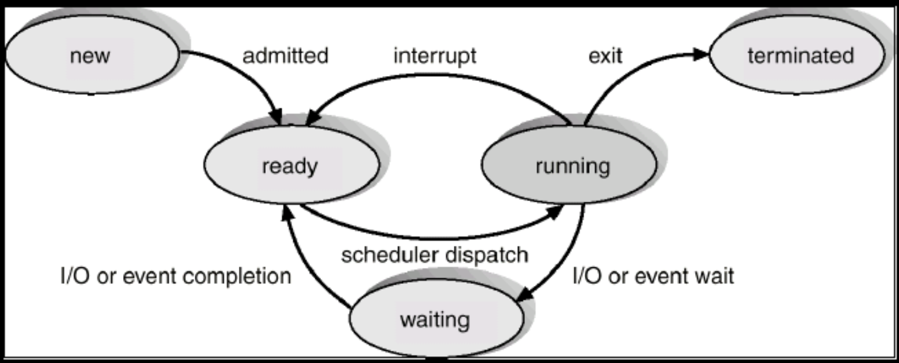

# 친절한 SQL 튜닝 - 조시형

## 1장 SQL 처리 과정과 I/O

### 1.1 SQL 파싱과 최적화

* SQL 튜닝을 시작하기에 앞서 옵티마이저가 SQL을 어떻게 처리하는지, 서버 프로세스는 어떻게 읽고 저장하는지 살펴보자.

**옵티마이저**

* SQL 옵티마이저는 SQL쿼리를 최적하기 위해 최적의 실행 계획을 결정하며 아래와 같은 과정을 통해 이루어집니다. (네비게이션과 같은 역할을 해주는 최적의 실행 계획을 해주는 내부 엔진으로 기억하자)

1. 쿼리 파싱 및 분석 : SQL문을 분석하고 파싱하여 내부 표현으로 변환하여 분석.
2. 통계 정보 수집 : 테이블 및 인덱스 통계 정보 수집.
3. 실행 계획 생성 : 테이블 및 인덱스 액세스 방법, 조인 순서, 조인 방법 포함 실행.
4. 최적 실행 계획 선택 : 생성된 실행 계획 중에서 가장 효율적 선택함으로써 쿼리 실행 시간, 리소스 사용량 최소

**서버 프로세스**

1. 클라이언트 연결 수립.
2. SQL 쿼리 수신.
3. 쿼리 실행
4. 결과 반환
5. 연결 종료

**프로시저**

* 프로시저 : 데이터베이스 내에서 미리 컴파일되어 저장된 하나 이상의 SQL문과 프로그래밍 논리를 가진 데이터베이스 객체입니다.

```SQL
CREATE OR REPLACE PROCEDURE calculate_sum (
    num1 IN NUMBER,
    num2 IN NUMBER
)
IS
    total NUMBER;
BEGIN
    -- 입력된 두 숫자의 합을 계산합니다.
    total := num1 + num2;
    
    -- 결과를 출력합니다.
    DBMS_OUTPUT.PUT_LINE('두 숫자의 합: ' || total);
END;

-- 호출방법
BEGIN
    calculate_sum(10, 20);
END;
```

* SQL은 Structured Query Language 의 줄임말이다. PL/SQL 처럼 절차적 프로그래밍 기능을 구현할 수 있는 확장 언어도 제공하지만, 기본적으로 구조적이고 집합적이고 선언적인 질의 언어이다.
* 결과적으로는 구조적, 집합적이지만 결과집합을 만드는 과정은 절차적일 수 밖에 없기 때문에 프로시저가 필요하다. 그런 프로시저를 만들어 내는 DBMS 내부 엔진이 바로 SQL 옵티마이저이다.
* DBMS 내부에서 프로시저를 작성하고 컴파일해서 실행 가능한 상태로 만드는 전 과정을 **SQL 최적화**라고 한다.

**SQL최적화**

1. SQL 파싱

* **SQL파서**가 파싱을 진행. 파싱을 요약하면 아래와 같음.
    * 파싱 트리 생성 : SQL 문의 구성요소를 분석하여 파싱 트리 생성
    * Syntax 생성 : 문법적 오류 유무 확인
    * Semantic 체크 : 의미상 오류 확인 (존재하지 않는 테이블 또는 컬럼 사용 유무 파악)

2. SQL 최적화

* 옵티마이저가 수집한 시스템 및 통계정보를 바탕으로 다양한 실행경로를 생성 비교 후 효율적인 하나 선택

3. 로우 소스 생성

* 실행경로를 실제 실행 가능한 코드, 프로시저 형태로 포맷팅 하는 단계

**SQL옵티마이저**

* SQL옵티마이저 : 작업을 가장 효율적으로 수행할 수 있는 최적의 데이터 액세스 경로를 선택해주는 DBMS 핵심 엔진

1. 쿼리를 수행하는 데 후보군이 될만한 실행계획 탐색
2. 데이터 딕셔너리에 수집해 둔 통계를 이용하여 각 실행계획의 예상비용 선택
3. 최저 비용을 나타내는 실행계획 선택

**실행계획과 비용**

* DBMS에는 SQL 실행경로 미리보기를 통해 SQL이 테이블을 스캔하는지 인덱스를 스캔하는지, 인덱스 스캔을 한다면 어떤 인덱스인지를 확인할 수 있다.

```SQL
CREATE INDEX tt1_x01 ON tt1(NO, id);
CREATE INDEX tt1_x02 ON tt1(NO, id, name);

SELECT 
	*
FROM
	tt1
WHERE
	NO = 2
	AND id = 9;

SELECT /*+ index(tt1 tt1_x02) */
	*
FROM
	tt1
WHERE
	NO = 2
	AND id = 9;

SELECT /*+ full(tt1) */
	*
FROM
	tt1
WHERE
	NO = 2
	AND id = 9;
```

* 위와 같이 인덱스를 생성하였을 때 옵티마이저는 T_X01 인덱스를 선택했다. 선택한 근거는 무엇일까?
* tt1_x02 인덱스를 선택했을 때는 코스트가 2, full scan을 선택했을 때는 코스트가 20으로 선택한 근거가 비용임을 알 수 있다.
* 비용은 쿼리를 수행하는 동안 발생할 것으로 예상되는 I/O 횟수 또는 예상 소요시간을 표현한 값이다.
* 하지만 네비게이션과 동일하게 목적지에 도착하기까지 걸리는 시간은 예상보다 늦게 도착할 수도 일찍 도착하기도 한다.
* SQL 실행계획에 표시되는 Cost도 어디까지나 예상치이며 옵티마이저가 통계정보를 활용해서 계산해 낸 값이다.

```SQL
/*+ INDEX(A A_X01) INDEX(B B_X01) */    -- 두 유효
/*+ INDEX(C), FULL(D)*/     -- 첫 번째 힌트만 유효

-- 스키마명 명시 X
SELECT /*+ FULL(SCOTT.EMP)*/    -- 무효
    FROM EMP

-- FROM 절 옆에 ALIAS 사용 시 힌트에도 ALIAS 사용
SELECT /*+ FULL(EMP)*/
    FROM EMP e
```

* 옵티마이저가 제공해주는 힌트를 사용할 때는 위와 같은 주의사항들에 맞춰서 사용하자.

```SQL
SELECT /*+ LEADING(A) USE_NL(B) INDEX(A (주문일자)) INDEX(B 고객_PK) */
    A. 주문번호, A.주문금액, B.고객명, B.연락처, B.주소
FROM 주문 A, 고객 B
WHERE A.주문일자 = :ORD_DT
AND   A.고객ID = B.고객ID
```

* 옵티마이저의 작은 실수가 기업에 큰 손실을 끼치는 시스템 같은 경우 위와 같이 빈틈없는 힌트 기술을 통해 다른 방식을 선택하지 못하도록 기술해준다.
* **자주 사용하는 힌트 목록은 27P 참고**

### 1.2 SQL 공유 및 재사용

* SQL 내부 최적화 과정을 알고나면 동시성이 높은 트랜잭션 처리 시스템에서 바인드 변수가 왜 중요한지 이해하자.

**소프트파싱 vs 하드파싱**

* **SQL 파싱, 최적화, 로우 소스 생성 과정**을 거쳐 생성한 내부 프로시저를 반복 재사용할 수 있도록 캐싱해 두는 메모리 공간을 **라이브러리 캐시**라고 한다.


* 라이브러리 캐시는 위의 그림과 같은 구조이며 SGA구성요소이고, 서버 프로세스와 백그라운드 프로세스가 공통으로 액세스하는 데이터와 제어 구조를 캐싱하는 메모리 공간이다.


* 소프트 파싱과 하드 파싱은 위의 도식화한 그림으로 설명이 된다.

* **소프트파싱** : SQL을 캐시에서 찾아 바로 실행단계로 넘어가는 것
* **하드파싱** : 찾는 데 실패해 최적화 및 로우 소스 생성 단계까지 모두 거치는 것

**SQL 최적화 과정은 왜 하드한가?**

* 네비게이션을 예로 들어 가장 빠른 길을 선택하는 방식은 최적 경로 탐색이 꽤 어렵고 무거운 작업임을 알 수가 있다.
* 마찬가지로 옵티마이저 SQL을 최적할 때도 훨씬 많은 일을 수행한다.
    * ex) 다섯 개 테이블 조인 쿼리문 5! 가지 수, NL, 소트 머지, 해시, 테이블 전체, 인덱스 스캔 등등.. 고려해야 할 일이 상당히 많다.
* 데이터베이스에서 이루어지는 처리 과정은 대부분 I/O 작업에 집중되는 반면, 하드 파싱은 **CPU를 많이 소비하는 몇 안되는 작업** 중 하나이다.
* 어려운 하드파싱 작업을 거쳐 생성한 내부 프로시저를 **한 번만 사용하고 버린다면** 이만저만한 **비효율**이기 때문에 **라이브러리 캐시가 필요**하다

### 1.2.1 바인드 변수의 중요성

* 사용자 정의 함수/프로시저, 트리거, 패키지 등은 생성할 때부터 이름을 갖는다.
* 컴파일 상태로 딕셔너리에 저장되며, 사용자가 삭제하지 않는 한 영구적으로 보관된다.
* 실행할 때 라이브러리 캐시에 적재함으로써 여러 사용자가 공유하면서 재사용한다.

**이름없는 SQL문제**

* 반면에 SQL은 이름이 따로 없기 때문에 딕셔너리에 저장하지 않으며, 처음 실행할 때 최적화 과정을 거쳐 동적으로 생성한 내부 프로시저를 라이브러리 캐시에 적재함으로써 재사용한다.
* 캐시 공간이 부족하게되면 버려졌다가 다음에 다시 실행할 떄 똑같은 과정을 거쳐 캐시에 적재된다.
* 라이브러리 캐시에서 SQL을 찾기 위해 사용하는 키 값이 SQL문 그 자체이므로 각각 최적화를 진행하고 라이브러리 캐시에서 별도 공간을 사용한다.

**아래 중요한 예제를 통해 알아보자**

* 500만 고객을 보유한 어떤 쇼핑몰에서 로그인 모듈 담당 개발자가 프로그램을 아래와 같이 작성했다고 하자.

```SQL
public void login(String login_id) throws Exception{
    String SQLStmt = "SELECT * FROM CUSTOMER WHERE LOGIN_ID = '" + login_id + "'";
    Statement st = con.createStatement();
    ResultSet rs = st.executeQuery(SQLStmt);
    if(rs.next()){
        // do anything
    }
    rs.close();
    st.close();
}
```

* 위와 같이 코드를 작성할 경우 100만 고객이 동시에 시스템 접속을 하면 무슨 일이 발생할까?
* DBMS에 발생하는 부하는 대게 과도한 I/O가 원인이기 때문에 여러 종류의 경합 떄문에 로그인 처리가 제대로 처리되지 않을 것이다.
* 이유는 SQL 하드파싱 때문이다. 내부 라이브러리 캐시(V$SQL)를 조회해보자.

```SQL
SELECT * FROM CUSTOMER WHERE LOGIN_ID = 'oraking'
SELECT * FROM CUSTOMER WHERE LOGIN_ID = 'javaking'
SELECT * FROM CUSTOMER WHERE LOGIN_ID = 'tommy'
...
...

-- 내부 프로시저
create procedure LOGIN_ORAKING() {...}
create procedure LOGIN_JAVAKING() {...}
create procedure LOGIN_TOMMY() {...}
...
...
```

* 로그인 프로그램을 이렇게 작성하게 되면 고객이 로그인할 때마다 DBMS 내부 프로시저를 하나씩 만들어서 라이브러리 캐시에 적재하는 셈이다.
* 이런식으로 여러 개 생성할 것이 아니라 로그인ID를 파라미터로 받는 프로시저 하나를 공유하면서 재사용 하는 것이 유리하다.

```SQL
-- 로그인 ID를 파라미터로 받는 프로시저를 하나로 공유한다면?
create procedure LOGIN (login_id in varchar2) {...}

public void login(String login_id) throws Exception{
    String SQLStmt = "SELECT * FROM CUSTOMER WHERE LOGIN_ID = ?";
    PreparedStatement st = con.prepareStatement(SQLStmt);
    st.setString(1, login_id);
    ResultSet rs = st.executeQuery();
    if(rs.next()){
        // do anything
    }
    rs.close();
    st.close();
}

-- 아래와 같은 로그인과 관련해서 아래 SQL 하나만 발견된다.
SELECT * FROM CUSTOMER WHERE LOGIN_ID = :1
```

* 이처럼 파라미터 Driven 방식으로 SQL을 작성하는 방법이 제공되는데 이 것이 바로 바인드 변수이다.
* 종합해보자면 하드파싱은 하나만 사용함으로써 캐싱된 SQL을 100만 고객이 공유하고 재사용함으로써 부담을 줄이는 것이다.

### 1.3 데이터 저장 구조 및 I/O 메커니즘

* I/O 튜닝이 곧 SQL 튜닝이라고 해도 과언이 아닐만큼 I/O 이해에 대한 이해가 중요할 수 밖에 없다. 데이터 저장 구조, 디스크 및 메모리에서 데이터를 읽는 메커니즘을 제대로 살펴보자.

**SQL이 느린이유**

* SQL이 느린 이유는 십중팔구 I/O 때문이다. 구체적으로 디스크 I/O 때문이다.
* 그렇다면 I/O란 무엇일까 이 책의 저자는 I/O 를 잠(SLEEP) 이라고 설명한다.
* OS 또는 I/O 시스템이 처리하는 동안 프로세스는 잠을 자기 때문이다.



* 프로세스는 실행 중인 프로그램이며 위와 같은 생명주기를 같는다.
* 생성 이후 종료 전까지의 준비와 실행과 대기 상태를 반복한다.(new -> ready -> running -> wait -> terminated)
* 여러 프로세스가 하나의 CPU를 공유할 수 있지만 특정 순간에는 하나의 프로세스만 CPU를 사용할 수 있기 때문에 이런 메커니즘이 필요하다.
* interrupt 없이 일하는 프로세스도 디스크에서 데이터를 읽을 때는 CPU를 OS에 반환하고 수면상태에서 I/O가 완료되기를 기다린다.
* 열심히 일해야 할 프로세스가 잠을 자고 있으니 I/O가 많으면 성능이 느려질 수 밖에 없다.
* 일반적으로 I/O Call 속도는 Single Block I/O 기준 평균 10ms 

### 1.3.1 데이터베이스 저장 구조

* 데이터를 저장하려면 먼저 테이블스페이스를 생성해야 한다.
* 테이블스페이스는 세그먼트를 담는 콘테이너로서, **여러 개의 데이터파일**로 구성된다.


* 위와 같이 테이블스페이스를 생성했으면 그림처럼 세그먼트(테이블, 저장공간이 필요한 오브젝트)를 생성한다.
* 세그먼트는 여러 익스텐트로 구성되어있다. 파티션 구조가 아니라면 테이블도 하나의 세그먼트이고 인덱스도 하나의 세그먼트이다. (즉 각 파티션이 하나의 세그먼트)
* 익스텐트는 연속된 블록들의 집합이기도 하다. 연속된 여러 개의 데이터 블록으로 구성되어있다.
* 실제로 저장하는 공간은 데이트 블록이고 한 블록에 저장된 레코드는 모두 같은 테이블 레코드이다.
* 데이터베이스에서 데이터를 읽고 쓰는 단위는 블록이며, 특정 레코드 하나를 읽는다하더라도 해당 블록을 통째로 읽는다.
* 각 용어에 대해 간단히 정의하자면 아래와 같다.

1. 블록 : 데이터를 읽고 쓰는 단위
2. 익스텐트 : 공간을 확장하는 단위, 연속된 블록 집합
3. 세그먼트 : 데이터 저장공간이 필요한 오브젝트
4. 테이블스페이스 : 세그먼트를 담는 콘테이너
5. 데이터파일 : 디스크 상의 물리적인 OS 파일

### 1.3.2 시퀀셜 액세스 vs 랜덤 엑세스

* 테이블 또는 인덱스 블록을 액세스하는 방식으로는 **시퀀셜 액세스와 랜덤 액세스** 두 가지가 있다.
* 시퀀셜 엑세스는 단어의 의미와 같이 연결된 순서에 따라 차례대로 블록을 읽는 방식이다.
* 인덱스 리프 블록은 앞뒤를 가리키는 주소값을 통해 논리적으로 연결되어있는데 이 주소 값에 따라 앞 또는 뒤로 순차적으로 스캔하는 방식이 시퀀셜 액세스에 해당한다.

**데이터 블록 간에는 서로 논리적인 연결고리를 갖고 있지 않은데 어떻게 액세스할까?**

* 오라클은 세그먼트에 할당된 익스텐트 목록을 세그먼트 헤더에 맵으로 관리한다.
* 익스텐트 맵은 각 인스텐트의 첫 번째 블록 주소 값을 갖는다.
* 읽어야 할 익스텐트 목록을 익스텐트 맵에서 얻고, 연속해서 저장된 블록을 순서대로 읽으면 이것이 Full Table Scan 이다.
* 랜덤 액세스는 논리적, 물리적인 순서를 따르지 않고, 레코드 하나를 읽기 위해 한 블록씩 접근하는 방식이다.

### 1.3.3 논리적I/O vs 물리적 I/O

**DB 버퍼캐시**

* 디스크 I/O가 SQL 성능을 결정하는 것은 거듭 강조한다.
* 자주 읽는 블록을 매번 디스크에서 읽는 것은 비효율적이고 DBMS에 데이터 캐싱 매커니즘이 필수인 이유이다.
* 앞서 알아본 라이브러리 캐시가 SQL과 실행계획, DB 저장형 함수/프로시저 등을 캐싱하는 **코드 캐시**라고 한다면, **DB 버퍼 캐시는 데이터 캐시**라고 할 수 있다(같은 블록에 대한 반복적인 I/O Call을 줄이는 목적)
* 서버 프로세스와 데이터 파일 사이에 위치함으로써 데이터 블록을 읽기 전에 버퍼캐시부터 탐색한다.
* 운 좋게 캐시에서 블록을 찾으면 프로세스가 잠을 자지 않아도 되니 속도는 당연히 빠르고, 찾지 못하더라도 한 번은 I/O Call을 하고 잠을 자겠지만 두 번째 부터는 잠을 자지 않아도 되는 공유메모리 영역으로 같은 블록을 읽는 다른 프로세스도 득을 본다.

**논리적 I/O vs 물리적 I/O**

* 논리적 블록 I/O : SQL문을 처리하는 과정에 메모리 버퍼캐시에서 발생한 총 블록 I/O (메모리 I/O)
* 물리적 블록 I/O : 디스크에서 발생한 총 블록 I/O (디스크 I/O)

* SQL 처리 도중 읽어야 할 블록을 버퍼캐시에서 찾지 못할 때만 디스크를 액세스하므로 논리적 블록 I/O 중 일부를 물리적으로 I/O 한다.
* 메모리 I/O는 전기적 신호인데 반해, 디스크 I/O는 액세스 암을 통해 물리적 작용이 일어나므로 논리적 I/O보다 10,000배쯤 느리다.
* SQL을 수행하려면 데이터가 담긴 블록을 읽어야 하는데 데이터를 입력하거나 삭제하지 않는 상황에서 조건절에 같은 변수 값을 입력하면, 아무리 여러 번 실행해도 매번 읽는 블록 수는 같다.
* **SQL을 수행하면서 읽은 총 블록 I/O**가 **논리적 I/O**이다.
* DB 버퍼캐시에서 블록을 찾지 못해 **디스크에서 읽은 블록 I/O**가 **물리적 I/O** 이다.

**버퍼캐시 히트율**

* 버퍼캐시 효율을 측정하는 데 전통적으로 가장 많이 사용해 온 지표는 **버퍼캐시 히트율(BCHR)**이다.

**BCHR = (논리적 I/O - 물리적 I/O / 논리적 I/O) * 100**

* BCHR은 읽은 전제 블록 중에서 물리적인 디스크 I/O를 수반하지 않고 곧바로 메모리에서 찾은 비율을 나타낸다.
* 일반적으로 시스템 레벨에서 평균 99% 히트율을 달성해야 한다.
* 실제 SQL 성능을 향상하려면 물리적 I/O 가 아닌 논리적 I/O를 줄여야 한다. 공식을 아래와 같이 변경하면 쉽게 알 수 있다.

**물리적 I/O = 논리적 I/O * (100 - BCHR)**

* 즉 논리적 I/O는 일정하여 물리적 I/O는 BCHR에 의해 결정되는데 시스템 상황에 의해 결정되기 때문에 SQL 성능을 높이기 위해서는 **논리적 I/O를 줄이는 일뿐이다.**
* **논리적 I/O를 줄임으로써 물리적 I/O를 줄이는 것이 곧 SQL 튜닝이다.**

### 1.3.4 SingleBlock I/O vs MultiBlock I/O

* 메모리 캐시가 클수록 좋지만, 데이터를 모두 캐시에 적재할 수는 없으므로 캐시에서 찾지 못한 데이터 블록은 I/O Call을 통해 디스크에서 DB 버퍼캐시로 적재하고서 읽는다.
* I/O Call을 할 때, 한 번에 한 블록씩 요청하기도 하고, 여러 블록씩 요청하기도 하는데 **한 번에 한블록씩 요청해서 메모리에 적재하는 방식을 Single Block I/O** 라고한다.
* 반면에 **한 번에 여러 블록씩 요청해서 메모리에 적재하는 방식을 Multiblock I/O** 라고 한다.
* 인덱스를 이용할 때는 기본적으로 인덱스와 테이블 모두 Single Block I/O 방식을 사용한다.
* 반대로 많은 데이터 블록을 읽을 때는 Multiblock I/O 방식이 효율적이다(Full Scan).
* 정리하자면 MultiBlock I/O는 캐시에서 찾지 못한 특정 블록을 읽으려고 할 때 캐시에 미리 적재하는 기능이며 Full Scan 할 때 성능이 좋다.

### 1.3.5 Table Full Scan vs Index Range Scan

* 테이블에 저장된 데이터를 읽는 방식은 크게 두 가지다. 테이블 전체를 스캔해서 읽는 방식과 인덱스를 이용해서 읽는 방식이다. 
* Tabls Full Scan 은 말그대로 테이블에 속한 블록 '전체'를 읽어서 사용자가 원하는 데이터를 찾는 방식이다.
* 인덱스를 이용한 테이블 액세스는 인덱스에서 일정량을 스캔하면서 얻은 ROWID로 테이블 레코드를 찾아가는 방식이다.

**무조건적으로 Index Scan 을 사용하는 것이 빠르진 않다?**

여지껏 무조건 Index Scan 을 타야 속도가 빠른 줄 알았는데 이 책에서는 그렇지 않다라고 정의하고 있다. 이유에 대해서 알아보자.

* **Table Full Scan**은 시퀀셜 액세스와 Multiblock I/O 방식으로 디스크 블록을 읽는다.한 블록에 속한 모든 레코드를 한 번에 읽어 들이고, 캐시에서 찾지 못하면 한 번의 수면을 통해 수십 ~ 수백 개 블록을 한꺼번에 I/O 하는 메커니즘이다.
* 하지만 수십 ~ 수백 건의 소량 데이터를 찾을 때 수백만 ~ 수천만 건 데이터를 스캔하는건 비효율적이므로 소량 데이터를 검색할 때는 반드시 인덱스를 이용해야 한다.
* **Index Range Scan**을 통한 테이블 액세스는 랜덤 액세스와 Single Block I/O 방식으로 디스크 블록을 읽는다. 캐시에서 블록을 못찾으면, '레코드 하나를 읽기 위해 매번 잠을 자는 I/O 메커니즘이다. 따라서 많은 데이터를 읽을 때는 Table Full Scan보다 불리하다.

## 2장 인덱스 기본

* 인덱스에 대한 개념만 알고있을 뿐 명확한 그림이 없는 상태에서 설계하고 개발하니 성능이 좋을 리 없다.
* 인덱스 탐색 과정이 **수직적 탐색과 수평적 탐색** 두 단계로 이루어진다는 사실에 대해 유념하며 알아보자.

### 2.1 인덱스 구조 및 탐색

**데이터를 찾는 두 가지 방법**

* 어떤 초등학교를 방문해 '홍길동' 학생을 찾는 방법은 두 가지다.
* 첫째는, 1학년 1반부터 6학년 맨 마지막 반까지 모든 교실을 돌며 홍길동 학생을 찾는 것이다.
* 둘째는, 교무실에서 학생 명부를 조회해 홍길동 학생이 있는 교실만 찾아가는 것이다.
* 결과는 홍길동 학생이 많으면 첫째, 몇 안 되면 후자가 빠르다.

* 데이터베이스 테이블에서 데이터를 찾는 방법도 크게 아래 두 가지에 해당한다.

1. 테이블 전체를 스캔한다.
2. 인덱스를 이용한다.

* 모든 교실을 돌며 학생을 찾는 경우가 전자이고, 학생부를 이용한 경우가 후자인 것이다.
* 테이블 전체 스캔과 관련해서는 튜인 요소가 많지 않지만, 인덱스와 관련해서는 튜닝 요소가 매우 많고 기법도 다양하다.

**인덱스 튜닝의 두 가지 핵심요소**

1. 인덱스 스캔 과정에서 발생하는 비효율을 줄이는 것. 즉, **인덱스 스캔 효율화 튜닝**

* 학생명부에서 시력이 1.0 ~ 1.5 인 홍길동 학생을 찾는 경우를 예로 들어보자.
* 학생명부를 이름과 시력순으로 정렬해 두었다면 소량만 스캔하면 되지만 학생명부를 시력과 이름순으로 정렬해 두었다면 똑같이 두명을 찾는데도 많은 양을 스캔해야 한다.

2. 테이블 액세스 횟수를 줄이는 것. 즉, **랜덤 액세스 최소화 튜닝**

* 시력이 1.0 ~ 1.5인 학생은 50명이고 이름이 홍길동인 학생은 5명이고, 시력이 1.0 ~ 1.5인 홍길동 학생은 2명이다.
    * 이름과 시력만으로 각각 정렬한 학생명부가 있다면 어느 쪽이 더 효과적일까?
    * 당연히, 이름순으로 정렬한 학생명부를 선택하면 교실을 다섯 번만 찾아가면 되기 때문에 유리하다.
    * 어떤 학생명부를 사용하느냐에 따라 교실 방문 횟수는 다르다.


* 인덱스 스캔 효율화 튜닝과 랜덤 액세스 최소화 튜닝 둘 다 중요하지만, 더 중요한 하나를 고른다면 랜덤 액세스 최소화 튜닝이다.
* 홍길동 학생을 찾는 예만 하더라도 **학생명부를 스캔하는 과정에도 비효율이 있겠지만, 학생명부에 없는 나머지 정보를 얻기 위해 직접 교실을 찾아가는 부담이 훨씬 더 크다.**
* 이 예제가 말해주는건 인덱스 튜닝의 핵심요소이며 가장 중요한 결론은 **SQL 튜닝은 랜덤 I/O와의 전쟁이다.**

**SQL 튜닝은 랜덤 I/O 와의 전쟁**

* 데이터베이스 성능이 느린 이유는 디스크 I/O 때문이다.
* 읽어야 할 데이터량이 많고, 그 과정에 I/O가 많이 발생할 때 느리다.

### 2.1.1 인덱스 구조

* **인덱스** : 대용량 테이블에서 필요한 데이터만 빠르게 효율적으로 액세스하기 위해 사용하는 오브젝트이다. 
* 즉, 책 뒤쪽에 있는 색인과 같은 역할을 한다.
* 데이터베이스에서도 인덱스 없이 데이터를 검색하려면, 테이블을 처음부터 끝까지 모두 읽어야 한다.
* 반면, 인덱스를 이용하면 일부만 읽고 멈출 수 있으며 범위 스캔이 가능하다. 범위 스캔이 가능한 이유는 인덱스가 정렬돼 있기 때문이다.


* DBMS는 일반적으로 B+Tree 인덱스를 사용하는데 구조는 위의 그림과 같다.
* 나무를 거꾸로 뒤집은 모양으로 뿌리(Root)가 위에 있고 가지(Branch)를 거쳐 맨 아래에 잎사귀(Leaf)가 존재한다.
* 리프 블록에 저장된 각 레코드는 키값 순으로 정렬돼 있을 뿐만 아니라 테이블 레코드를 가리키는 주소값 ROWID를 갖으며 인덱스 키값이 같으면 ROWID 순으로 정렬된다.
* 인덱스를 스캔하는 이유는 검색 조건을 만족하는 소량의 데이터를 빨리 찾고 거기서 ROWID를 얻기위함이다.

* ROWID = 데이터 블록 주소 + 로우 번호
* 데이터 블록 주소 = 데이터 파일 번호 + 블록 번호
* 블록 번호 : 데이터파일 내에서 부여한 상대적 순번
* 로우 번호 : 블록 내 순번 

* 수직적 탐색 : **인덱스 스캔 시작지점을 찾는 과정**
* 수평적 탐색 : **데이터를 찾는 과정**

### 2.2.2 인덱스 수직적 탐색

* 인덱스 수직적 탐색은 정렬된 인덱스 레코드 중 조건을 만족하는 첫 번째 레코드를 찾는 과정이며 즉, **인덱스 스캔 시작지점을 찾는 과정이다.**
* 루트를 포함해 브랜치 블록에 저장된 각 인덱스 레코드는 하위 블록에 대한 주소값을 갖는다. 이것이 루트에서 시작해 리프블록까지 수직적 탐색이 가능한 이유이다.
* 수직적 탐색 과정에 찾고자 하는 값보다 크거나 같은 값을 만나면, 바로 직전 레코드가 가리키는 하위 블록으로 이동한다.

* 인덱스를 수직적으로 탐색할 때는, 등산 푯말과 같은 역할을 한다.
* 이는, **조건을 만족하는 첫 번째 레코드**가 목표 지점임을 기억하자.

### 2.2.3 인덱스 수평적 탐색

* 수직적 탐색을 통해 스캔 시작점을 찾았으면, 찾고자 하는 데이터가 더 안나타날 때까지 인덱스 리프 블록을 수평적으로 스캔한다. 이는 인덱스에서 본격적으로 데이터를 찾는 과정이다.
* 인덱스 리프 블록끼리는 서로 앞뒤 블록에 대한 주소값을 갖는 양방향 연결 리스트(double linked list) 구조이다.
* 인덱스를 수평적으로 탐색하는 이유는 조건절을 만족하는 데이터를 모두 찾고 ROWID를 얻기 위해서이다.
* 필요한 컬럼을 인덱스가 모두 갖고 있어 인덱스만 스캔하고 끝나는 경우도 있지만, 일반적으로 액세스를 스캔하고서 테이블도 액세스한다. (이 때 ROWID가 필요하다.)

### 2.2.4 결합 인덱스 구조와 탐색

```SQL
SELECT 
    이름, 설명
FROM 
    사원
WHERE 
    성별 = '여자'
    AND 이름 = '유관순'
```

1. 인덱스를 **성별 + 이름** 순으로 구성한 경우

    * 총 사원 50명 중 성별 = 여자인 레코드 25건을 찾고, 이름을 검사해 최종적으로 2명 출력 -> 25번의 검사

2. 인덱스를 **이름+ 성별** 순으로 구성한 경우

    * 총 사원 50명 중 이름 = '유관순'인 레코드 2건을 찾고, 거기서 성별을 검사해 최종적으로 2명 출력 -> 2번의 검사

* 여기서 알 수 있듯, 선택도가 낮은 '이름' 컬럼을 앞쪽에 두고 결합인덱스를 생성해야 검사횟수를 줄일 수 있어 성능에 유리하다고들 알고 있다.
* 하지만 엑셀의 데이터 필터 기능과 같은 위와 달리 **B+TREE 인덱스는 엑셀처럼 평면 구조가 아니기에 어느 컬럼을 앞에 두든 일량에는 차이가 없다.**

### 2.2 인덱스 기본 사용법

* 인덱스 기본 사용법은 인덱스를 Range Scan 하는 방법을 의미한다.
* 인덱스를 Range Scan 할 수 없게 되는 이유를 알고 나면, Range Scan 하는 방법도 자연스럽게 터득한다.
* 인덱스 컬럼을 가공하지 않아야 인덱스를 정상적으로 사용할 수 있다.
* 인덱스를 정상적으로 사용한다라는 표현은 리프 블록에서 스캔 시작점을 찾아 거기서부터 스캔하다가 중간에 멈추는 것을 의미한다. **(리프블록 일부만 스캔하는 Index Range Scan)**
* 인덱스 컬럼을 가공해도 인덱스를 사용할 수는 있지만, 스캔 시작점을 찾을 수 없고 멈출 수 없어 리프 블록 전체를 스캔해야만 한다. **(일부가 아닌 전체 스캔하는 Index Full Scan)**

### 2.2.1 인덱스를 Range Scan 할 수 없는 이유

모든 SQL 튜닝 책은 이와 같이 말한다. **인덱스 컬럼을 가공하면 인덱스를 정상적으로 사용할 수 없다.**

* 기본 중에서 기본에 해당하므로 모르는 사람은 없으나, 이유에 대해서는 잘설명하지 못한다 이유는 무엇일까??
* 이를 설명하기 위해서는 앞서 말한 수직적, 수평적 탐색인 인덱스 탐색 과정을 알아야 한다.
* 인덱스 컬럼을 가공했을 때 인덱스를 정상적으로 사용할 수 없는 이유는 **인덱스 스캔 시작점을 찾을 수 없기 때문이다.**
* 쉽게 말하면 Index Range Scan은 범위를 인덱스에서 범위를 스캔한다는 뜻인데, 일정 범위를 스캔하려면 시작 지점과 끝지점이 존재해야한다.

**아래 예제를 통해서 알아보자**

* 2007년 1월 1일 이후에 태어난 첫 번째 학생을 찾는 과정이 인덱스로 말하면 수직적 탐색에 해당한다.
* 데이터베이스에서 아래 조건절을 처리할 때도 똑같은 과정을 거친다.

```sql
where 생년월일 between '20070101' and '20070131'
```

* 이번에는 년도와 상관없이 5월에 태어난 학생을 찾아보자. 스캔 시작점은 어디고 어디서 멈춰야 할까??

```sql
where substr(생년월일, 5, 2) = '05'
```

* 위와 같이 조건절을 처리할 경우 인덱스에는 가공되지 않은 값이 저장되어있어 스캔 시작점과 끝지점을 찾을 수 없다.
* 아래 예제도 전부 마찬가지로 해당한다.

```sql
where nvl(주문수량, 0) < 100
where 업체명 like '%대한%'
where (전화번호 = :tel_no OR 고객명 = :cust_nm)
where (전화번호 in :tel_no1, :tel_no2)
```

* SQL을 아래와 같이 UNION ALL 방식으로 작성하면 각 브랜치 별로 인덱스 스캔 시작점을 찾을 수 있으므로 Range Scan이 가능하다.
* 위와 같은 쿼리를 UNION ALL 방식으로 아래와 같이 작성하면 Index Range Scan 을 사용할 수 있다.

```sql
select *
from 고객
where 고객명 = :cust_nm
union all 
select *
from 고객
where 전화번호 = :tel_no
and (고객명 <> :cust_nm or 고객명 is null)

select * 
from 고객
where 전화번호 = :tel_no1
select *
from 고객
where 전화번호 = :tel_no2
```

* 번외로 IN 조건절에 대해서는 SQL 옵티마이저가 IN_List Iterator 방식을 사용하여, IN-List 개수만큼 Index Range Scan을 반복함으로써 UNION ALL 으로 변환한 것과 같은 효과를 얻을 수가 있다.
* 정리하자면 위에서 정의한 **nvl이나 like 처럼 가공한 인덱스 컬럼을 정상적으로 Index를 사용할 수 없으나, OR 또는 IN 조건절은 옵티마이저의 쿼리 변환을 통해 Index Range Scan 으로 처리되기도 한다.**

### 2.2.2 더 중요한 인덱스 사용 조건

* 인덱스를 정상적으로 사용하는데 있어 더 중요한 선행조건이 있다.
* 인덱스를 아래 그림과 같이 소속팀 + 사원명 + 연령 순으로 구성했다고 가정하자.


```SQL
SELECT 사원번호, 소속팀, 연령, 입사일자, 전화번호
FROM    사원
WHERE 사원명 = '홍길동'
```

* 데이터를 소속팀 순으로 정렬하고, 소속팀이 같으면 사원명 순으로 정렬하고, 사원명까지 같으면 연령순으로 정렬한다는 의미이다.
* 이름이 같은 사원이더라도 소속팀이 다르면 서로 멀리 떨어져 인덱스 스캔 시작점을 찾을 수 없고, 어디서 멈춰야 할지도 알 수 없다. (인덱스 리프 블록을 처음부터 끝까지 모두 스캔해야 한다.)
* 인덱스를 Range Scan 하기 위한 가장 첫 번째 조건은 인덱스 선두 컬럼이 조건절에 있어야 한다는 사실이다.

**아래 예제는 인덱스 컬럼을 가공했는데 Range Scan하는 경우의 예이다.**

```sql
-- TXA1234_TX02 인덱스 : 기준연도 + 과세구분코드 + 보고회차 + 실명확인번호

SELECT * FROM 
WHERE 기준연도 = :stdr_year
AND SUBSTR(과세구분코드, 1, 4) =: txtn_dcd
AND 보고회차 = :rpt_tmrd
AND 실명확인번호 = :rnm_cnfm_no
```

* 인덱스를 Range Scan 하려면 인덱스 선두 컬럼이 가공되지 않은 상태로 조건절에 있어야 한다.
* 반대로 말해 **인덱스 선두 컬럼이 가공되지 않은 상태로 조건절에 있으면 인덱스 Range Scan은 무조건 가능하다.**
* 위의 예제에서는 선두 컬럼인 '기준연도'를 가공하지 않았으므로 인덱스 Range Scan이 가능하다.

**인덱스 잘타니까 튜닝 끝??**

* SQL을 개발하면서 실행계획을 확인하지 않는 개발자가 대다수이다.
* 확인하더라도 인덱스를 타는지, 안타는지 확인하는 수준에 그친다. (인덱스를 잘 타면 성능도 문제없다고 생각한다.)
* 인덱스를 정말 잘 타는지는 인덱스 리프 블록에서 스캔하는 양을 따져봐야 알 수 있다.

```sql
SELECT *
FROM 주문상품
WHERE 주문일자 =:ord_dt
AND 상품번호 LIKE '%PING%'

SELECT *
FROM 주문상품
WHERE 주문일자 =:ord_dt
AND SUBSTR(상품번호, 1, 4) = 'PING';
```

* 위 SQL에서는 상품번호는 스캔 범위를 줄이는데 전혀 역할을 하지 못한다.
* 첫 번째 SQL은 중간 값 검색이기 때문이고, 두 번재 SQL은 컬럼을 가공했기 때문이다.

### 2.2.3 인덱스를 이용한 소트 연산 생략

* **인덱스를 Range Scan 할 수 있는 이유는 데이터가 정렬돼 있기 때문이다.**
* 찾고자 하는 데이터가 정렬된 상태로 서로 모여있기 때문에 전체가 아닌 일정 부분만 읽다가 멈출 수 있다.
* 인덱스 컬럼을 가공해도 인덱스를 사용할 수 있지만, 찾고자 하는 데이터가 전체 구간에 흩어져 있기 때문에 Range Scan이 불가능하거나 비효율이 발생한다.
* 하지만 테이블과 달리 인덱스는 정렬돼어있기 때문에 Range Scan이 가능하고, 소트 연산 생략효과도 부수적으로 얻게 된다.


* 위 그림에서는 장비번호 + 변경일자 + 변경순번으로 PK가 구성되어있다.

```sql
SELECT *
FROM 상태변경이력
WHERE 장비번호 = 'C'
AND 변경일자 = '20180316'
```

* 위와 같이 장비번호와 변경일자를 모두 '=' 조건으로 검색할 때 PK 인덱스를 사용하면 결과집합은 변경순번 순으로 출력된다.
* 옵티마이저는 이런 속성을 활용해 SQL에 ORDER BY 가 있어도 정렬 연산을 따로 수행하지 않는다.
* PK 인덱스를 스캔하면서 출력한 결과집합은 어차피 변경순번 순으로 정렬되기 때문이다.
* 실행계획에 SORT ORDER BY 연산이 없음을 확인해보자.

## 3장 인덱스 튜닝

## 4장 조인 튜닝

## 5장 소트 튜닝

## 6장 DML 튜닝

## 7장 SQL 옵티마이저